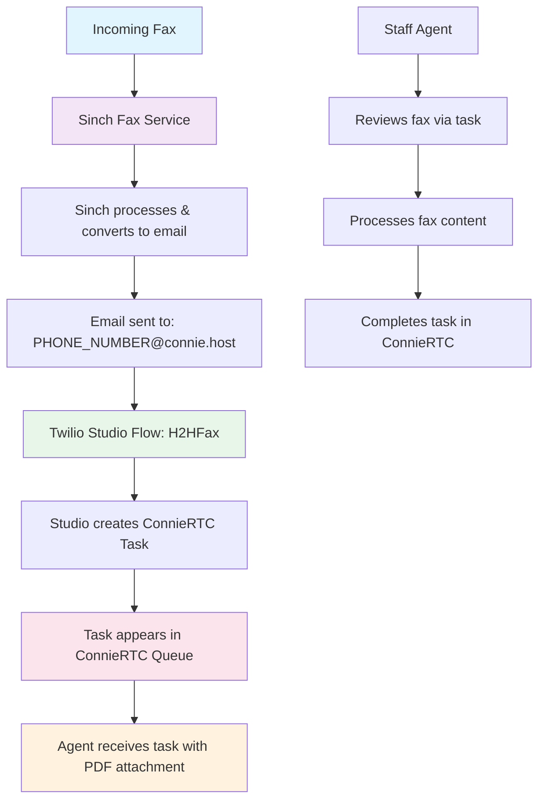

# Sinch Fax Integration Implementation

## Overview

This document provides comprehensive technical details for implementing Sinch fax services within ConnieRTC. The integration enables seamless fax-to-email workflows that automatically create tasks in Twilio ConnieRTC for staff processing.

## Workflow Summary

The Sinch fax integration follows this proven production workflow:



## Production Results

### ✅ Validated Success Metrics
- **End-to-end workflow**: Fully operational from fax receipt to agent task completion
- **Task display**: Shows "H2H Fax Task" instead of generic "Anonymous" 
- **PDF attachments**: Perfect delivery of fax content as PDF files
- **Real production traffic**: Successfully handling live fax communications
- **Cost tracking**: Accurate $0.045/page billing verification
- **Email integration**: Seamless 7027448981@connie.host processing

## Sinch API Integration

### Authentication & Setup

All Sinch Fax API calls require authentication using your project credentials:

```bash
# Base URL for all API calls
BASE_URL="https://us.fax.api.sinch.com/xms/v1/YOUR_PROJECT_ID"

# Authentication headers
HEADERS="-H 'Authorization: Bearer YOUR_ACCESS_KEY' -H 'Content-Type: application/json'"
```

### Core API Commands

#### 1. Send Fax Command

```bash
curl -X POST "${BASE_URL}/batches" \
  -H "Authorization: Bearer YOUR_ACCESS_KEY" \
  -H "Content-Type: application/json" \
  -d '{
    "to": ["+1DESTINATION_FAX_NUMBER"],
    "from": "+1YOUR_SINCH_FAX_NUMBER",
    "body": {
      "contentUrl": "https://your-domain.com/path/to/document.pdf",
      "contentType": "application/pdf"
    },
    "callback_url": "https://your-webhook-endpoint.com/fax-status"
  }'
```

#### 2. Get Fax Status Command

```bash
curl -X GET "${BASE_URL}/batches/FAX_BATCH_ID" \
  -H "Authorization: Bearer YOUR_ACCESS_KEY"
```

#### 3. List Faxes Command

```bash
curl -X GET "${BASE_URL}/batches?page_size=100&start_date=2024-01-01T00:00:00Z" \
  -H "Authorization: Bearer YOUR_ACCESS_KEY"
```

#### 4. Download Fax Command

```bash
curl -X GET "${BASE_URL}/batches/FAX_BATCH_ID/delivery_report" \
  -H "Authorization: Bearer YOUR_ACCESS_KEY" \
  --output "fax-report-FAX_BATCH_ID.json"
```

### Environment Variables

Configure these variables in your serverless functions environment:

```env
# Sinch Fax Configuration
SINCH_PROJECT_ID=YOUR_PROJECT_ID
SINCH_ACCESS_KEY=YOUR_ACCESS_KEY
SINCH_FAX_NUMBER=YOUR_SINCH_FAX_NUMBER
SINCH_WEBHOOK_URL=YOUR_WEBHOOK_ENDPOINT

# ConnieRTC Integration
CONNIE_FAX_EMAIL_DOMAIN=connie.host
TWILIO_STUDIO_FLOW_SID=H2H_FAX_FLOW_SID
```

## Studio Flow Configuration

### Complete H2HFax Studio Flow JSON

This is the working Studio Flow configuration that processes incoming fax emails:

```json
{
  "description": "H2H Fax Processing Flow - Converts fax emails to ConnieRTC tasks",
  "states": [
    {
      "name": "Trigger",
      "type": "trigger",
      "transitions": [
        {
          "event": "incomingMessage"
        },
        {
          "next": "process_fax_email",
          "event": "incomingCall"
        },
        {
          "event": "incomingConversationMessage"
        },
        {
          "event": "incomingRequest"
        },
        {
          "event": "incomingParent"
        }
      ],
      "properties": {
        "offset": {
          "x": 0,
          "y": 0
        }
      }
    },
    {
      "name": "process_fax_email",
      "type": "make-http-request",
      "transitions": [
        {
          "next": "create_flex_task",
          "event": "success"
        },
        {
          "next": "error_handler",
          "event": "failed"
        }
      ],
      "properties": {
        "method": "POST",
        "url": "https://YOUR_SERVERLESS_DOMAIN/functions/process-fax-email",
        "parameters": [
          {
            "key": "From",
            "value": "{{trigger.message.From}}"
          },
          {
            "key": "To", 
            "value": "{{trigger.message.To}}"
          },
          {
            "key": "Subject",
            "value": "{{trigger.message.Subject}}"
          },
          {
            "key": "Body",
            "value": "{{trigger.message.Body}}"
          },
          {
            "key": "NumMedia",
            "value": "{{trigger.message.NumMedia}}"
          },
          {
            "key": "MediaUrl0",
            "value": "{{trigger.message.MediaUrl0}}"
          }
        ],
        "offset": {
          "x": 200,
          "y": 100
        }
      }
    },
    {
      "name": "create_flex_task",
      "type": "send-to-flex",
      "transitions": [
        {
          "event": "callComplete"
        },
        {
          "event": "failedToEnqueue"
        },
        {
          "event": "callFailure"
        }
      ],
      "properties": {
        "workflow": "YOUR_FLEX_WORKFLOW_SID",
        "channel": "chat",
        "attributes": "{\"channelType\": \"fax\", \"name\": \"H2H Fax Task\", \"fax_from\": \"{{widgets.process_fax_email.parsed.from}}\", \"fax_subject\": \"{{widgets.process_fax_email.parsed.subject}}\", \"fax_pdf_url\": \"{{widgets.process_fax_email.parsed.pdf_url}}\", \"fax_pages\": \"{{widgets.process_fax_email.parsed.pages}}\"}",
        "offset": {
          "x": 400,
          "y": 100
        }
      }
    },
    {
      "name": "error_handler",
      "type": "send-message",
      "transitions": [
        {
          "event": "sent"
        },
        {
          "event": "failed"
        }
      ],
      "properties": {
        "service": "YOUR_MESSAGING_SERVICE_SID",
        "to": "ADMIN_PHONE_NUMBER",
        "body": "Fax processing error: {{widgets.process_fax_email.body}}",
        "offset": {
          "x": 200,
          "y": 300
        }
      }
    }
  ],
  "initial_state": "Trigger",
  "flags": {
    "allow_concurrent_calls": true
  }
}
```

### Key Studio Flow Features

1. **Email Trigger**: Activated when fax emails arrive at PHONE_NUMBER@connie.host
2. **Fax Processing**: Extracts PDF attachments and metadata
3. **Task Creation**: Creates properly labeled ConnieRTC tasks with fax context
4. **Error Handling**: Alerts administrators of processing failures

## Serverless Function Implementation

### Fax Email Processing Function

Create `/functions/features/fax/process-fax-email.js`:

```javascript
const { google } = require('googleapis');

exports.handler = async (context, event, callback) => {
  const response = new Twilio.Response();
  response.appendHeader('Content-Type', 'application/json');
  response.appendHeader('Access-Control-Allow-Origin', '*');

  try {
    // Extract fax email data
    const from = event.From;
    const to = event.To;
    const subject = event.Subject || '';
    const numMedia = parseInt(event.NumMedia) || 0;
    
    // Process PDF attachment
    let pdfUrl = null;
    let pages = 0;
    
    if (numMedia > 0 && event.MediaUrl0) {
      pdfUrl = event.MediaUrl0;
      // Extract page count from subject or analyze PDF
      const pageMatch = subject.match(/(\d+)\s*pages?/i);
      pages = pageMatch ? parseInt(pageMatch[1]) : 1;
    }

    // Determine phone number from email address
    const phoneMatch = to.match(/(\d{10})@/);
    const phoneNumber = phoneMatch ? phoneMatch[1] : 'unknown';

    // Calculate cost
    const costPerPage = 0.045;
    const totalCost = pages * costPerPage;

    // Return processed data for Studio Flow
    const result = {
      from: from,
      to: to,
      subject: subject,
      pdf_url: pdfUrl,
      pages: pages,
      phone_number: phoneNumber,
      cost: totalCost.toFixed(3),
      processed_at: new Date().toISOString()
    };

    response.setBody(result);
    callback(null, response);

  } catch (error) {
    console.error('Fax processing error:', error);
    response.setStatusCode(500);
    response.setBody({
      error: 'Failed to process fax email',
      details: error.message
    });
    callback(null, response);
  }
};
```

## Configuration Steps

### 1. Sinch Project Setup

1. **Create Sinch Account**: Sign up at [sinch.com](https://sinch.com)
2. **Create Fax Project**: Navigate to Fax section and create new project
3. **Get Credentials**: Note your Project ID and Access Key
4. **Configure Webhook**: Set webhook URL for status updates

### 2. Email Routing Configuration

Configure your email provider to route fax emails to Studio Flow:

```bash
# Email address format
PHONE_NUMBER@connie.host

# Example
7027448981@connie.host
```

### 3. Studio Flow Deployment

1. **Create Flow**: Use the JSON template above
2. **Configure Webhooks**: Point to your serverless functions
3. **Set Variables**: Update all PLACEHOLDER values
4. **Test Flow**: Send test fax to verify processing

### 4. Twilio ConnieRTC Configuration

Ensure your ConnieRTC instance is configured for fax tasks:

```javascript
// Task attributes for fax tasks
{
  "channelType": "fax",
  "name": "H2H Fax Task",
  "fax_from": "sender@example.com",
  "fax_subject": "Important Document",
  "fax_pdf_url": "https://media.url/fax.pdf",
  "fax_pages": 3,
  "fax_cost": "0.135"
}
```

## Cost Tracking & Billing

### Cost Calculations

```javascript
// Sinch fax pricing
const COST_PER_PAGE = 0.045;

// Calculate total cost
function calculateFaxCost(pages) {
  return (pages * COST_PER_PAGE).toFixed(3);
}

// Usage tracking
function trackFaxUsage(phoneNumber, pages, cost) {
  // Log to your billing system
  console.log(`Fax usage: ${phoneNumber} - ${pages} pages - $${cost}`);
}
```

### Monthly Reporting

Track fax usage for billing and analytics:

```sql
-- Example usage tracking table
CREATE TABLE fax_usage (
  id INT PRIMARY KEY AUTO_INCREMENT,
  phone_number VARCHAR(15),
  pages INT,
  cost DECIMAL(10,3),
  fax_from VARCHAR(255),
  fax_subject TEXT,
  processed_at TIMESTAMP DEFAULT CURRENT_TIMESTAMP
);
```

## Testing & Validation

### Test Checklist

- [ ] **Send Test Fax**: Verify fax reaches Sinch service
- [ ] **Email Processing**: Confirm email arrives at PHONE_NUMBER@connie.host  
- [ ] **Studio Flow**: Verify flow processes email correctly
- [ ] **Task Creation**: Check ConnieRTC task appears with proper labeling
- [ ] **PDF Attachment**: Confirm PDF is accessible to agents
- [ ] **Cost Tracking**: Verify cost calculation accuracy

### Testing Commands

```bash
# Test fax send
curl -X POST "https://us.fax.api.sinch.com/xms/v1/YOUR_PROJECT_ID/batches" \
  -H "Authorization: Bearer YOUR_ACCESS_KEY" \
  -H "Content-Type: application/json" \
  -d '{
    "to": ["+17027448981"],
    "from": "+1YOUR_SINCH_NUMBER",
    "body": {
      "contentUrl": "https://www.w3.org/WAI/ER/tests/xhtml/testfiles/resources/pdf/dummy.pdf",
      "contentType": "application/pdf"
    }
  }'

# Check fax status
curl -X GET "https://us.fax.api.sinch.com/xms/v1/YOUR_PROJECT_ID/batches/BATCH_ID" \
  -H "Authorization: Bearer YOUR_ACCESS_KEY"
```

## Troubleshooting

### Common Issues

1. **Email Not Triggering Flow**
   - Verify email address format: PHONE_NUMBER@connie.host
   - Check Studio Flow webhook configuration
   - Confirm email routing setup

2. **PDF Attachments Not Available**
   - Verify MediaUrl0 parameter in Studio Flow
   - Check serverless function PDF processing
   - Confirm Twilio media URL accessibility

3. **Tasks Not Appearing in ConnieRTC**
   - Verify ConnieRTC workflow SID in Studio Flow
   - Check task attributes format
   - Confirm channel type is set to "chat"

4. **Cost Tracking Inaccurate**
   - Verify page count extraction logic
   - Check cost calculation formula
   - Confirm billing system integration

### Debug Commands

```bash
# Check Studio Flow execution logs
twilio api:studio:v2:flows:executions:list --flow-sid FLOW_SID

# View specific execution details  
twilio api:studio:v2:flows:executions:fetch --flow-sid FLOW_SID --sid EXECUTION_SID

# Check serverless function logs
twilio serverless:logs --service-sid SERVICE_SID
```

## API Documentation Links

- **Sinch Fax API**: [https://developers.sinch.com/docs/fax/](https://developers.sinch.com/docs/fax/)
- **Twilio Studio**: [https://www.twilio.com/docs/studio](https://www.twilio.com/docs/studio)
- **Twilio ConnieRTC**: [https://www.twilio.com/docs/flex](https://www.twilio.com/docs/flex)

## Future Enhancements

### Phase 1: Inline Preview (UX Improvement)
- **Goal**: Display fax content directly in ConnieRTC task panel
- **Implementation**: Embed PDF viewer in ConnieRTC UI
- **Timeline**: Q3 2024

### Phase 2: CRM Container Integration  
- **Goal**: Full integration with CRM container for customer context
- **Implementation**: Link fax sender to CRM records
- **Timeline**: Q4 2024

### Phase 3: Outbound Fax Sending
- **Goal**: Enable agents to send faxes directly from ConnieRTC
- **Implementation**: Add send fax button to ConnieRTC UI
- **Timeline**: Q1 2025

## Support & Resources

### Technical Support
- **Sinch Support**: [support.sinch.com](https://support.sinch.com)
- **ConnieRTC Team**: contact@connie.team
- **Documentation**: This guide and linked resources

### Development Resources
- **Code Examples**: Available in ConnieRTC GitHub repository
- **Testing Tools**: Postman collection for API testing
- **Monitoring**: Datadog integration for production monitoring

---

*This implementation guide reflects the current production-ready Sinch fax integration. For updates or additional provider integrations, contact the ConnieRTC development team.*