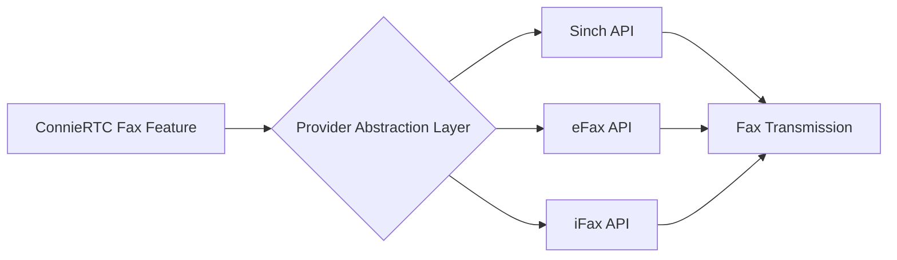

# Choose Your Fax Provider

ConnieRTC follows a carrier-agnostic philosophy, allowing you to select the fax provider that best meets your nonprofit's specific needs, budget, and compliance requirements.

## Provider Comparison

Choose the provider that best fits your organization's requirements:

| Feature | Sinch **Currently Integrated** | eFax *Planned* | iFax *Planned* |
|---------|-----------------------------------|-------------------|-------------------|
| 📠 **Fax Send/Receive** | ✅ | ✅ | ✅ |
| 🔒 **HIPAA Compliance** | ✅ BAA Available | ✅ BAA Available | ✅ BAA Available |
| 💵 **Nonprofit Pricing** | Volume-based | Subscription | Pay-per-page |
| 📄 **Page Limits** | 200 pages/fax | 180 pages/fax | 100 pages/fax |
| 🌍 **International** | 200+ countries | 50+ countries | 30+ countries |
| 📊 **API Features** | REST + Webhooks | REST API | REST + GraphQL |
| ⚡ **Delivery Speed** | < 2 min average | < 3 min average | < 5 min average |
| 📱 **Mobile Support** | API only | API + SDK | API + SDK |
| 🔧 **Setup Complexity** | Moderate | Simple | Simple |
| ⏰ **Implementation Time** | 30-45 minutes | 20-30 minutes | 20-30 minutes |

---

## 🎯 Provider Selection Guide

### Option A: Sinch (Currently Integrated)
**Perfect for:** Organizations needing high-volume international faxing with advanced API features.

**Key Benefits:**
- ✅ Already integrated with ConnieRTC template
- ✅ Proven reliability at scale
- ✅ Advanced webhook capabilities for real-time status
- ✅ Superior international coverage
- ✅ Volume-based pricing ideal for high-usage nonprofits

**Nonprofit Considerations:**
- Best cost efficiency for 500+ pages/month
- BAA included at no extra cost
- 24/7 technical support included
- API rate limits suitable for bulk operations

**Implementation:** → [Sinch Fax Setup Guide](/developers/building/feature-management/channels/fax/providers/sinch-setup)

---

### Option B: eFax (Planned Integration)
**Perfect for:** Small to medium nonprofits with predictable fax volumes.

**Key Benefits:**
- 🚧 Simple subscription model
- 🚧 Lowest setup complexity
- 🚧 Built-in fax-to-email options
- 🚧 No per-page charges within plan limits
- 🚧 Well-established brand trust

**Nonprofit Considerations:**
- Fixed monthly costs aid budget planning
- Free trial available for testing
- Overage charges apply beyond plan limits
- Best for 100-500 pages/month

**Status:** Integration planned for Q2 2025

---

### Option C: iFax (Planned Integration)
**Perfect for:** Organizations with sporadic fax needs or strict pay-per-use requirements.

**Key Benefits:**
- 🚧 True pay-per-page pricing
- 🚧 No monthly minimums
- 🚧 Modern GraphQL API
- 🚧 Best mobile SDK support
- 🚧 Lowest barrier to entry

**Nonprofit Considerations:**
- No monthly commitment required
- Ideal for < 100 pages/month
- Per-page costs higher than subscription models
- Perfect for seasonal or project-based usage

**Status:** Integration planned for Q3 2025

---

## 🏗️ Integration Architecture

All fax providers integrate with ConnieRTC using a standardized pattern:

### Carrier-Agnostic Benefits:
- **No Vendor Lock-in:** Switch providers without code changes
- **Rate Optimization:** Use multiple providers for best rates
- **Failover Support:** Automatic fallback to secondary provider
- **Unified Interface:** Same ConnieRTC features regardless of provider

---

## 📋 Provider Requirements Checklist

### For All Providers:
- ✅ Dedicated fax number (can port existing)
- ✅ API credentials from provider
- ✅ ConnieRTC admin access
- ✅ Basic understanding of fax compliance requirements

### Provider-Specific Requirements:

#### Sinch:
- ✅ Sinch account with Fax API enabled
- ✅ Service Plan ID and Auth Token
- ✅ Webhook URL configuration access

#### eFax (When Available):
- ✅ eFax Developer account
- ✅ API subscription plan
- ✅ Account identifier and password

#### iFax (When Available):
- ✅ iFax API access
- ✅ API key and secret
- ✅ GraphQL endpoint permissions

---

## 🔒 Compliance & Security Considerations

### HIPAA Compliance:
All three providers offer HIPAA-compliant solutions with signed BAAs:

- **Document Encryption:** All providers use TLS 1.2+ for transmission
- **At-Rest Encryption:** Fax storage encrypted with AES-256
- **Audit Trails:** Complete logging of all fax activities
- **Access Controls:** Role-based permissions supported

### Nonprofit-Specific Compliance:
- **Data Retention:** Configurable policies for all providers
- **International Regulations:** Sinch offers best global compliance
- **PCI Compliance:** Not applicable for fax transmission
- **State Regulations:** All providers meet US state requirements

---

## 💰 Cost Analysis for Nonprofits

### Monthly Volume Scenarios:

| Pages/Month | Sinch | eFax | iFax |
|-------------|-------|------|------|
| 0-100 | $25 base | $19.95/mo | $0.10/page |
| 100-500 | $25 + usage | $19.95/mo | $0.10/page |
| 500-1000 | $45 estimated | $39.95/mo | $0.08/page |
| 1000+ | Volume discount | $69.95/mo | $0.06/page |

:::tip Nonprofit Discounts
Contact each provider directly to inquire about nonprofit pricing. Many offer 15-30% discounts for registered 501(c)(3) organizations.
:::

---

## 🚀 Implementation Timeline

### Currently Available:
- **Sinch:** Full integration ready for deployment

### Roadmap:
- **Q2 2025:** eFax integration and documentation
- **Q3 2025:** iFax integration and documentation
- **Q4 2025:** Multi-provider failover support

---

## 🆘 Making Your Decision

Consider these factors when choosing your fax provider:

1. **Volume:** How many pages per month?
2. **Budget:** Fixed vs. variable costs?
3. **Geography:** Domestic only or international?
4. **Compliance:** HIPAA or other requirements?
5. **Timeline:** Need it now or can wait for planned integrations?

---

## 📞 Ready to Implement?

- **Sinch Users:** → [Continue to Sinch Setup Guide](/developers/building/feature-management/channels/fax/providers/sinch-setup)
- **eFax/iFax Users:** Join our [provider waitlist](https://connie.one/contact) for early access

:::info Professional Services
Need help choosing or implementing a fax provider? Our team can assess your needs and handle the complete setup. Contact your Connie representative for professional services options.
:::

---

## 🔄 Future Provider Additions

ConnieRTC's carrier-agnostic architecture makes it easy to add new providers. If you need a specific fax provider not listed here, please [submit a feature request](https://github.com/ConnieML/connieRTC-flex/issues).

Current provider requests under evaluation:
- RingCentral Fax
- Concord Fax
- SRFax
- MetroFax