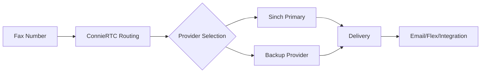

# Fax Implementation Guide

This guide helps you choose and implement the right fax solution for your client within their existing Connie deployment.

## Which Fax Solution Does Your Client Need?

Choose the option that best fits your client's requirements:

| Feature | Option A:<br/>Basic Inbound Fax | Option B:<br/>Bidirectional Fax | Option C:<br/>Full Integration |
|---------|----------------------------------|----------------------------------|--------------------------------|
| 📥 **Receive Faxes** | ✅ | ✅ | ✅ |
| 📤 **Send Faxes** | ❌ | ✅ | ✅ |
| 📧 **Email Delivery** | ✅ | ✅ | ✅ |
| 🔄 **Flex Task Routing** | ❌ | ✅ | ✅ |
| 📎 **PDF Attachments** | ✅ | ✅ | ✅ |
| 🔐 **HIPAA Compliance** | ✅ | ✅ | ✅ |
| 🔧 **Setup Complexity** | Simple | Moderate | Advanced |
| ⚙️ **Provider** | Sinch | Sinch | Sinch + Custom Integration |
| 🕐 **Setup Time** | 20 minutes | 45 minutes | 2-3 hours |

---

## 🎯 Choose Your Implementation Path

### Option A: Basic Inbound Fax
**Perfect for:** Organizations that only need to receive faxes and forward them via email.

**What senders experience:**
- Send fax to dedicated number → Fax converts to PDF → Delivered to email inbox

**What you'll deploy:**
- Sinch fax-to-email configuration
- Dedicated fax number provisioning
- Email routing rules

**Next steps:** → [Set up Basic Inbound Fax](/developers/building/feature-management/channels/fax/basic-fax-setup)

---

### Option B: Bidirectional Fax  
**Perfect for:** Organizations that need to both send and receive faxes with agent tracking.

**What users experience:**
- Receive: Fax arrives → Creates task in Flex → Agent handles fax
- Send: Agent initiates → Uploads document → Sends via Sinch API

**What you'll deploy:**
- Complete Professional Services Template fax feature
- Sinch API integration
- Flex UI components for fax sending
- Task routing for inbound faxes

**Next steps:** → [Set up Bidirectional Fax](/developers/building/feature-management/channels/fax/bidirectional-fax-setup)

---

### Option C: Full Integration
**Perfect for:** Healthcare organizations requiring complete audit trails and EMR integration.

**What users experience:**
- Everything from Option B
- Direct EMR/CRM integration
- Complete audit logging
- Automated document workflows

**What administrators get:**
- Full HIPAA compliance documentation
- Delivery confirmations
- Failed transmission handling
- Automated retry logic
- Document management integration

**What you'll deploy:**
- Everything from Option B
- Custom integration layer
- Enhanced security features
- Compliance reporting

**Next steps:** → [Set up Full Fax Integration](/developers/building/feature-management/channels/fax/full-integration-setup)

---

## 🚀 Quick Start Prerequisites

### For All Options:
- ✅ Admin access to your organization's Connie deployment
- ✅ Sinch account with fax capabilities
- ✅ Dedicated fax number (can be ported or new)
- ✅ Email addresses for fax delivery

### Additional for Option B:
- ✅ Flex UI deployment access
- ✅ Understanding of task routing configuration

### Additional for Option C:
- ✅ Access to EMR/CRM API documentation
- ✅ Security/compliance team approval
- ✅ Document retention policy defined

---

## 🏗️ Implementation Overview

All fax options leverage **Sinch's carrier-grade fax infrastructure** integrated with ConnieRTC's multi-channel capabilities.

### What You're NOT Doing:
- ❌ Managing physical fax machines
- ❌ Dealing with analog phone lines
- ❌ Building fax protocol handlers

### What You ARE Doing:
- ✅ Configuring Sinch fax services
- ✅ Setting up number routing
- ✅ Enabling template features
- ✅ Testing fax transmission

---

## 📋 Deployment Pattern (All Options)

The deployment pattern follows ConnieRTC standards while incorporating Sinch-specific configuration:

```bash
# 1. Configure Sinch credentials and numbers
# (Templates provided in each guide)

# 2. Deploy serverless functions (if using Options B or C)
cd serverless-functions && npm run deploy

# 3. Apply infrastructure changes
cd infra-as-code/terraform/environments/default
terraform apply -var-file="local.tfvars"

# 4. Test fax transmission
# (Test scripts and numbers provided in each guide)
```

---

## 🔐 Security & Compliance Considerations

### HIPAA Compliance
All fax options are designed with HIPAA compliance in mind:
- ✅ Encrypted transmission (TLS 1.2+)
- ✅ Encrypted storage (if applicable)
- ✅ Audit logging capabilities
- ✅ Access controls via OKTA SSO

### Data Retention
- Configure retention policies based on your requirements
- Automatic purging available for all options
- Compliance reports available for Option C

---

## 📊 Carrier-Agnostic Architecture

ConnieRTC's fax implementation follows our carrier-agnostic philosophy:



This ensures:
- No vendor lock-in
- Automatic failover capabilities
- Rate optimization
- Geographic redundancy

---

## 🆘 Need Help?

- **New to Fax Integration?** Start with Option A for the simplest setup
- **Healthcare/Legal Requirements?** Option C provides full compliance features
- **Contractor/Developer?** Look for "Professional Services" callouts in each guide
- **Troubleshooting?** Every guide includes common issues and solutions

---

## 📠 Ready to Choose?

Click on your preferred option above to get started with step-by-step implementation instructions tailored to your client's fax needs.

:::tip Professional Services Available
If you prefer to have our team handle the implementation, professional services are available for all fax options. Our team has extensive experience with Sinch integration and HIPAA-compliant fax solutions. Contact your Connie representative for details.
:::

:::info Why Sinch for Fax?
ConnieRTC uses Sinch as our primary fax provider because:
- Global coverage with local number support
- 99.9% uptime SLA
- HIPAA-compliant infrastructure
- RESTful API for easy integration
- Competitive pricing for nonprofits
:::

---

## 📈 Fax Volume Considerations

Choose your implementation based on expected volume:

| Monthly Volume | Recommended Option | Rationale |
|----------------|-------------------|-----------|
| < 100 faxes | Option A | Simple email delivery sufficient |
| 100-1000 faxes | Option B | Task routing helps manage volume |
| > 1000 faxes | Option C | Automation and integration critical |

---

## 🔄 Migration from Traditional Fax

If your client currently uses traditional fax machines:

1. **Number Porting**: We can port existing fax numbers to Sinch
2. **Parallel Operation**: Run both systems during transition
3. **Training**: Each option includes training materials
4. **Support**: 30-day post-migration support included

Contact your Connie representative to discuss migration planning.