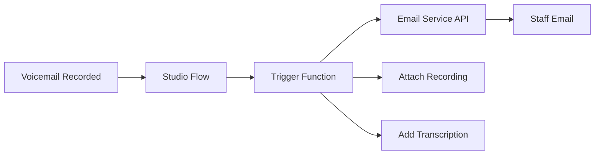

# Email Notifications Add-On

Send voicemail recordings and transcripts directly to staff email addresses when messages are left.

## What It Does
- Automatically emails voicemail recordings as MP3 attachments
- Includes caller information (number, timestamp, duration)
- Optional: Include transcription text in email body
- Supports multiple recipient addresses
- Customizable email templates

## When to Use
- Organizations that prefer email-centric workflows
- Need immediate notification of voicemails
- Staff work primarily from email
- Want backup delivery method for messages
- Compliance requires email trails

## Compatible Workflows
- ✅ **Direct + Options**: Email notifications for voicemail option
- ✅ **Direct to Voicemail**: Email every recorded message
- ⚠️ **Direct**: Only applicable if voicemail add-on also enabled

## Technical Implementation

### Email Service Providers

Choose from supported providers:

| Provider | Free Tier | Setup Complexity | Best For |
|----------|-----------|------------------|----------|
| **Mailgun** | 100 emails/day | Simple | Most organizations |
| **SendGrid** | 100 emails/day | Simple | High deliverability needs |
| **SMTP2GO** | 1,000 emails/month | Moderate | *Coming Soon* |

### Architecture Overview



### Setup Steps

#### Option 1: Mailgun Setup (Recommended)

**Step 1: Create Mailgun Account**
1. Go to [mailgun.com](https://mailgun.com) and create an account
2. Choose **US** region (recommended for most organizations)
3. Verify your email and complete account setup

**Step 2: Add Your Domain**
Use a dedicated subdomain for best deliverability:
- **Recommended format**: `voicemail.[yourdomain].com`
- **Example**: If your domain is `helpinghand.org`, use `voicemail.helpinghand.org`

1. In Mailgun dashboard → **Sending** → **Domains**
2. Click **Add New Domain**
3. Enter: `voicemail.[YOUR_DOMAIN]`
4. Select **US** region
5. Click **Add Domain**

**Step 3: Configure DNS Records**
Mailgun will provide DNS records. Add these to your domain:

```dns
# Example DNS records (yours will be different)
Type: TXT
Name: voicemail.helpinghand.org
Value: v=spf1 include:mailgun.org ~all

Type: TXT  
Name: smtp._domainkey.voicemail.helpinghand.org
Value: k=rsa; p=MIGfMA0GCSqGSIb3DQEBAQUAA4GNADCBiQ...

Type: CNAME
Name: email.voicemail.helpinghand.org
Value: mailgun.org

Type: MX
Name: voicemail.helpinghand.org
Value: 10 mxa.mailgun.org
```

:::warning DNS Propagation Time
DNS changes take 1-24 hours to propagate. Check verification status in Mailgun dashboard.
:::

**Step 4: Get Your Sending API Key**

:::warning Critical: Use Domain-Specific Sending Key
**Do NOT use the Private API key from Settings → API Keys.** You need a domain-specific sending key.
:::

After your domain is verified:
1. Navigate to your domain: Mailgun dashboard → **Sending** → **Domains**
2. Click on your domain (e.g., `voicemail.yourdomain.com`)
3. Go to **Domain settings** → **Sending keys** tab
4. Click **Add sending key**
5. Copy both the **Key ID** and **API Send Key**
6. Use the **API Send Key** for your `MAILGUN_API_KEY` environment variable

**Step 5: Test Mailgun Configuration**

:::danger Critical: Test Before Deployment
This step prevents 90% of setup failures.
:::

```bash
# Test your Mailgun API before proceeding
curl -s -w "\nHTTP Status: %{http_code}\n" --user "api:[YOUR_SENDING_API_KEY]" \
    https://api.mailgun.net/v3/[YOUR_DOMAIN]/messages \
    -F from='Test <test@[YOUR_DOMAIN]>' \
    -F to='[ADMIN_EMAIL]' \
    -F subject='Pre-Deployment API Test' \
    -F text='If you receive this, Mailgun API is working correctly.'
```

**Expected result:**
```json
{"id":"<20250722104855.38483d1186b94dc9@yourdomain.com>","message":"Queued. Thank you."}
HTTP Status: 200
```

#### Option 2: SendGrid Setup

1. Create SendGrid account at [sendgrid.com](https://sendgrid.com)
2. Verify your sender identity (domain or single sender)
3. Create an API key with "Mail Send" permissions
4. Configure DNS records for domain authentication
5. Test API connectivity

#### Option 3: SMTP2GO Setup *(Coming Soon)*

SMTP2GO integration is planned for a future release.

2. **Configure Serverless Function**
   ```javascript
   // Basic email notification function
   exports.handler = async (context, event, callback) => {
     const { recording_url, caller_number, duration } = event;
     
     // Format email content
     const emailData = {
       to: context.NOTIFICATION_EMAIL,
       subject: `New voicemail from ${caller_number}`,
       html: `
         <h3>New Voicemail Message</h3>
         <p><strong>From:</strong> ${caller_number}</p>
         <p><strong>Duration:</strong> ${duration} seconds</p>
         <p><strong>Time:</strong> ${new Date().toLocaleString()}</p>
       `,
       attachments: [{
         filename: 'voicemail.mp3',
         path: recording_url
       }]
     };
     
     // Send via email service
     await sendEmail(emailData);
     callback(null, 'Email sent successfully');
   };
   ```

3. **Update Studio Flow**
   - Add webhook widget after recording
   - Pass recording URL and caller data
   - Handle email delivery confirmation

4. **Configure Environment Variables**
   ```bash
   MAILGUN_API_KEY=your_mailgun_key
   MAILGUN_DOMAIN=your_domain.mailgun.org
   NOTIFICATION_EMAIL=admin@yourorg.org
   ```

## Email Template Customization

### Basic Template
```html
<h2>New Voicemail Message</h2>
<p><strong>From:</strong> {{caller_number}}</p>
<p><strong>Duration:</strong> {{duration}} seconds</p>
<p><strong>Received:</strong> {{timestamp}}</p>
{{#if transcription}}
<h3>Message Transcript:</h3>
<p>{{transcription}}</p>
{{/if}}
<p>Audio recording is attached.</p>
```

### Professional Template
```html
<div style="font-family: Arial, sans-serif; max-width: 600px;">
  <header style="background: #f4f4f4; padding: 20px;">
    <h2>{{organization_name}} - New Voicemail</h2>
  </header>
  <main style="padding: 20px;">
    <h3>Message Details</h3>
    <table>
      <tr><td><strong>Caller:</strong></td><td>{{caller_number}}</td></tr>
      <tr><td><strong>Duration:</strong></td><td>{{duration}} seconds</td></tr>
      <tr><td><strong>Received:</strong></td><td>{{timestamp}}</td></tr>
    </table>
    {{#if transcription}}
    <h3>Transcript</h3>
    <div style="background: #f9f9f9; padding: 15px; border-left: 4px solid #007cba;">
      {{transcription}}
    </div>
    {{/if}}
  </main>
</div>
```

## Configuration Options

### Multiple Recipients
```javascript
const recipients = [
  'admin@yourorg.org',
  'support@yourorg.org',
  'manager@yourorg.org'
];
```

### Conditional Routing
Route emails based on criteria:
```javascript
// Route by time of day
const isBusinessHours = checkBusinessHours();
const recipientEmail = isBusinessHours ? 
  context.BUSINESS_HOURS_EMAIL : 
  context.AFTER_HOURS_EMAIL;

// Route by caller type  
const isKnownCaller = await checkCRM(caller_number);
const priority = isKnownCaller ? 'high' : 'normal';
```

### Attachment Options
```javascript
const attachments = [];

// Always include recording
attachments.push({
  filename: `voicemail_${timestamp}.mp3`,
  path: recording_url
});

// Optionally include transcript as text file
if (transcription) {
  attachments.push({
    filename: 'transcript.txt',
    content: transcription
  });
}
```

## Integration with Other Add-Ons

### With Transcription Add-On
```javascript
// Include transcription in email body
if (event.transcription) {
  emailData.html += `
    <h3>Message Transcript:</h3>
    <p>${event.transcription}</p>
  `;
}
```

### With CRM Integration
```javascript
// Include caller context from CRM
const callerInfo = await lookupCaller(caller_number);
if (callerInfo) {
  emailData.html += `
    <h3>Caller Information:</h3>
    <p><strong>Name:</strong> ${callerInfo.name}</p>
    <p><strong>Account:</strong> ${callerInfo.account_id}</p>
  `;
}
```

## Troubleshooting

### Common Issues

**Emails not being sent**
- Check email service API credentials
- Verify webhook URLs are accessible
- Review serverless function logs

**Attachments missing**
- Confirm recording URL is accessible
- Check file size limits (typically 25MB)
- Verify audio format compatibility  

**Emails going to spam**
- Configure SPF/DKIM records
- Use professional from address
- Avoid spam trigger words in subject

### Performance Optimization

**Large Recording Files**
```javascript
// Check file size before attaching
const fileSize = await getRecordingSize(recording_url);
if (fileSize > 10 * 1024 * 1024) { // 10MB limit
  // Include download link instead of attachment
  emailData.html += `
    <p><a href="${recording_url}">Download Recording</a></p>
  `;
} else {
  emailData.attachments = [{ filename: 'voicemail.mp3', path: recording_url }];
}
```

**Rate Limiting**
```javascript
// Implement exponential backoff for retries
const retry = async (fn, attempts = 3) => {
  try {
    return await fn();
  } catch (error) {
    if (attempts > 1) {
      await sleep(1000 * (4 - attempts)); // Backoff delay
      return retry(fn, attempts - 1);
    }
    throw error;
  }
};
```

## Best Practices

### Security
- Use environment variables for API keys
- Validate webhook signatures
- Sanitize email content
- Implement rate limiting

### Reliability
- Add retry logic for failed sends
- Log all email attempts
- Monitor delivery rates
- Have backup notification methods

### Compliance
- Include opt-out mechanisms
- Respect email retention policies
- Log email delivery for audit trails
- Follow GDPR/privacy requirements