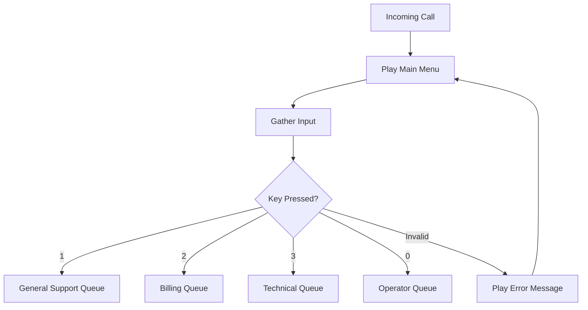

# IVR Functions Add-On

Create interactive voice response (IVR) menus with "Press 1 for X, Press 2 for Y" functionality to route calls to different departments or services.

## What It Does
- Present callers with menu options via voice prompts
- Route calls based on keypad selections
- Support multi-level menus (submenus)
- Provide different services/departments routing
- Handle invalid selections gracefully

## When to Use
- Multi-department organizations
- Different service offerings requiring different handling
- Need to pre-qualify or categorize callers
- Want to reduce agent workload through self-service options
- Professional call routing requirements

## Compatible Workflows
- ✅ **Direct + Options**: Add department routing before queuing
- ✅ **Direct to Voicemail**: Route to different voicemail boxes
- ✅ **Direct**: Add menu before connecting to agents

## Technical Implementation

### Menu Structure Examples

#### Simple Department Routing
```
"Thank you for calling. Please select from the following options:
Press 1 for General Support
Press 2 for Billing Questions  
Press 3 for Technical Support
Press 0 to speak with an operator"
```

#### Service-Based Routing
```
"Welcome to Community Services. 
Press 1 for Food Assistance
Press 2 for Housing Support
Press 3 for Job Training Programs
Press 4 for Mental Health Resources
Press 9 to repeat this menu"
```

#### Multi-Level Menu
```
Main Menu → "Press 1 for Client Services"
  └─ Submenu → "Press 1 for New Clients, Press 2 for Existing Clients"

Main Menu → "Press 2 for Provider Services"  
  └─ Submenu → "Press 1 for Referrals, Press 2 for Training"
```

### Studio Flow Configuration



### Setup Steps

1. **Design Menu Structure**
   ```json
   {
     "main_menu": {
       "prompt": "Please select from the following options...",
       "options": {
         "1": {"label": "General Support", "action": "queue:general"},
         "2": {"label": "Billing", "action": "queue:billing"},
         "3": {"label": "Technical", "action": "queue:technical"},
         "0": {"label": "Operator", "action": "queue:operator"},
         "9": {"label": "Repeat Menu", "action": "repeat"}
       },
       "timeout": 10,
       "max_attempts": 3
     }
   }
   ```

2. **Create Voice Prompts**
   - Professional text-to-speech (Polly-Matthew-Neural)
   - Custom recorded prompts
   - Multi-language support

3. **Configure Studio Flow Widgets**
   - **Play Widget**: Menu prompts
   - **Gather Widget**: Capture keypad input
   - **Split Widget**: Route based on selection
   - **Queue Widget**: Send to appropriate agent queue

4. **Set Up TaskRouter Queues**
   ```json
   [
     {
       "queue_name": "General_Support",
       "target_workers": "routing.skills HAS 'general'",
       "priority": 1
     },
     {
       "queue_name": "Billing_Support", 
       "target_workers": "routing.skills HAS 'billing'",
       "priority": 2
     },
     {
       "queue_name": "Technical_Support",
       "target_workers": "routing.skills HAS 'technical'", 
       "priority": 1
     }
   ]
   ```

## Advanced Features

### Business Hours Routing
Route differently based on time:
```javascript
const isBusinessHours = checkBusinessHours();
const menuOptions = isBusinessHours ? 
  businessHoursMenu : afterHoursMenu;
```

### Dynamic Menu Content
Update menus based on external data:
```javascript
// Check system status
const systemStatus = await checkSystemHealth();
if (systemStatus.technical === 'down') {
  // Remove technical support option
  delete menuOptions['3'];
  // Add notice about technical issues
  menuPrompt += " Technical support is currently unavailable.";
}
```

### Call Volume Based Routing
```javascript
const queueStats = await getQueueStatistics();
const generalWaitTime = queueStats.general.avg_wait_time;

if (generalWaitTime > 300) { // 5 minutes
  menuPrompt += " General support is experiencing longer than usual wait times.";
}
```

### Self-Service Options
```javascript
// Add self-service options to reduce agent load
const selfServiceMenu = {
  "4": {"label": "Check Account Balance", "action": "self_service:balance"},
  "5": {"label": "Make a Payment", "action": "self_service:payment"},
  "6": {"label": "Update Information", "action": "self_service:update"}
};
```

## Menu Best Practices

### Prompt Design
- Keep options to 4-5 maximum per menu
- Use clear, concise language
- Provide option to repeat menu (Press 9)
- Always include operator option (Press 0)
- State most common options first

### Timing Configuration
```json
{
  "gather_timeout": 10,
  "max_attempts": 3,
  "inter_digit_timeout": 3,
  "finish_on_key": "#"
}
```

### Error Handling
```
First attempt: "I didn't catch that. Please press 1 for..."
Second attempt: "Please select a valid option from the menu..."
Third attempt: "I'll connect you with an operator who can help."
```

## Integration with Other Add-Ons

### With Custom Greetings
```javascript
// Personalized greeting before menu
const greeting = await getCustomGreeting({
  time_of_day: new Date().getHours(),
  caller_number: event.From,
  organization: context.ORG_NAME
});
```

### With CRM Integration
```javascript
// Skip menu for VIP callers
const callerInfo = await lookupCaller(event.From);
if (callerInfo && callerInfo.vip_status) {
  // Route directly to priority queue
  return routeToQueue('vip_support');
}
```

### With Transcription
```javascript
// Log menu selections for analysis
await logInteraction({
  caller: event.From,
  menu_path: ['main', 'option_2', 'billing'],
  timestamp: new Date()
});
```

## Multi-Language Support

### Language Selection Menu
```
"Para Español, presiona 1. For English, press 2."
```

### Dynamic Language Routing
```javascript
const detectLanguage = async (caller_number) => {
  const history = await getCallerHistory(caller_number);
  return history.preferred_language || 'en';
};

const language = await detectLanguage(event.From);
const menuPrompts = getMenuPrompts(language);
```

## Analytics and Optimization

### Menu Performance Tracking
```javascript
// Track menu usage patterns
const analytics = {
  total_calls: 1000,
  menu_selections: {
    option_1: 450, // 45%
    option_2: 200, // 20% 
    option_3: 150, // 15%
    timeout: 100,  // 10% - may need clearer prompts
    invalid: 100   // 10% - consider menu redesign
  }
};
```

### A/B Testing Menus
```javascript
// Test different menu structures
const testGroup = hash(event.From) % 2;
const menuVersion = testGroup === 0 ? 'menu_a' : 'menu_b';
```

## Troubleshooting

### Common Issues

**Callers not hearing menu options**
- Check audio file formats and bitrates
- Verify Studio Flow widget configuration
- Test from different phone types

**Invalid key presses not handled**  
- Configure proper timeout settings
- Add error handling for invalid selections
- Provide clear instructions

**Menu loops or hangs**
- Check Studio Flow transitions
- Verify Gather widget timeout settings
- Add maximum attempt limits

### Performance Optimization

**Menu Load Times**
- Cache frequently used prompts
- Optimize audio file sizes
- Use CDN for prompt delivery

**Queue Distribution**
- Monitor queue wait times
- Adjust routing based on capacity
- Implement overflow routing

## Advanced Configurations

### Conditional Menus
```javascript
// Different menus based on caller type
const callerSegment = await identifyCallerSegment(event.From);
const menuConfig = getMenuForSegment(callerSegment);
```

### Time-Based Routing
```javascript
// Route differently during peak hours
const isPeakTime = checkPeakHours();
if (isPeakTime) {
  // Offer callback options prominently
  menuConfig.options['1'] = {
    label: "Request a callback to avoid wait times",
    action: "callback"
  };
}
```

### Integration with External Systems
```javascript
// Check external system availability
const systemStatus = await checkExternalSystems();
menuConfig.options = menuConfig.options.filter(option => 
  systemStatus[option.system] === 'available'
);
```