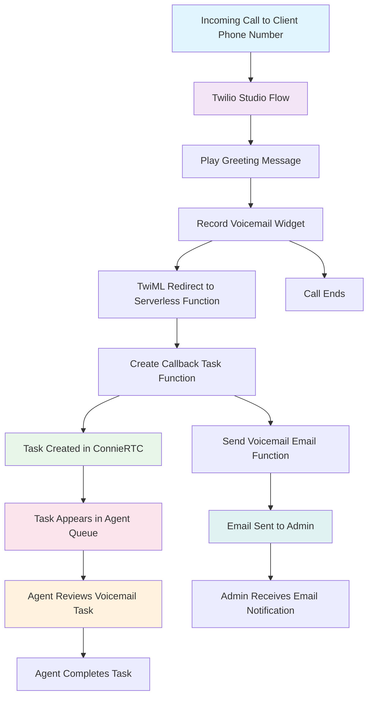
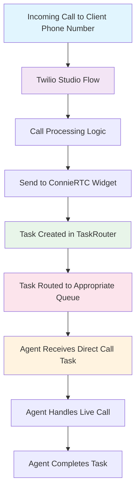

# ConnieRTC Voice Direct Service Architecture

This document provides generic, client-agnostic Mermaid diagrams that illustrate the ConnieRTC Voice Direct service architecture for developer documentation and implementation reference.

## Overview

ConnieRTC Voice Direct services provide two primary workflows for handling incoming voice calls:

1. **Voice Direct + Voicemail**: Auto-routes callers to voicemail with task creation and email notifications
2. **Voice Direct (Basic)**: Direct routing to task queues without voicemail options

Both workflows are designed to be **client-agnostic** and use generic terminology that applies to any ConnieRTC deployment.

## Voice Direct + Voicemail Architecture

This workflow provides a complete voicemail experience with automatic task creation and email notifications to administrators. It's ideal for organizations that need to capture all incoming communications.



### Key Components

- **Client Phone Number**: The customer-facing phone number that routes to the Studio Flow
- **Studio Flow**: Twilio Studio flow that orchestrates the voice experience
- **Serverless Functions**: Backend logic for task creation and email processing
- **ConnieRTC Task Queue**: Where voicemail tasks appear for agent processing
- **Email Service**: Automated notifications sent to administrators

### Process Flow

1. **Call Initiation**: Customer calls the client's phone number
2. **Studio Processing**: Studio flow plays greeting and initiates recording
3. **Voicemail Capture**: Recording widget captures the customer's message
4. **Task Creation**: Serverless function creates a task in ConnieRTC with voicemail details
5. **Email Notification**: Parallel process sends voicemail to admin email as attachment
6. **Agent Processing**: Agent receives task with voicemail recording and handles accordingly

## Voice Direct (Basic) Architecture

This streamlined workflow provides direct routing to ConnieRTC task queues without voicemail capabilities. It's designed for organizations that prefer immediate task creation without hold queues.



### Key Components

- **Client Phone Number**: The customer-facing phone number
- **Studio Flow**: Minimal Studio flow for call routing
- **Send to ConnieRTC Widget**: Studio widget that creates tasks and routes to agents
- **TaskRouter**: Connie's task routing engine
- **Task Queue**: Specific queue based on routing logic

### Process Flow

1. **Call Initiation**: Customer calls the client's phone number
2. **Studio Processing**: Studio flow processes the call with minimal logic
3. **Task Creation**: Send to ConnieRTC widget creates a task immediately
4. **Task Routing**: TaskRouter routes the task to the appropriate queue
5. **Agent Assignment**: Available agent receives the task and connects to the live call
6. **Call Handling**: Agent handles the customer call directly

## Implementation Considerations

### Generic Configuration Parameters

Both workflows use these generic configuration elements:

- **Client Phone Number**: The customer-facing number (varies by client)
- **Studio Flow SID**: References the specific Studio flow
- **Workflow SID**: TaskRouter workflow for routing logic
- **Task Queue**: Target queue for task routing
- **Serverless Function URLs**: Backend processing endpoints

### Environment Variables

```bash
# Generic environment variables (client-specific values)
TWILIO_FLEX_WORKSPACE_SID=WSxxxxxxxxxxxxxxxxxxxxxxxxxxxxxxxx
TWILIO_FLEX_CALLBACK_WORKFLOW_SID=WWxxxxxxxxxxxxxxxxxxxxxxxxxxxxxxxx
ADMIN_EMAIL=admin@client-domain.com
MAILGUN_DOMAIN=voicemail.client-domain.com
MAILGUN_API_KEY=key-xxxxxxxxxxxxxxxxxxxxxxxxxxxxxxxx
```

### Deployment Patterns

1. **Terraform Deployment**: Infrastructure as Code for consistent deployments
2. **Serverless Functions**: Deployed via Twilio CLI or CI/CD pipeline
3. **Studio Flow**: JSON configuration imported into Twilio Studio
4. **ConnieRTC Configuration**: UI attributes and feature flags

## Feature Comparison

| Feature | Voice Direct Basic | Voice Direct + Voicemail |
|---------|-------------------|---------------------------|
| Live Call Handling | ✅ | ❌ |
| Voicemail Recording | ❌ | ✅ |
| Email Notifications | ❌ | ✅ |
| Task Creation | ✅ | ✅ |
| Agent Interface | Standard Call | Voicemail Playback |
| Implementation Complexity | Low | Medium |
| Infrastructure Requirements | Minimal | Functions + Email Service |

## Related Documentation

- [Voice Direct Workflows](./direct.md)
- [Voicemail-Only Configuration](./voicemail-only.md)
- [Callback and Voicemail Feature](../../../feature-library/callback-and-voicemail.md)
- [Email Notifications Setup](../add-ons/email-notifications.md)

## Developer Notes

### Customization Points

- **Greeting Messages**: Modify Studio flow messages for client branding
- **Routing Logic**: Adjust TaskRouter workflows for specific business rules
- **Email Templates**: Customize email notifications with client-specific formatting
- **Task Attributes**: Add custom attributes for client-specific data requirements

### Monitoring and Analytics

- **Studio Flow Metrics**: Monitor call volume and flow completion rates
- **Task Metrics**: Track task creation, assignment, and completion times
- **Email Delivery**: Monitor email notification success rates
- **Agent Performance**: Analyze voicemail processing and response times

### Security Considerations

- **Recording Access**: Voicemail recordings contain sensitive customer data
- **Email Security**: Ensure secure transmission of voicemail attachments
- **API Authentication**: Proper credential management for all service integrations
- **Data Retention**: Implement appropriate retention policies for recordings and tasks

These architecture diagrams provide a foundation for understanding ConnieRTC Voice Direct services and can be customized for specific client implementations while maintaining the core architectural patterns.