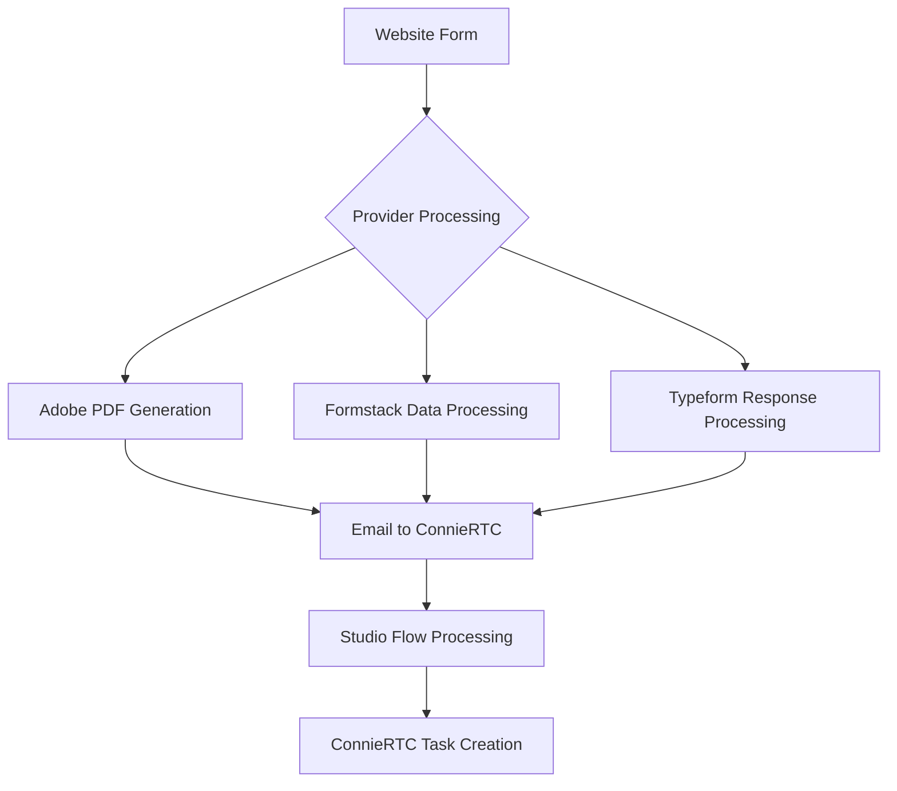
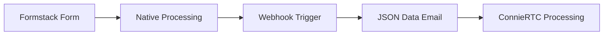

# Choose Your Web Forms Provider

ConnieRTC follows a multi-platform philosophy, allowing you to select the web forms provider that best meets your nonprofit's specific needs, technical requirements, and budget constraints.

## Provider Comparison

Choose the provider that best fits your organization's requirements:

| Feature | Adobe Acrobat Sign<br/>**Currently Integrated** | Formstack<br/>*Planned* | Typeform<br/>*Planned* |
|---------|------------------------------------------------|------------------------|----------------------|
| 📋 **Form Type** | PDF-based professional forms | Web-native HTML forms | Interactive conversational forms |
| 🔒 **HIPAA Compliance** | ✅ BAA Available | ✅ BAA Available | ✅ BAA Available |
| 💵 **Nonprofit Pricing** | $15-25/user/month | $99+/month organization | $35+/month organization |
| 📄 **Form Complexity** | Complex PDF forms | Medium web forms | Simple conversational forms |
| 🌍 **Integration Options** | WordPress + API | Native web widgets | Embed + API |
| 📊 **API Features** | REST + Webhooks | REST + GraphQL | REST + Webhooks |
| ⚡ **Processing Speed** | ~1 min PDF generation | < 30 sec immediate | < 15 sec immediate |
| 📱 **Mobile Support** | Responsive PDF forms | Native mobile responsive | Mobile-first design |
| 🔧 **Setup Complexity** | Moderate (WordPress + Adobe) | Simple (embed code) | Simple (embed code) |
| ⏰ **Implementation Time** | 45-60 minutes | 20-30 minutes | 15-25 minutes |

---

## 🎯 Provider Selection Guide

### Option A: Adobe Acrobat Sign (Currently Integrated)
**Perfect for:** Organizations needing professional PDF documentation with complex form workflows.

**Key Benefits:**
- ✅ Already integrated with ConnieRTC template
- ✅ Professional PDF generation and branding
- ✅ Proven reliability in production (Hospital 2 Home)
- ✅ WordPress integration with validation layer
- ✅ Complete form field preservation
- ✅ Professional document presentation

**Nonprofit Considerations:**
- Best for intake forms requiring signatures and documentation
- Professional appearance builds trust with clients
- PDF documents suitable for record-keeping and compliance
- Integration with existing WordPress websites
- Higher monthly cost but professional value

**Technical Requirements:**
- WordPress website with form builder plugin
- Adobe Acrobat Sign Professional subscription
- Email routing configuration
- Studio Flow deployment

**Implementation:** → [Adobe Acrobat Sign Setup Guide](/developers/backend/web/adobe-implementation)

---

### Option B: Formstack (Planned Integration)
**Perfect for:** Organizations needing flexible web-native forms with advanced conditional logic.

**Key Benefits:**
- 🚧 Native web forms with no PDF conversion needed
- 🚧 Advanced conditional logic and branching
- 🚧 Built-in analytics and form optimization
- 🚧 Multiple integration options (API, webhooks, Zapier)
- 🚧 A/B testing capabilities for form optimization

**Nonprofit Considerations:**
- Fixed monthly organizational pricing
- Best for high-volume form submissions
- Advanced reporting and analytics included
- No per-submission costs
- Great for surveys and feedback collection

**Status:** Integration planned for Q2 2025

---

### Option C: Typeform (Planned Integration)
**Perfect for:** Organizations wanting engaging, conversational form experiences.

**Key Benefits:**
- 🚧 Conversational form interface increases completion rates
- 🚧 Mobile-first design philosophy
- 🚧 Beautiful, engaging user experience
- 🚧 Logic jumps and personalized questions
- 🚧 Built-in analytics and insights

**Nonprofit Considerations:**
- Highest completion rates due to engaging design
- Best for client-facing forms and surveys
- Modern, accessible interface
- Good free tier for testing
- Ideal for feedback and intake screening

**Status:** Integration planned for Q3 2025

---

## 🏗️ Integration Architecture

All web forms providers integrate with ConnieRTC using a standardized email-to-task pattern:



### Multi-Platform Benefits:
- **No Vendor Lock-in:** Switch providers without changing ConnieRTC configuration
- **Form Optimization:** Use different providers for different form types
- **Unified Processing:** Same ConnieRTC task handling regardless of provider
- **Consistent Experience:** Staff see uniform task presentation

---

## 📋 Provider Requirements Checklist

### For All Providers:
- ✅ Website platform for form embedding
- ✅ ConnieRTC admin access with email channel configured
- ✅ Dedicated email addresses for form routing (e.g., `forms@connie.host`)
- ✅ Studio Flow deployment capability
- ✅ Staff training on form task processing

### Provider-Specific Requirements:

#### Adobe Acrobat Sign:
- ✅ WordPress website with form builder plugin
- ✅ Adobe Acrobat Sign Professional subscription
- ✅ Developer account with API access
- ✅ Email routing configuration capability

#### Formstack (When Available):
- ✅ Formstack account with appropriate plan
- ✅ Webhook configuration permissions
- ✅ API access credentials
- ✅ Form embed capability on website

#### Typeform (When Available):
- ✅ Typeform account with Professional features
- ✅ Webhook configuration access
- ✅ Custom redirect capability
- ✅ API integration permissions

---

## 🔒 Compliance & Security Considerations

### HIPAA Compliance:
All three providers offer HIPAA-compliant solutions with appropriate safeguards:

- **Data Encryption:** All providers use TLS 1.2+ for form transmission
- **At-Rest Encryption:** Form data encrypted with AES-256 standards
- **Audit Trails:** Complete logging of form submissions and processing
- **Access Controls:** Role-based permissions for form data access

### Nonprofit-Specific Compliance:
- **Data Retention:** Configurable policies for form submission storage
- **Privacy Controls:** Built-in consent management and privacy notices
- **International Regulations:** GDPR and similar privacy law compliance
- **Accessibility:** WCAG 2.1 AA compliance for all form interfaces

---

## 💰 Cost Analysis for Nonprofits

### Monthly Cost Scenarios:

| Submissions/Month | Adobe Acrobat Sign | Formstack | Typeform |
|------------------|-------------------|-----------|----------|
| 0-100 | $15-25/user | $99/org base | $35/org base |
| 100-500 | $15-25/user | $99/org | $35/org |
| 500-1000 | $25/user + volume | $199/org | $70/org |
| 1000+ | Enterprise pricing | $399/org | $135/org |

### Hidden Costs to Consider:
- **Adobe:** WordPress hosting, plugin licensing, PDF storage
- **Formstack:** Advanced features, additional users, integrations
- **Typeform:** Response limits, advanced logic, custom branding

:::tip Nonprofit Discounts
Contact each provider directly to inquire about nonprofit pricing. Many offer 15-50% discounts for registered 501(c)(3) organizations.
:::

---

## 🚀 Implementation Timeline

### Currently Available:
- **Adobe Acrobat Sign:** Full integration ready for deployment with proven production success

### Roadmap:
- **Q2 2025:** Formstack integration and documentation
- **Q3 2025:** Typeform integration and documentation  
- **Q4 2025:** Multi-provider form routing and advanced analytics

---

## 🛠️ Technical Implementation Patterns

### Email-Based Processing (All Providers)
```javascript
// Common workflow pattern for all providers
Form Submission → Provider Processing → Email Notification → 
Studio Flow → Task Creation → Staff Assignment
```

### Provider-Specific Processing:

#### Adobe Acrobat Sign:


#### Formstack (Planned):


#### Typeform (Planned):


---

## 🎯 Use Case Recommendations

### Choose Adobe Acrobat Sign For:
- **Professional Intake Forms:** Require signatures and official documentation
- **Legal Documents:** Need PDF generation for compliance and records
- **Complex Forms:** Multi-page forms with detailed information collection
- **Branding Requirements:** Professional appearance essential for organizational credibility

### Choose Formstack For:
- **High-Volume Submissions:** Processing hundreds of forms monthly
- **Conditional Logic:** Forms that branch based on user responses
- **Analytics Needs:** Detailed reporting on form performance
- **Integration Requirements:** Need to connect with multiple systems

### Choose Typeform For:
- **User Experience Priority:** Completion rates are critical
- **Mobile-First Forms:** Primarily mobile users
- **Engagement Focus:** Forms need to feel conversational
- **Simple Data Collection:** Straightforward information gathering

---

## 🆘 Making Your Decision

Consider these factors when choosing your web forms provider:

1. **Form Complexity:** Simple data collection vs. complex documentation?
2. **Volume:** How many submissions per month?
3. **Budget:** User-based vs. organization-based pricing?
4. **User Experience:** Professional documentation vs. engaging interaction?
5. **Technical Resources:** WordPress integration vs. simple embed?
6. **Compliance:** PDF documentation requirements?

---

## 📞 Ready to Implement?

- **Adobe Users:** → [Continue to Adobe Setup Guide](/developers/backend/web/adobe-implementation)
- **Formstack/Typeform Users:** Join our [provider waitlist](https://connie.one/contact) for early access
- **Need Guidance:** [Schedule consultation](https://connie.one/contact) with our implementation team

:::info Professional Services
Need help choosing or implementing a web forms provider? Our team can assess your needs and handle the complete setup including WordPress configuration, Adobe integration, and staff training. Contact your Connie representative for professional services options.
:::

---

## 🔄 Future Provider Additions

ConnieRTC's flexible architecture makes it easy to add new web forms providers. If you need a specific provider not listed here, please [submit a feature request](https://github.com/ConnieML/connieRTC-flex/issues).

Current provider requests under evaluation:
- Google Forms (limitations: no HIPAA compliance)
- JotForm (HIPAA-compliant option)
- Wufoo (legacy support consideration)
- Cognito Forms (comprehensive feature set)
- Gravity Forms (WordPress native)