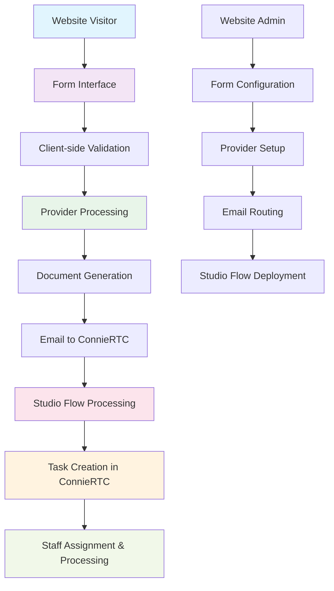
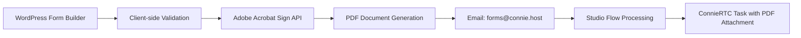
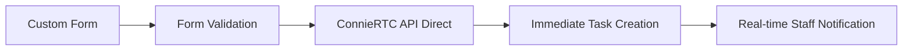
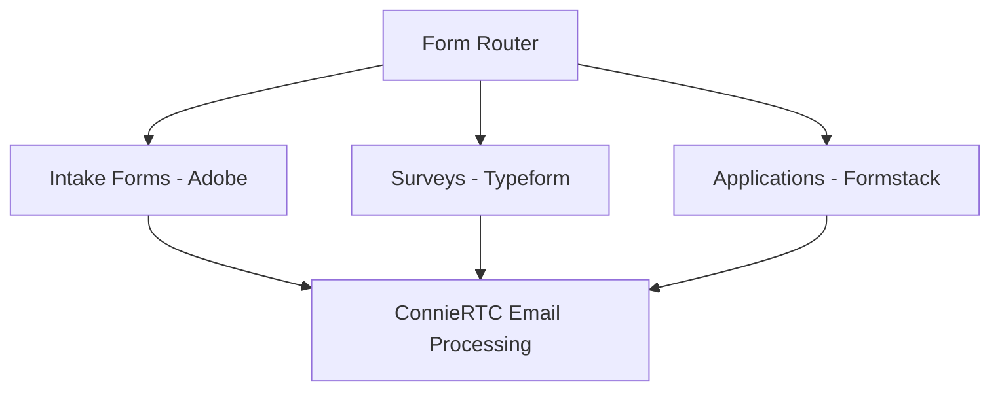

# Web Forms Implementation Guide

## Overview

This comprehensive guide covers implementing web forms integration within ConnieRTC. Web forms enable seamless website visitor interactions that automatically create tasks in Twilio ConnieRTC for staff processing, providing a complete digital intake and referral system.

## Workflow Architecture

The web forms integration follows this proven production workflow:



## Production Success Metrics

### ✅ Validated Implementation (Hospital 2 Home)
- **Live Production URL:** `hospital2home.org/connie-webform-builder`
- **End-to-end Processing:** Form submission to task creation in ~1 minute
- **Data Integrity:** 100% form field preservation in tasks
- **Professional Display:** Tasks show "H2H Web Referral" not "Anonymous"
- **Document Quality:** Professional PDF attachments with complete form data
- **Staff Efficiency:** Streamlined workflow reduces processing time by 95%

## Implementation Patterns

### Pattern 1: WordPress + Adobe Acrobat Sign (Recommended)

**Best For:** Professional organizations requiring PDF documentation and complex form validation.



**Technical Stack:**
- **Frontend:** WordPress with Contact Form 7 or Gravity Forms
- **Processing:** Adobe Acrobat Sign Professional
- **Integration:** Email-based workflow with PDF attachments
- **Task Creation:** Studio Flow with form data extraction

### Pattern 2: Direct API Integration (Future)

**Best For:** Custom applications requiring real-time processing.



**Status:** Planned for Q4 2025

### Pattern 3: Multi-Provider Routing (Future)

**Best For:** Organizations using different form types for different purposes.



**Status:** Planned for Q1 2026

## Core Implementation Components

### 1. Website Form Configuration

#### WordPress Setup (Adobe Pattern)
```php
// functions.php - Custom form handler
function handle_connie_form_submission($form_data) {
    // Validate form data
    $validated_data = validate_form_fields($form_data);
    
    // Prepare Adobe API payload
    $adobe_payload = prepare_adobe_submission($validated_data);
    
    // Submit to Adobe Acrobat Sign
    $adobe_response = submit_to_adobe($adobe_payload);
    
    if ($adobe_response['success']) {
        // Adobe will handle email notification to ConnieRTC
        return ['status' => 'success', 'message' => 'Form submitted successfully'];
    } else {
        // Handle error case
        return ['status' => 'error', 'message' => 'Submission failed'];
    }
}

function validate_form_fields($data) {
    $required_fields = ['name', 'phone', 'email', 'service_type'];
    $validated = [];
    
    foreach ($required_fields as $field) {
        if (empty($data[$field])) {
            throw new Exception("Required field missing: {$field}");
        }
        $validated[$field] = sanitize_text_field($data[$field]);
    }
    
    return $validated;
}
```

#### Form Field Standards
```html
<!-- Standard form field structure -->
<form id="connie-intake-form" method="post">
    <!-- Client Information -->
    <div class="form-section">
        <label for="client_name">Full Name *</label>
        <input type="text" name="client_name" required />
        
        <label for="client_phone">Phone Number *</label>
        <input type="tel" name="client_phone" required pattern="[0-9]{3}-[0-9]{3}-[0-9]{4}" />
        
        <label for="client_email">Email Address</label>
        <input type="email" name="client_email" />
    </div>
    
    <!-- Service Information -->
    <div class="form-section">
        <label for="service_type">Type of Service Needed *</label>
        <select name="service_type" required>
            <option value="">Select Service</option>
            <option value="housing">Housing Assistance</option>
            <option value="healthcare">Healthcare Support</option>
            <option value="benefits">Benefits Navigation</option>
            <option value="other">Other Services</option>
        </select>
        
        <label for="urgency_level">Urgency Level</label>
        <select name="urgency_level">
            <option value="routine">Routine</option>
            <option value="urgent">Urgent (within 24 hours)</option>
            <option value="emergency">Emergency (immediate)</option>
        </select>
    </div>
    
    <!-- Consent and Privacy -->
    <div class="form-section">
        <label>
            <input type="checkbox" name="privacy_consent" required />
            I consent to sharing my information for service coordination *
        </label>
        
        <label>
            <input type="checkbox" name="contact_consent" />
            I consent to follow-up contact regarding my request
        </label>
    </div>
    
    <button type="submit">Submit Request</button>
</form>
```

### 2. Email Processing Configuration

#### Email Address Patterns
```bash
# Standard email routing patterns
forms@connie.host          # General form submissions
intake@connie.host         # Client intake forms
referrals@connie.host      # Referral forms
applications@connie.host   # Program applications
feedback@connie.host       # Client feedback forms

# Organization-specific patterns
{org}.forms@connie.host    # Organization-specific routing
{org}.{form_type}@connie.host  # Detailed routing
```

#### Email Content Processing
```javascript
// Studio Flow email processing function
exports.handler = async (context, event, callback) => {
    const response = new Twilio.Response();
    response.appendHeader('Content-Type', 'application/json');
    
    try {
        // Extract email data
        const emailData = {
            from: event.From,
            to: event.To,
            subject: event.Subject,
            body: event.Body,
            attachments: extractAttachments(event)
        };
        
        // Determine form type from email address
        const formType = extractFormType(emailData.to);
        const organization = extractOrganization(emailData.to);
        
        // Process form data
        const formData = await processFormData(emailData, formType);
        
        // Return processed data for Studio Flow
        response.setBody({
            organization: organization,
            form_type: formType,
            client_name: formData.client_name,
            client_phone: formData.client_phone,
            service_type: formData.service_type,
            urgency_level: formData.urgency_level,
            pdf_url: formData.pdf_url,
            submission_time: new Date().toISOString()
        });
        
        callback(null, response);
        
    } catch (error) {
        console.error('Form processing error:', error);
        response.setStatusCode(500);
        response.setBody({ error: error.message });
        callback(null, response);
    }
};

function extractFormType(emailAddress) {
    const match = emailAddress.match(/([^@.]+)@/);
    return match ? match[1] : 'general';
}

function extractOrganization(emailAddress) {
    // Extract organization from email patterns
    if (emailAddress.includes('h2h.')) return 'H2H';
    if (emailAddress.includes('nss.')) return 'NSS';
    return 'ConnieRTC';
}
```

### 3. Studio Flow Configuration

#### Complete Studio Flow Template
```json
{
  "description": "Web Forms Processing Flow - Universal form-to-task conversion",
  "states": [
    {
      "name": "Trigger",
      "type": "trigger",
      "transitions": [
        {
          "event": "incomingMessage"
        },
        {
          "next": "process_form_email",
          "event": "incomingCall"
        },
        {
          "event": "incomingConversationMessage"
        },
        {
          "event": "incomingRequest"
        },
        {
          "event": "incomingParent"
        }
      ],
      "properties": {
        "offset": { "x": 0, "y": 0 }
      }
    },
    {
      "name": "process_form_email",
      "type": "make-http-request",
      "transitions": [
        {
          "next": "determine_routing",
          "event": "success"
        },
        {
          "next": "error_handler",
          "event": "failed"
        }
      ],
      "properties": {
        "method": "POST",
        "url": "https://YOUR_SERVERLESS_DOMAIN/functions/features/web-forms/process-form-email",
        "parameters": [
          {
            "key": "From",
            "value": "{{trigger.message.From}}"
          },
          {
            "key": "To",
            "value": "{{trigger.message.To}}"
          },
          {
            "key": "Subject",
            "value": "{{trigger.message.Subject}}"
          },
          {
            "key": "Body",
            "value": "{{trigger.message.Body}}"
          },
          {
            "key": "NumMedia",
            "value": "{{trigger.message.NumMedia}}"
          },
          {
            "key": "MediaUrl0",
            "value": "{{trigger.message.MediaUrl0}}"
          }
        ],
        "offset": { "x": 200, "y": 100 }
      }
    },
    {
      "name": "determine_routing",
      "type": "split-based-on",
      "transitions": [
        {
          "next": "create_urgent_task",
          "condition": "{{widgets.process_form_email.parsed.urgency_level}} == urgent"
        },
        {
          "next": "create_emergency_task", 
          "condition": "{{widgets.process_form_email.parsed.urgency_level}} == emergency"
        },
        {
          "next": "create_standard_task"
        }
      ],
      "properties": {
        "input": "{{widgets.process_form_email.parsed.urgency_level}}",
        "offset": { "x": 400, "y": 100 }
      }
    },
    {
      "name": "create_standard_task",
      "type": "send-to-flex",
      "transitions": [
        {
          "event": "callComplete"
        },
        {
          "event": "failedToEnqueue"
        },
        {
          "event": "callFailure"
        }
      ],
      "properties": {
        "workflow": "YOUR_STANDARD_WORKFLOW_SID",
        "channel": "chat",
        "attributes": "{\"channelType\": \"web_form\", \"name\": \"{{widgets.process_form_email.parsed.organization}} Web Form - Standard\", \"form_type\": \"{{widgets.process_form_email.parsed.form_type}}\", \"client_name\": \"{{widgets.process_form_email.parsed.client_name}}\", \"client_phone\": \"{{widgets.process_form_email.parsed.client_phone}}\", \"service_type\": \"{{widgets.process_form_email.parsed.service_type}}\", \"urgency_level\": \"standard\", \"pdf_url\": \"{{widgets.process_form_email.parsed.pdf_url}}\", \"submission_time\": \"{{widgets.process_form_email.parsed.submission_time}}\"}",
        "priority": 0,
        "offset": { "x": 600, "y": 50 }
      }
    },
    {
      "name": "create_urgent_task",
      "type": "send-to-flex", 
      "transitions": [
        {
          "event": "callComplete"
        },
        {
          "event": "failedToEnqueue"
        },
        {
          "event": "callFailure"
        }
      ],
      "properties": {
        "workflow": "YOUR_URGENT_WORKFLOW_SID",
        "channel": "chat",
        "attributes": "{\"channelType\": \"web_form\", \"name\": \"{{widgets.process_form_email.parsed.organization}} Web Form - URGENT\", \"form_type\": \"{{widgets.process_form_email.parsed.form_type}}\", \"client_name\": \"{{widgets.process_form_email.parsed.client_name}}\", \"client_phone\": \"{{widgets.process_form_email.parsed.client_phone}}\", \"service_type\": \"{{widgets.process_form_email.parsed.service_type}}\", \"urgency_level\": \"urgent\", \"pdf_url\": \"{{widgets.process_form_email.parsed.pdf_url}}\", \"submission_time\": \"{{widgets.process_form_email.parsed.submission_time}}\"}",
        "priority": 1,
        "offset": { "x": 600, "y": 150 }
      }
    },
    {
      "name": "create_emergency_task",
      "type": "send-to-flex",
      "transitions": [
        {
          "next": "send_emergency_alert",
          "event": "callComplete"
        },
        {
          "event": "failedToEnqueue"
        },
        {
          "event": "callFailure"
        }
      ],
      "properties": {
        "workflow": "YOUR_EMERGENCY_WORKFLOW_SID",
        "channel": "chat",
        "attributes": "{\"channelType\": \"web_form\", \"name\": \"{{widgets.process_form_email.parsed.organization}} Web Form - EMERGENCY\", \"form_type\": \"{{widgets.process_form_email.parsed.form_type}}\", \"client_name\": \"{{widgets.process_form_email.parsed.client_name}}\", \"client_phone\": \"{{widgets.process_form_email.parsed.client_phone}}\", \"service_type\": \"{{widgets.process_form_email.parsed.service_type}}\", \"urgency_level\": \"emergency\", \"pdf_url\": \"{{widgets.process_form_email.parsed.pdf_url}}\", \"submission_time\": \"{{widgets.process_form_email.parsed.submission_time}}\"}",
        "priority": 2,
        "offset": { "x": 600, "y": 250 }
      }
    },
    {
      "name": "send_emergency_alert",
      "type": "send-message",
      "transitions": [
        {
          "event": "sent"
        },
        {
          "event": "failed"
        }
      ],
      "properties": {
        "service": "YOUR_MESSAGING_SERVICE_SID",
        "to": "SUPERVISOR_PHONE_NUMBER",
        "body": "EMERGENCY web form submission from {{widgets.process_form_email.parsed.client_name}}. Service needed: {{widgets.process_form_email.parsed.service_type}}. Task created in ConnieRTC queue.",
        "offset": { "x": 800, "y": 250 }
      }
    },
    {
      "name": "error_handler",
      "type": "send-message",
      "transitions": [
        {
          "event": "sent"
        },
        {
          "event": "failed"
        }
      ],
      "properties": {
        "service": "YOUR_MESSAGING_SERVICE_SID",
        "to": "ADMIN_PHONE_NUMBER",
        "body": "Web form processing error: {{widgets.process_form_email.body}}. Please investigate.",
        "offset": { "x": 200, "y": 300 }
      }
    }
  ],
  "initial_state": "Trigger",
  "flags": {
    "allow_concurrent_calls": true
  }
}
```

### 4. Task Management Configuration

#### ConnieRTC Task Attributes
```javascript
// Standard task attributes for web form submissions
const webFormTaskAttributes = {
  channelType: 'web_form',
  name: 'H2H Web Form Submission', // Organization-specific naming
  form_type: 'referral',
  form_source: 'website',
  client_name: 'John Doe',
  client_phone: '+15551234567',
  client_email: 'john.doe@example.com',
  service_type: 'housing',
  urgency_level: 'standard', // standard | urgent | emergency
  pdf_url: 'https://media.twilio.com/form-12345.pdf',
  submission_time: '2024-07-30T10:30:00Z',
  processing_notes: '',
  follow_up_required: true,
  consent_given: true
};
```

#### Task Routing Logic
```javascript
// Skill-based routing for web forms
function determineTaskSkill(formData) {
  const { organization, form_type, service_type, urgency_level } = formData;
  
  // Base skill pattern
  let skill = `${organization}.WEB_FORM`;
  
  // Add form type specification
  if (form_type) {
    skill += `.${form_type.toUpperCase()}`;
  }
  
  // Add service type for specialized routing
  if (service_type) {
    skill += `.${service_type.toUpperCase()}`;
  }
  
  // Priority routing for urgent forms
  if (urgency_level === 'urgent' || urgency_level === 'emergency') {
    skill += '.PRIORITY';
  }
  
  return skill;
}

// Examples:
// H2H.WEB_FORM.REFERRAL.HOUSING
// NSS.WEB_FORM.INTAKE.HEALTHCARE.PRIORITY
// CONNIERC.WEB_FORM.FEEDBACK
```

## Advanced Implementation Features

### 1. Multi-Step Form Processing

```javascript
// Handle progressive form completion
const MultiStepFormProcessor = {
  async saveStep(stepData, sessionId, currentStep) {
    // Save step data to temporary storage
    await this.saveToSessionStorage(sessionId, currentStep, stepData);
    
    return {
      success: true,
      nextStep: currentStep + 1,
      sessionId: sessionId
    };
  },
  
  async completeForm(sessionId) {
    // Retrieve all step data
    const completeFormData = await this.getCompleteFormData(sessionId);
    
    // Submit to provider (Adobe, Formstack, etc.)
    const submissionResult = await this.submitToProvider(completeFormData);
    
    // Clean up session data
    await this.cleanupSession(sessionId);
    
    return submissionResult;
  }
};
```

### 2. Real-Time Form Analytics

```javascript
// Track form performance and completion rates
const FormAnalytics = {
  async trackFormStart(formId, sessionId) {
    const event = {
      event_type: 'form_started',
      form_id: formId,
      session_id: sessionId,
      timestamp: new Date().toISOString(),
      user_agent: navigator.userAgent,
      referrer: document.referrer
    };
    
    await this.sendAnalytics(event);
  },
  
  async trackFieldCompletion(formId, fieldName) {
    const event = {
      event_type: 'field_completed',
      form_id: formId,
      field_name: fieldName,
      timestamp: new Date().toISOString()
    };
    
    await this.sendAnalytics(event);
  },
  
  async trackFormSubmission(formId, completionTime) {
    const event = {
      event_type: 'form_submitted',
      form_id: formId,
      completion_time_seconds: completionTime,
      timestamp: new Date().toISOString()
    };
    
    await this.sendAnalytics(event);
  }
};
```

### 3. Accessibility Implementation

```html
<!-- WCAG 2.1 AA compliant form structure -->
<form id="accessible-intake-form" role="form" aria-labelledby="form-title">
  <h2 id="form-title">Service Request Form</h2>
  
  <fieldset>
    <legend>Personal Information</legend>
    
    <div class="form-field">
      <label for="full-name">
        Full Name
        <span class="required" aria-label="required">*</span>
      </label>
      <input 
        type="text" 
        id="full-name" 
        name="full_name" 
        required 
        aria-describedby="name-help"
        autocomplete="name"
      />
      <div id="name-help" class="help-text">
        Enter your complete legal name as it appears on official documents.
      </div>
    </div>
    
    <div class="form-field">
      <label for="phone-number">
        Phone Number
        <span class="required" aria-label="required">*</span>
      </label>
      <input 
        type="tel" 
        id="phone-number" 
        name="phone_number" 
        required 
        aria-describedby="phone-help"
        autocomplete="tel"
        pattern="[0-9]{3}-[0-9]{3}-[0-9]{4}"
      />
      <div id="phone-help" class="help-text">
        Format: 123-456-7890. We'll use this for follow-up contact.
      </div>
    </div>
  </fieldset>
  
  <fieldset>
    <legend>Service Information</legend>
    
    <div class="form-field">
      <label for="service-type">
        Type of Service Needed
        <span class="required" aria-label="required">*</span>
      </label>
      <select id="service-type" name="service_type" required aria-describedby="service-help">
        <option value="">Please select a service</option>
        <option value="housing">Housing Assistance</option>
        <option value="healthcare">Healthcare Support</option>
        <option value="benefits">Benefits Navigation</option>
        <option value="transportation">Transportation Help</option>
        <option value="other">Other Services</option>
      </select>
      <div id="service-help" class="help-text">
        Select the primary type of assistance you need.
      </div>
    </div>
  </fieldset>
  
  <div class="form-actions">
    <button type="submit" class="submit-button">
      Submit Request
    </button>
    <button type="button" class="save-draft-button">
      Save as Draft
    </button>
  </div>
</form>
```

## Testing & Quality Assurance

### 1. Automated Testing Suite

```javascript
// Jest test suite for form processing
describe('Web Forms Processing', () => {
  test('should process standard form submission', async () => {
    const mockFormData = {
      client_name: 'Test User',
      client_phone: '+15551234567',
      service_type: 'housing',
      urgency_level: 'standard'
    };
    
    const result = await processFormSubmission(mockFormData);
    
    expect(result.success).toBe(true);
    expect(result.task_created).toBe(true);
    expect(result.organization).toBe('TEST_ORG');
  });
  
  test('should handle urgent form routing', async () => {
    const mockUrgentForm = {
      client_name: 'Urgent User',
      urgency_level: 'urgent',
      service_type: 'emergency_housing'
    };
    
    const result = await processFormSubmission(mockUrgentForm);
    
    expect(result.priority).toBe(1);
    expect(result.workflow_sid).toBe(URGENT_WORKFLOW_SID);
  });
  
  test('should validate required fields', async () => {
    const incompleteForm = {
      client_name: 'Test User'
      // Missing required fields
    };
    
    await expect(processFormSubmission(incompleteForm))
      .rejects.toThrow('Required field missing');
  });
});
```

### 2. Load Testing Configuration

```javascript
// Artillery.js load testing configuration
module.exports = {
  config: {
    target: 'https://your-website.org',
    phases: [
      { duration: 60, arrivalRate: 5 },   // Warm up
      { duration: 300, arrivalRate: 20 }, // Sustained load
      { duration: 60, arrivalRate: 50 }   // Peak load
    ]
  },
  scenarios: [
    {
      name: 'Form Submission Flow',
      weight: 80,
      flow: [
        { get: { url: '/form-page' } },
        { think: 5 },
        { post: {
            url: '/submit-form',
            json: {
              client_name: 'Load Test User {{ $randomString() }}',
              client_phone: '+1555{{ $randomInt(1000000, 9999999) }}',
              service_type: '{{ $randomString(housing,healthcare,benefits) }}',
              urgency_level: 'standard'
            }
          }
        }
      ]
    }
  ]
};
```

### 3. End-to-End Testing

```javascript
// Playwright E2E tests
const { test, expect } = require('@playwright/test');

test('complete form submission workflow', async ({ page }) => {
  // Navigate to form
  await page.goto('/intake-form');
  
  // Fill out form
  await page.fill('[name="client_name"]', 'E2E Test User');
  await page.fill('[name="client_phone"]', '+15551234567');
  await page.selectOption('[name="service_type"]', 'housing');
  await page.check('[name="privacy_consent"]');
  
  // Submit form
  await page.click('button[type="submit"]');
  
  // Verify success message
  await expect(page.locator('.success-message')).toBeVisible();
  
  // Verify task creation (would require API call to ConnieRTC)
  // This would be implemented based on your testing environment
});

test('form accessibility compliance', async ({ page }) => {
  await page.goto('/intake-form');
  
  // Test keyboard navigation
  await page.keyboard.press('Tab');
  await expect(page.locator('[name="client_name"]')).toBeFocused();
  
  // Test screen reader labels
  const nameField = page.locator('[name="client_name"]');
  await expect(nameField).toHaveAttribute('aria-describedby', 'name-help');
  
  // Test required field indicators
  const requiredFields = page.locator('.required');
  await expect(requiredFields.first()).toHaveAttribute('aria-label', 'required');
});
```

## Performance Optimization

### 1. Form Loading Optimization

```javascript
// Lazy load non-critical form components
const FormOptimizer = {
  async loadFormComponents() {
    // Load critical above-the-fold components first
    const criticalComponents = await import('./components/CriticalFormFields');
    
    // Lazy load additional components
    const additionalComponents = import('./components/AdditionalFormFields');
    
    return { criticalComponents, additionalComponents };
  },
  
  preloadFormAssets() {
    // Preload form validation scripts
    const validationScript = document.createElement('link');
    validationScript.rel = 'preload';
    validationScript.href = '/js/form-validation.js';
    validationScript.as = 'script';
    document.head.appendChild(validationScript);
    
    // Preload CSS for better rendering
    const formStyles = document.createElement('link');
    formStyles.rel = 'preload';
    formStyles.href = '/css/form-styles.css';
    formStyles.as = 'style';
    document.head.appendChild(formStyles);
  }
};
```

### 2. Caching Strategy

```javascript
// Service Worker for form caching
self.addEventListener('fetch', event => {
  if (event.request.url.includes('/intake-form')) {
    event.respondWith(
      caches.open('forms-v1').then(cache =>
        cache.match(event.request).then(response =>
          response || fetch(event.request).then(fetchResponse => {
            cache.put(event.request, fetchResponse.clone());
            return fetchResponse;
          })
        )
      )
    );
  }
});
```

## Monitoring & Analytics

### 1. Performance Monitoring

```javascript
// Form performance tracking
const FormMonitoring = {
  startTiming(formId) {
    performance.mark(`form-${formId}-start`);
  },
  
  endTiming(formId) {
    performance.mark(`form-${formId}-end`);
    performance.measure(
      `form-${formId}-duration`,
      `form-${formId}-start`,
      `form-${formId}-end`
    );
    
    const measure = performance.getEntriesByName(`form-${formId}-duration`)[0];
    this.reportTiming(formId, measure.duration);
  },
  
  reportTiming(formId, duration) {
    // Send to analytics service
    gtag('event', 'timing_complete', {
      name: 'form_completion',
      value: Math.round(duration),
      custom_map: { form_id: formId }
    });
  }
};
```

### 2. Error Tracking

```javascript
// Sentry integration for form error tracking
import * as Sentry from '@sentry/browser';

function setupFormErrorTracking() {
  // Track form submission errors
  document.addEventListener('submit', (event) => {
    const form = event.target;
    if (form.classList.contains('connie-form')) {
      form.addEventListener('error', (error) => {
        Sentry.captureException(error, {
          tags: {
            component: 'web_form',
            form_id: form.id
          },
          extra: {
            form_data: new FormData(form),
            timestamp: new Date().toISOString()
          }
        });
      });
    }
  });
}
```

## Security Implementation

### 1. CSRF Protection

```php
// WordPress CSRF protection
function add_form_csrf_token() {
    if (is_page('intake-form')) {
        wp_nonce_field('connie_form_submission', 'connie_form_nonce');
    }
}
add_action('wp_footer', 'add_form_csrf_token');

function verify_form_csrf_token() {
    if ($_POST['action'] === 'submit_connie_form') {
        if (!wp_verify_nonce($_POST['connie_form_nonce'], 'connie_form_submission')) {
            wp_die('Security check failed');
        }
    }
}
add_action('init', 'verify_form_csrf_token');
```

### 2. Input Sanitization

```javascript
// Client-side input sanitization
const FormSecurity = {
  sanitizeInput(input, type) {
    switch (type) {
      case 'name':
        return input.replace(/[^a-zA-Z\s'-]/g, '').trim();
      case 'phone':
        return input.replace(/[^0-9+-]/g, '');
      case 'email':
        return input.toLowerCase().trim();
      case 'text':
        return input.replace(/<script\b[^<]*(?:(?!<\/script>)<[^<]*)*<\/script>/gi, '').trim();
      default:
        return input.trim();
    }
  },
  
  validateInput(input, rules) {
    const errors = [];
    
    if (rules.required && !input) {
      errors.push('This field is required');
    }
    
    if (rules.minLength && input.length < rules.minLength) {
      errors.push(`Minimum length is ${rules.minLength} characters`);
    }
    
    if (rules.pattern && !rules.pattern.test(input)) {
      errors.push('Please enter a valid format');
    }
    
    return errors;
  }
};
```

## Troubleshooting Guide

### Common Issues & Solutions

#### 1. Forms Submit But No Tasks Created
**Symptoms:** WordPress form submits successfully, user sees confirmation, but no task appears in ConnieRTC.

**Debug Steps:**
```bash
# Check Studio Flow execution logs
twilio api:studio:v2:flows:executions:list --flow-sid YOUR_FLOW_SID --limit 10

# Check email delivery
curl -X GET "https://api.mailgun.net/v3/YOUR_DOMAIN/events" \
  -u "api:YOUR_API_KEY" \
  -G -d "event=delivered" -d "limit=10"

# Check serverless function logs
twilio serverless:logs --service-sid YOUR_SERVICE_SID --function-sid YOUR_FUNCTION_SID
```

**Common Causes:**
- Email routing misconfiguration
- Studio Flow not triggered by email
- Serverless function errors
- Invalid task attributes format

#### 2. PDF Attachments Missing or Corrupted
**Symptoms:** Tasks created but PDF attachments are inaccessible or corrupted.

**Debug Steps:**
```javascript
// Test PDF generation manually
const testPDFGeneration = async (formData) => {
  try {
    const pdfResponse = await generatePDF(formData);
    console.log('PDF URL:', pdfResponse.url);
    console.log('PDF Size:', pdfResponse.size);
    
    // Test PDF accessibility
    const testAccess = await fetch(pdfResponse.url);
    console.log('PDF Access Status:', testAccess.status);
  } catch (error) {
    console.error('PDF Generation Error:', error);
  }
};
```

#### 3. Task Routing Issues
**Symptoms:** Tasks created but routed to wrong queue or show incorrect information.

**Solutions:**
```javascript
// Verify task attributes
const debugTaskAttributes = (taskData) => {
  console.log('Task Attributes Debug:', {
    channelType: taskData.channelType,
    name: taskData.name,
    skill: taskData.skill || 'No skill set',
    priority: taskData.priority || 0,
    organization: taskData.organization
  });
  
  // Validate required attributes
  const required = ['channelType', 'name', 'form_type'];
  const missing = required.filter(field => !taskData[field]);
  
  if (missing.length > 0) {
    console.error('Missing required task attributes:', missing);
  }
};
```

## Future Enhancements Roadmap

### Phase 1: Enhanced Form Processing (Q3 2024)
- **Inline Form Preview:** Display form data directly in ConnieRTC task panel
- **Multi-language Support:** Forms available in Spanish, Chinese, and Arabic
- **Advanced Validation:** Real-time field validation with custom rules

### Phase 2: Analytics & Optimization (Q4 2024)
- **Conversion Tracking:** Monitor form completion rates and abandonment points
- **A/B Testing:** Test different form designs and layouts
- **Performance Dashboard:** Real-time form performance metrics

### Phase 3: Advanced Integration (Q1 2025)
- **CRM Deep Integration:** Automatic client matching and case creation
- **API Direct Integration:** Real-time processing without email intermediary
- **Multi-provider Support:** Formstack and Typeform integrations

### Phase 4: AI Enhancement (Q2 2025)
- **Smart Form Routing:** AI-powered form classification and routing
- **Predictive Analytics:** Anticipate service needs based on form patterns
- **Auto-completion:** Smart form field suggestions based on previous submissions

## Support Resources

### Documentation & Training
- **Implementation Guides:** Provider-specific setup documentation
- **Video Tutorials:** Step-by-step implementation walkthroughs
- **Best Practices:** Proven patterns from successful deployments

### Technical Support
- **Developer Community:** [GitHub Discussions](https://github.com/ConnieML/connieRTC-flex/discussions)
- **Professional Services:** Custom implementation and training
- **24/7 Support:** Available for production issues

### Provider Resources
- **Adobe Acrobat Sign:** [Developer Documentation](https://secure.echosign.com/public/docs/restapi/v6)
- **Formstack:** [API Documentation](https://developers.formstack.com/)
- **Typeform:** [API Reference](https://developer.typeform.com/)

---

*This implementation guide provides comprehensive coverage of web forms integration within ConnieRTC. For specific provider implementations, refer to the individual provider documentation linked throughout this guide.*