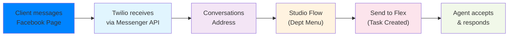
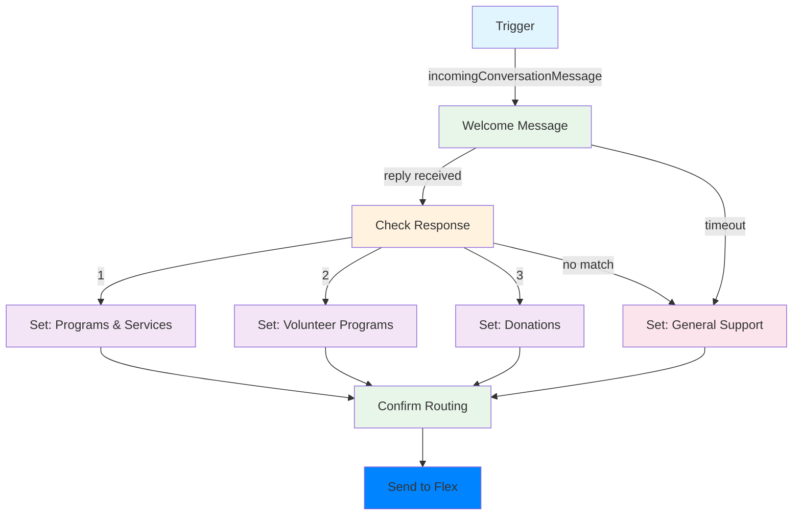

# Facebook Messenger Channel Setup Guide

This guide walks Connie administrators and AI agents through the complete process of activating Facebook Messenger as a communication channel on a ConnieRTC Flex instance.

## Overview

The Facebook Messenger channel allows community members to message your organization through your Facebook Page. Messages are routed through an interactive department menu and land as tasks in the Flex agent queue — just like voice, email, WhatsApp, and web channels.

### How It Works



1. A community member sends a message to your Facebook Page via Messenger
2. Twilio receives the message through the Facebook Messenger API
3. The Conversations Address routes it to your Studio Flow
4. The Studio Flow presents an interactive department menu (reply 1, 2, or 3)
5. Based on the reply, a task is created in Flex with the correct department label
6. An agent accepts the task and has a two-way Messenger conversation

## Prerequisites

Before starting, ensure you have:

- [ ] **Twilio Account** with Flex 2.x (Conversations API) enabled
- [ ] **Twilio CLI** installed and authenticated to the target account
- [ ] **Facebook Page** for the CBO (this is the Page community members will message)
- [ ] **Meta Business Manager** account ([business.meta.com](https://business.meta.com)) with admin access to the Facebook Page
- [ ] **Flex Plugin** deployed (ConnieRTC flex-project-template)

:::info One Page Per CBO
Each CBO needs its own dedicated Facebook Page for Messenger. A Facebook Page can only be connected to one Twilio account at a time.
:::

---

## Step 1: Connect Your Facebook Page to Twilio

Unlike WhatsApp (which uses phone numbers), Facebook Messenger uses your organization's Facebook Page as the sender identity. You connect the Page through Twilio Console's Facebook Messenger setup.

### 1.1 Start the Connection Flow

1. Navigate to **Twilio Console → Messaging → Senders → Facebook Messenger Senders**
2. Click **"Get Started"** (or **"Connect a Facebook Page"** if you've connected before)

<!-- PLACEHOLDER: Screenshot of Twilio Console Facebook Messenger Senders page -->
<div style={{border: '2px dashed #ccc', borderRadius: '8px', padding: '40px', textAlign: 'center', margin: '20px 0', backgroundColor: '#f9f9f9'}}>
  <p style={{color: '#666', fontSize: '14px'}}>📸 <strong>Screenshot Placeholder</strong></p>
  <p style={{color: '#999', fontSize: '12px'}}>Twilio Console → Messaging → Senders → Facebook Messenger Senders → "Get Started"</p>
</div>

### 1.2 Authenticate with Facebook

1. Click **"Continue with Facebook"**
2. Log in with a Facebook account that has **admin access** to the target Page
3. In the permissions dialog, ensure you grant access to:
   - **Manage your Pages** — required for Messenger integration
   - **Manage messaging on your Pages** — required for sending/receiving messages
4. Select the **Facebook Page** you want to connect

<!-- PLACEHOLDER: Screenshot of Facebook login and Page selection -->
<div style={{border: '2px dashed #ccc', borderRadius: '8px', padding: '40px', textAlign: 'center', margin: '20px 0', backgroundColor: '#f9f9f9'}}>
  <p style={{color: '#666', fontSize: '14px'}}>📸 <strong>Screenshot Placeholder</strong></p>
  <p style={{color: '#999', fontSize: '12px'}}>Facebook Login → Grant Permissions → Select Facebook Page for the CBO</p>
</div>

### 1.3 Select Your Meta Business Manager

1. Choose the **Business Portfolio** (Meta Business Manager) that owns the Facebook Page
2. Confirm the connection
3. Twilio will display the connected Page with its Page ID

<!-- PLACEHOLDER: Screenshot of successful Facebook Page connection in Twilio Console -->
<div style={{border: '2px dashed #ccc', borderRadius: '8px', padding: '40px', textAlign: 'center', margin: '20px 0', backgroundColor: '#f9f9f9'}}>
  <p style={{color: '#666', fontSize: '14px'}}>📸 <strong>Screenshot Placeholder</strong></p>
  <p style={{color: '#999', fontSize: '12px'}}>Twilio Console showing connected Facebook Page with Page ID and ONLINE status</p>
</div>

### 1.4 Verify Sender Status

Confirm the Facebook Messenger sender is active via API:

```bash
curl -u "$ACCOUNT_SID:$AUTH_TOKEN" \
  "https://messaging.twilio.com/v2/Channels/Senders?Channel=messenger"
```

You should see your Page with `"status": "ONLINE"`. Note the **Sender SID** (starts with `XE`) — you'll need it in the next step.

---

## Step 2: Add Sender to Messaging Service

The Facebook Messenger sender must be added to the Flex Conversations messaging service, just like WhatsApp and SMS senders.

### 2.1 Find the Default Messaging Service

```bash
curl -u "$ACCOUNT_SID:$AUTH_TOKEN" \
  "https://conversations.twilio.com/v1/Configuration"
```

Note the `default_messaging_service_sid` (starts with `MG`).

### 2.2 Add the Messenger Sender

```bash
curl -X POST "https://messaging.twilio.com/v1/Services/$MESSAGING_SERVICE_SID/ChannelSenders" \
  -u "$ACCOUNT_SID:$AUTH_TOKEN" \
  --data-urlencode "Sid=$MESSENGER_SENDER_SID"
```

Replace `$MESSENGER_SENDER_SID` with the sender SID (starts with `XE`) from Step 1.4.

---

## Step 3: Create the Studio Flow

The Studio Flow handles the interactive department menu. The flow design is identical to WhatsApp — only the task attributes differ.

### 3.1 Flow Architecture



### 3.2 Deploy the Flow

Save the following JSON as `messenger-flow.json` and deploy:

<details>
<summary><strong>Click to expand: Facebook Messenger Studio Flow JSON Template</strong></summary>

```json
{
  "description": "Facebook Messenger intake flow with department routing",
  "flags": { "allow_concurrent_calls": true },
  "initial_state": "Trigger",
  "states": [
    {
      "name": "Trigger",
      "properties": { "offset": { "x": 0, "y": 0 } },
      "transitions": [
        { "event": "incomingMessage" },
        { "event": "incomingCall" },
        { "event": "incomingConversationMessage", "next": "welcome_message" },
        { "event": "incomingRequest" },
        { "event": "incomingParent" }
      ],
      "type": "trigger"
    },
    {
      "name": "welcome_message",
      "properties": {
        "body": "Welcome to [YOUR ORG] on Facebook Messenger! How can we help you today?\n\nPlease reply with a number:\n1 - Our Programs & Services\n2 - Volunteer Programs\n3 - Donations",
        "channel": "{{trigger.message.ChannelSid}}",
        "from": "{{flow.channel.address}}",
        "offset": { "x": 400, "y": 200 },
        "service": "{{trigger.message.InstanceSid}}",
        "timeout": "3600"
      },
      "transitions": [
        { "event": "incomingMessage", "next": "check_response" },
        { "event": "timeout", "next": "set_type_general" },
        { "event": "deliveryFailure" }
      ],
      "type": "send-and-wait-for-reply"
    },
    {
      "name": "check_response",
      "properties": {
        "input": "{{widgets.welcome_message.inbound.Body}}",
        "offset": { "x": 400, "y": 450 }
      },
      "transitions": [
        { "event": "noMatch", "next": "set_type_general" },
        {
          "conditions": [{ "arguments": ["{{widgets.welcome_message.inbound.Body}}"], "friendly_name": "If value equal_to 1", "type": "equal_to", "value": "1" }],
          "event": "match", "next": "set_type_programs"
        },
        {
          "conditions": [{ "arguments": ["{{widgets.welcome_message.inbound.Body}}"], "friendly_name": "If value equal_to 2", "type": "equal_to", "value": "2" }],
          "event": "match", "next": "set_type_volunteer"
        },
        {
          "conditions": [{ "arguments": ["{{widgets.welcome_message.inbound.Body}}"], "friendly_name": "If value equal_to 3", "type": "equal_to", "value": "3" }],
          "event": "match", "next": "set_type_donation"
        }
      ],
      "type": "split-based-on"
    },
    {
      "name": "set_type_programs",
      "properties": {
        "offset": { "x": 100, "y": 700 },
        "variables": [
          { "key": "task_type", "type": "string", "value": "contact" },
          { "key": "department", "type": "string", "value": "Programs & Services" }
        ]
      },
      "transitions": [{ "event": "next", "next": "confirm_routing" }],
      "type": "set-variables"
    },
    {
      "name": "set_type_volunteer",
      "properties": {
        "offset": { "x": 400, "y": 700 },
        "variables": [
          { "key": "task_type", "type": "string", "value": "volunteer" },
          { "key": "department", "type": "string", "value": "Volunteer Programs" }
        ]
      },
      "transitions": [{ "event": "next", "next": "confirm_routing" }],
      "type": "set-variables"
    },
    {
      "name": "set_type_donation",
      "properties": {
        "offset": { "x": 700, "y": 700 },
        "variables": [
          { "key": "task_type", "type": "string", "value": "donation" },
          { "key": "department", "type": "string", "value": "Donations" }
        ]
      },
      "transitions": [{ "event": "next", "next": "confirm_routing" }],
      "type": "set-variables"
    },
    {
      "name": "set_type_general",
      "properties": {
        "offset": { "x": -200, "y": 700 },
        "variables": [
          { "key": "task_type", "type": "string", "value": "contact" },
          { "key": "department", "type": "string", "value": "General Support" }
        ]
      },
      "transitions": [{ "event": "next", "next": "confirm_routing" }],
      "type": "set-variables"
    },
    {
      "name": "confirm_routing",
      "properties": {
        "body": "Thank you! A member of our {{flow.variables.department}} team will be with you shortly.",
        "channel": "{{trigger.message.ChannelSid}}",
        "from": "{{flow.channel.address}}",
        "offset": { "x": 400, "y": 950 },
        "service": "{{trigger.message.InstanceSid}}",
        "timeout": "2"
      },
      "transitions": [
        { "event": "incomingMessage", "next": "SendToFlex" },
        { "event": "timeout", "next": "SendToFlex" },
        { "event": "deliveryFailure", "next": "SendToFlex" }
      ],
      "type": "send-and-wait-for-reply"
    },
    {
      "name": "SendToFlex",
      "properties": {
        "attributes": "{\"type\": \"{{flow.variables.task_type}}\", \"channel\": \"messenger\", \"channelType\": \"messenger\", \"organization\": \"[YOUR ORG]\", \"department\": \"{{flow.variables.department}}\", \"customerName\": \"Messenger: {{flow.variables.department}}\", \"customers\": {\"name\": \"Messenger: {{flow.variables.department}}\"}}",
        "channel": "$CHAT_TASK_CHANNEL_SID",
        "offset": { "x": 400, "y": 1200 },
        "workflow": "$WORKFLOW_SID"
      },
      "transitions": [
        { "event": "callComplete" },
        { "event": "failedToEnqueue" },
        { "event": "callFailure" }
      ],
      "type": "send-to-flex"
    }
  ]
}
```

</details>

**Before deploying**, customize the template:
- Replace `[YOUR ORG]` with the CBO name
- Replace `$CHAT_TASK_CHANNEL_SID` with the Chat TaskChannel SID (starts with `TC`)
- Replace `$WORKFLOW_SID` with the TaskRouter Workflow SID (starts with `WW`)
- Customize department names and menu options as needed

**Deploy the flow:**

```bash
twilio api:studio:v2:flows:create \
  --friendly-name "[CBO Name] Messenger Flow" \
  --status published \
  --definition "$(cat messenger-flow.json)"
```

Note the returned Flow SID (starts with `FW`).

:::warning Critical: incomingMessage vs incomingConversationMessage
The trigger must route `incomingConversationMessage` to the welcome message — NOT `incomingMessage`. Facebook Messenger via Conversations API uses `incomingConversationMessage`. If both events route to Flex, you'll get **duplicate tasks** for every Messenger message.
:::

---

## Step 4: Create the Conversations Address

The Conversations Address connects the Facebook Messenger sender (your Page) to the Studio Flow. The address format for Messenger uses the `messenger` type with your Facebook Page ID.

### 4.1 Find Your Facebook Page ID

Your Page ID was returned in Step 1.4 as part of the sender details. You can also find it via:

```bash
# List Messenger senders — the "address" field contains the Page ID
curl -u "$ACCOUNT_SID:$AUTH_TOKEN" \
  "https://messaging.twilio.com/v2/Channels/Senders?Channel=messenger"
```

The address will be in the format `messenger:PAGE_ID`.

### 4.2 Create the Conversations Address

```bash
curl -X POST "https://conversations.twilio.com/v1/Configuration/Addresses" \
  -u "$ACCOUNT_SID:$AUTH_TOKEN" \
  -d "FriendlyName=[CBO Name] Facebook Messenger" \
  -d "Type=messenger" \
  -d "Address=messenger%3APAGE_ID" \
  -d "AutoCreation.Enabled=true" \
  -d "AutoCreation.Type=studio" \
  -d "AutoCreation.StudioFlowSid=$FLOW_SID" \
  -d "AutoCreation.StudioRetryCount=3"
```

Replace:
- `PAGE_ID` with your Facebook Page ID (numeric, e.g., `123456789012345`)
- `$FLOW_SID` with the Studio Flow SID from Step 3

---

## Step 5: Configure the Flex Plugin (Optional)

To give Messenger tasks custom branding in Flex (blue icon, "Messenger" label), create a channel definition in the Flex plugin.

### 5.1 Create Messenger Channel Definition

Create `Messenger.tsx` in `plugin-flex-ts-template-v2/src/feature-library/channel-experience/flex-hooks/channels/`:

```typescript
import * as Flex from '@twilio/flex-ui';

export const MessengerChannel = (manager: Flex.Manager) => {
  const definition = Flex.DefaultTaskChannels.createDefaultTaskChannel(
    'messenger',
    (task) =>
      task.taskChannelUniqueName === 'chat' &&
      (task.attributes.channelType === 'messenger' ||
       task.attributes.channel === 'messenger'),
    'Message',      // icon name
    'Messenger',    // icon name (alt)
    '#0084FF'       // Messenger blue
  );

  // Customize task display
  definition.templates.TaskListItem = {
    ...definition.templates.TaskListItem,
    firstLine: (task: Flex.ITask) => `Messenger: ${task.attributes.department || 'General'}`,
    secondLine: (task: Flex.ITask) => task.attributes.from || task.defaultFrom,
  };

  definition.templates.TaskCanvasHeader = {
    ...definition.templates.TaskCanvasHeader,
    title: (task: Flex.ITask) => `Messenger: ${task.attributes.department || 'General'}`,
  };

  return definition;
};
```

### 5.2 Update Flex Configuration

Add Messenger to `ui_attributes.[cbo].json`:

```json
{
  "channel_experience": {
    "enabled": true,
    "messenger": {
      "enabled": true,
      "color": "#0084FF"
    }
  }
}
```

### 5.3 Build and Deploy

```bash
cd plugin-flex-ts-template-v2
npm run build
twilio flex:plugins:deploy --changelog "Add Facebook Messenger channel branding"
twilio flex:plugins:release --plugin plugin-flex-ts-template-v2@VERSION
```

---

## Step 6: Test End-to-End

### 6.1 Send a Test Message

1. Open **Facebook Messenger** on your phone or computer
2. Navigate to your organization's **Facebook Page**
3. Click **"Send Message"** or open an existing Messenger conversation
4. Send any text message (e.g., "Hello")

### 6.2 Verify the Flow

You should receive:
> "Welcome to [YOUR ORG] on Facebook Messenger! How can we help you today?
>
> Please reply with a number:
> 1 - Our Programs & Services
> 2 - Volunteer Programs
> 3 - Donations"

Reply with **1**, **2**, or **3**.

You should receive:
> "Thank you! A member of our [Department] team will be with you shortly."

### 6.3 Verify in Flex

1. Log into the Flex agent dashboard
2. A new task should appear in your queue
3. The task should show:
   - **Channel**: Messenger (blue branding if plugin is deployed)
   - **Department**: The department the sender selected
   - **Task attributes**: `channelType: "messenger"`, `channel: "messenger"`
4. Accept the task and send a reply
5. Verify the reply arrives back in the sender's Messenger conversation

<!-- PLACEHOLDER: Screenshot of Facebook Messenger task in Flex agent queue -->
<div style={{border: '2px dashed #ccc', borderRadius: '8px', padding: '40px', textAlign: 'center', margin: '20px 0', backgroundColor: '#f9f9f9'}}>
  <p style={{color: '#666', fontSize: '14px'}}>📸 <strong>Screenshot Placeholder</strong></p>
  <p style={{color: '#999', fontSize: '12px'}}>Flex UI showing Facebook Messenger task with blue channel branding, department label, and active conversation</p>
</div>

---

## Troubleshooting

### Facebook Page Not Appearing in Twilio Setup

**Cause**: The Facebook account used to log in doesn't have admin access to the Page, or the Page is owned by a different Meta Business Manager.

**Fix**: Log in with a Facebook account that has admin role on the target Page. Verify in Meta Business Manager → Business Settings → Pages that the Page is listed under the correct business.

### Token Expiry and Disconnected Webhooks

**Cause**: Facebook access tokens can expire or be invalidated when Page permissions change, the Facebook user who connected changes their password, or Meta revokes app access.

**Symptoms**: Messages stop arriving in Twilio. Sender status may show OFFLINE.

**Fix**:
1. Check sender status via API:
   ```bash
   curl -u "$ACCOUNT_SID:$AUTH_TOKEN" \
     "https://messaging.twilio.com/v2/Channels/Senders?Channel=messenger"
   ```
2. If OFFLINE, reconnect the Page through Twilio Console:
   - Navigate to **Messaging → Senders → Facebook Messenger Senders**
   - Remove the disconnected Page
   - Re-add it using **"Connect a Facebook Page"**
3. Verify the Conversations Address still points to the correct Flow

:::warning Proactive Monitoring
Unlike WhatsApp (which uses a stable API key), Facebook Messenger connections can break when tokens expire. Set up monitoring to check sender status periodically. A monthly check is recommended at minimum.
:::

### Duplicate Tasks in Flex

**Cause**: Both `incomingMessage` and `incomingConversationMessage` trigger events are routing to Flex.

**Fix**: In the Studio Flow trigger, only `incomingConversationMessage` should have a `next` target. The `incomingMessage` event should have no `next` value (empty transition). This is identical to the WhatsApp fix.

### Messages Not Delivering to User

**Cause**: Facebook has a 24-hour messaging window policy. After 24 hours of inactivity, you cannot send messages to a user unless they message you again first.

**Fix**: Respond within 24 hours. For proactive outreach beyond the 24-hour window, you would need Facebook-approved Message Tags (limited use cases). For most CBO scenarios, this is not an issue since the community member initiates the conversation.

### Sender Shows "Offline" After Working Previously

**Cause**: Token expiry (see above), or Meta has disconnected the webhook due to delivery failures or policy violations.

**Fix**: Reconnect the Page through Twilio Console. If the issue persists, check the Meta App Dashboard for any policy notifications or required actions.

---

## Maintenance

### Monthly Token Health Check

Facebook Messenger connections should be verified monthly:

```bash
# Check Messenger sender status
curl -u "$ACCOUNT_SID:$AUTH_TOKEN" \
  "https://messaging.twilio.com/v2/Channels/Senders?Channel=messenger"
```

If status is anything other than ONLINE, reconnect the Page through Twilio Console.

### Facebook Page Changes

If the CBO changes their Facebook Page name, profile picture, or other Page settings, these changes are reflected automatically in Messenger conversations. No Twilio-side updates are needed.

If the CBO **transfers Page ownership** to a different Meta Business Manager, the Messenger connection will break and needs to be re-established.

---

## Comparison: Facebook Messenger vs WhatsApp

| Feature | Facebook Messenger | WhatsApp |
|---|---|---|
| **Sender Identity** | Facebook Page | Phone Number |
| **Registration** | OAuth connection (Console) | Meta Embedded Signup + phone verification |
| **Address Format** | `messenger:PAGE_ID` | `whatsapp:+1XXXXXXXXXX` |
| **Token Management** | Requires periodic reconnection | Stable after initial setup |
| **Messaging Window** | 24-hour policy | 24-hour policy |
| **Verification** | No phone verification needed | Phone verification required |
| **Setup Complexity** | Lower | Higher |
| **User Reach** | Facebook users | WhatsApp users (global) |

---

## Per-CBO Deployment Checklist

Use this checklist when setting up Facebook Messenger for a new CBO:

- [ ] Verify CBO has a Facebook Page with admin access
- [ ] Verify Meta Business Manager owns the Facebook Page
- [ ] Connect Facebook Page in Twilio Console
- [ ] Verify sender is ONLINE via API
- [ ] Add sender to Flex Conversations messaging service
- [ ] Create and deploy Studio Flow (customize org name, departments)
- [ ] Create Conversations Address linking Page to flow
- [ ] Deploy Messenger channel definition in Flex plugin (if not already deployed)
- [ ] Test end-to-end: Messenger message → department menu → Flex task → agent reply
- [ ] Confirm no duplicate tasks
- [ ] Schedule monthly token health checks
- [ ] Train CBO staff on Messenger task handling

---

## AI Agent Quick Reference

For AI agents deploying Facebook Messenger programmatically, here is the condensed command sequence:

```bash
# 1. Verify Messenger sender is ONLINE
curl -u "$SID:$TOKEN" "https://messaging.twilio.com/v2/Channels/Senders?Channel=messenger"

# 2. Get default messaging service SID
curl -u "$SID:$TOKEN" "https://conversations.twilio.com/v1/Configuration"

# 3. Add sender to messaging service
curl -X POST "https://messaging.twilio.com/v1/Services/$MG_SID/ChannelSenders" \
  -u "$SID:$TOKEN" --data-urlencode "Sid=$XE_SID"

# 4. Deploy Studio Flow
twilio api:studio:v2:flows:create \
  --friendly-name "$CBO Messenger Flow" \
  --status published \
  --definition "$(cat messenger-flow.json)"

# 5. Create Conversations Address
curl -X POST "https://conversations.twilio.com/v1/Configuration/Addresses" \
  -u "$SID:$TOKEN" \
  -d "FriendlyName=$CBO Facebook Messenger" \
  -d "Type=messenger" \
  -d "Address=messenger%3APAGE_ID" \
  -d "AutoCreation.Enabled=true" \
  -d "AutoCreation.Type=studio" \
  -d "AutoCreation.StudioFlowSid=$FW_SID" \
  -d "AutoCreation.StudioRetryCount=3"

# 6. Test — send a Messenger message to the Page and verify task in Flex
```

:::info Note on Step 1 (Page Connection)
Facebook Page connection (Step 1 in the full guide) requires interactive OAuth through the Twilio Console and cannot be fully automated via API. An administrator must complete this step manually. All subsequent steps can be automated.
:::

---

*Facebook Messenger channel setup is a repeatable process for every CBO. Follow this guide exactly and use the checklist to ensure nothing is missed. Remember to schedule monthly token health checks — Messenger connections require more ongoing maintenance than other channels.*
