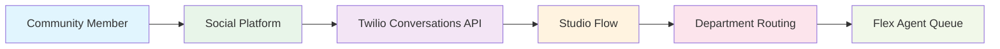
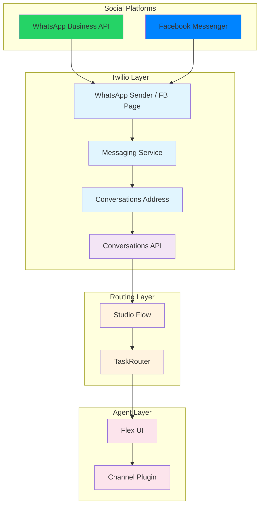

# Social Media Channels

Connect with your community on the platforms they use every day. ConnieRTC integrates with major social messaging platforms, routing conversations directly into your Flex agent queue alongside voice, email, fax, and web channels.

## How Social Media Channels Work

**The Complete Process**:
- **Community Member** sends a message via WhatsApp or Facebook Messenger
- **Twilio Conversations API** receives the inbound message from the social platform
- **Studio Flow** presents an interactive menu (department selection) to the sender
- **Department Routing** sets task attributes based on the sender's selection
- **Flex Agent Queue** receives the task with full channel branding and context

## Available Social Media Channels

  

    

      

        <h3>💬 WhatsApp</h3>
      

      

        
The world's most popular messaging app with 2+ billion users. Route WhatsApp Business messages directly into Flex with department-based routing.

        <ul>
          <li><strong>Status</strong>: ✅ Live</li>
          <li><strong>Requirements</strong>: Meta Business Manager, WhatsApp Business Account</li>
          <li><strong>Routing</strong>: Interactive department menu</li>
        </ul>
        <a href="/end-users/administrators/channels/social-media/whatsapp"><strong>WhatsApp Setup Guide →</strong></a>
      

    

  

  

    

      

        <h3>💙 Facebook Messenger</h3>
      

      

        
Reach community members through your organization's Facebook Page. Messages route into Flex as tasks with full conversation history.

        <ul>
          <li><strong>Status</strong>: ✅ Live</li>
          <li><strong>Requirements</strong>: Facebook Page, Meta Business Manager</li>
          <li><strong>Routing</strong>: Interactive department menu</li>
        </ul>
        <a href="/end-users/administrators/channels/social-media/facebook-messenger"><strong>Facebook Messenger Setup Guide →</strong></a>
      

    

  

## Key Benefits

### Meet People Where They Are
- **No App Downloads**: Clients use platforms they already have on their phones
- **Familiar Interface**: Messaging feels natural — no learning curve for clients
- **Asynchronous Communication**: Clients can message anytime, agents respond when available

### Unified Agent Experience
- **Single Dashboard**: Social media messages appear in the same Flex queue as voice, email, and web
- **Consistent Routing**: Department-based routing works identically across all social channels
- **Full Context**: Agents see channel type, department selection, and conversation history

### Per-CBO Architecture
Each CBO gets its own dedicated setup:
- **Own Phone Number** (WhatsApp) or **Own Facebook Page** (Messenger)
- **Own Studio Flow** with customized department menus
- **Own Conversations Address** linking the channel to the flow
- **Reusable Templates**: The setup process is identical for every new CBO

## Technical Architecture

## Getting Started

1. **Choose your channel**: [WhatsApp](/end-users/administrators/channels/social-media/whatsapp) or [Facebook Messenger](/end-users/administrators/channels/social-media/facebook-messenger)
2. **Follow the setup guide**: Each guide walks through every step from account setup to testing
3. **Test end-to-end**: Send a test message and verify it appears in Flex
4. **Train your team**: Ensure agents know how to handle social media tasks

---

*Social media channels extend your organization's reach to where your community already communicates. Follow the channel-specific guides to get started.*
