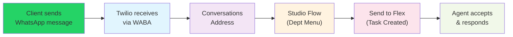
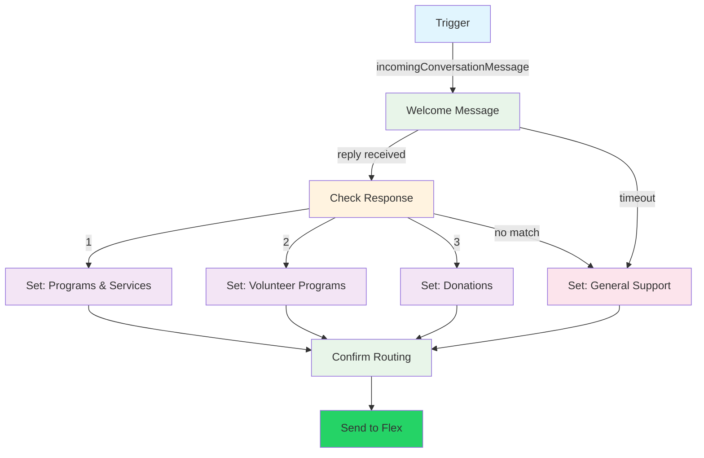

# WhatsApp Channel Setup Guide

This guide walks Connie administrators and AI agents through the complete process of activating WhatsApp as a communication channel on a ConnieRTC Flex instance.

## Overview

The WhatsApp channel allows community members to message your organization via WhatsApp. Messages are routed through an interactive department menu and land as tasks in the Flex agent queue — just like voice, email, and web channels.

### How It Works



1. A community member sends a WhatsApp message to your organization's number
2. Twilio receives the message via the WhatsApp Business API
3. The Conversations Address routes it to your Studio Flow
4. The Studio Flow presents an interactive department menu (reply 1, 2, or 3)
5. Based on the reply, a task is created in Flex with the correct department label
6. An agent accepts the task and has a two-way WhatsApp conversation

## Prerequisites

Before starting, ensure you have:

- [ ] **Twilio Account** with Flex 2.x (Conversations API) enabled
- [ ] **Twilio CLI** installed and authenticated to the target account
- [ ] **Meta Business Manager** account ([business.meta.com](https://business.meta.com))
- [ ] **Facebook Account** with admin access to the Meta Business Manager
- [ ] **Twilio Phone Number** to register as the WhatsApp sender
- [ ] **Flex Plugin** deployed (ConnieRTC flex-project-template)

:::info Important: One Number Per CBO
Each CBO needs its own dedicated phone number for WhatsApp. A phone number can only be registered as a WhatsApp sender on one WhatsApp Business Account (WABA) at a time. Numbers cannot be shared across CBOs.
:::

---

## Step 1: Register the WhatsApp Sender

The WhatsApp sender is the phone number that will receive and send WhatsApp messages for your organization. This requires linking your Twilio account with Meta's WhatsApp Business API.

### 1.1 Prepare the Phone Number

Before registration, **temporarily remove all webhooks** from the phone number to prevent verification codes from being intercepted:

```bash
# Remove voice and SMS webhooks from the number
# Replace PN_SID with your phone number's SID
curl -X POST "https://api.twilio.com/2010-04-01/Accounts/$ACCOUNT_SID/IncomingPhoneNumbers/$PN_SID.json" \
  -u "$ACCOUNT_SID:$AUTH_TOKEN" \
  -d "VoiceUrl=" -d "SmsUrl="
```

If the number has an **SMS Conversations Address**, disable it temporarily:

```bash
# Disable the SMS Conversations Address auto-creation
# Replace IG_SID with the Conversations Address SID
curl -X POST "https://conversations.twilio.com/v1/Configuration/Addresses/$IG_SID" \
  -u "$ACCOUNT_SID:$AUTH_TOKEN" \
  -d "AutoCreation.Enabled=false"
```

:::warning Why This Matters
If webhooks or Conversations Addresses are active on the number, Meta's verification SMS/call will be intercepted by Studio Flows or the Conversations pipeline. The verification code will never reach you. Always strip the number clean before starting registration.
:::

### 1.2 Start the Registration Flow

1. Navigate to **Twilio Console → Messaging → Senders → WhatsApp Senders**
2. Click **"Get Started"** (or **"Create new sender"** if you've registered before)
3. In Step 1, select **"Select Twilio number"**
4. Choose the phone number you prepared in Step 1.1

<!-- PLACEHOLDER: Screenshot of Twilio Console WhatsApp Senders page with "Get Started" button -->
<div style={{border: '2px dashed #ccc', borderRadius: '8px', padding: '40px', textAlign: 'center', margin: '20px 0', backgroundColor: '#f9f9f9'}}>
  <p style={{color: '#666', fontSize: '14px'}}>📸 <strong>Screenshot Placeholder</strong></p>
  <p style={{color: '#999', fontSize: '12px'}}>Twilio Console → Messaging → Senders → WhatsApp Senders → "Get Started"</p>
</div>

### 1.3 Link Your Meta Business Manager

1. Click **"Continue with Facebook"**
2. In the Meta popup, select your **Business Portfolio** (Meta Business Manager)
3. Select your existing **WhatsApp Business Account** or create a new one
4. If Twilio shows a warning about a specific WABA ID, make sure you select that WABA

<!-- PLACEHOLDER: Screenshot of Meta Business Manager selection popup -->
<div style={{border: '2px dashed #ccc', borderRadius: '8px', padding: '40px', textAlign: 'center', margin: '20px 0', backgroundColor: '#f9f9f9'}}>
  <p style={{color: '#666', fontSize: '14px'}}>📸 <strong>Screenshot Placeholder</strong></p>
  <p style={{color: '#999', fontSize: '12px'}}>Facebook Login for Business → Select Business Portfolio → Select WhatsApp Business Account</p>
</div>

### 1.4 Add Your Phone Number

1. When prompted for phone number type, select **"Use a new or existing WhatsApp number"**
2. Enter your Twilio phone number
3. Select **"Phone call"** for verification (recommended for Twilio numbers)

:::tip Phone Call Verification for Twilio Numbers
Since your number is a Twilio virtual number, you need to set up temporary call forwarding to receive the verification call:

```bash
# Forward calls to your mobile number temporarily
curl -X POST "https://api.twilio.com/2010-04-01/Accounts/$ACCOUNT_SID/IncomingPhoneNumbers/$PN_SID.json" \
  -u "$ACCOUNT_SID:$AUTH_TOKEN" \
  --data-urlencode "VoiceUrl=http://twimlets.com/forward?PhoneNumber=%2B1YOURMOBILE"
```

After verification completes, restore the original webhook (see Step 1.5).
:::

4. Click **"Send code"** and enter the verification code you receive on your mobile
5. Complete the registration flow until you see **"You've successfully completed WhatsApp sender registration"**

<!-- PLACEHOLDER: Screenshot of successful registration confirmation -->
<div style={{border: '2px dashed #ccc', borderRadius: '8px', padding: '40px', textAlign: 'center', margin: '20px 0', backgroundColor: '#f9f9f9'}}>
  <p style={{color: '#666', fontSize: '14px'}}>📸 <strong>Screenshot Placeholder</strong></p>
  <p style={{color: '#999', fontSize: '12px'}}>Twilio Console → WhatsApp Senders → Registration Success with sender listed as ONLINE</p>
</div>

### 1.5 Restore Phone Number Configuration

After successful registration, restore all webhooks and Conversations Addresses you disabled in Step 1.1:

```bash
# Restore voice and SMS webhooks
curl -X POST "https://api.twilio.com/2010-04-01/Accounts/$ACCOUNT_SID/IncomingPhoneNumbers/$PN_SID.json" \
  -u "$ACCOUNT_SID:$AUTH_TOKEN" \
  --data-urlencode "VoiceUrl=https://webhooks.twilio.com/v1/Accounts/$ACCOUNT_SID/Flows/$FLOW_SID" \
  -d "VoiceMethod=POST" \
  --data-urlencode "SmsUrl=https://webhooks.twilio.com/v1/Accounts/$ACCOUNT_SID/Flows/$FLOW_SID" \
  -d "SmsMethod=POST"

# Re-enable SMS Conversations Address
curl -X POST "https://conversations.twilio.com/v1/Configuration/Addresses/$IG_SID" \
  -u "$ACCOUNT_SID:$AUTH_TOKEN" \
  -d "AutoCreation.Enabled=true"
```

### 1.6 Verify Sender Status

Confirm the sender is online via API:

```bash
curl -u "$ACCOUNT_SID:$AUTH_TOKEN" \
  "https://messaging.twilio.com/v2/Channels/Senders?Channel=whatsapp"
```

You should see your number with `"status": "ONLINE"`.

---

## Step 2: Add Sender to Messaging Service

The WhatsApp sender must be added to the Flex Conversations messaging service.

### 2.1 Find the Default Messaging Service

```bash
curl -u "$ACCOUNT_SID:$AUTH_TOKEN" \
  "https://conversations.twilio.com/v1/Configuration"
```

Note the `default_messaging_service_sid` (starts with `MG`).

### 2.2 Add the WhatsApp Sender

```bash
curl -X POST "https://messaging.twilio.com/v1/Services/$MESSAGING_SERVICE_SID/ChannelSenders" \
  -u "$ACCOUNT_SID:$AUTH_TOKEN" \
  --data-urlencode "Sid=$WHATSAPP_SENDER_SID"
```

Replace `$WHATSAPP_SENDER_SID` with the sender SID (starts with `XE`) from Step 1.6.

---

## Step 3: Create the Studio Flow

The Studio Flow handles the interactive department menu. When a WhatsApp message arrives, the flow:

1. Sends a welcome message with department options
2. Waits for the sender's reply
3. Sets task attributes based on their selection
4. Routes the conversation to Flex

### 3.1 Flow Architecture



### 3.2 Deploy the Flow

Save the following JSON as `whatsapp-flow.json` and deploy:

<details>
<summary><strong>Click to expand: WhatsApp Studio Flow JSON Template</strong></summary>

```json
{
  "description": "WhatsApp intake flow with department routing",
  "flags": { "allow_concurrent_calls": true },
  "initial_state": "Trigger",
  "states": [
    {
      "name": "Trigger",
      "properties": { "offset": { "x": 0, "y": 0 } },
      "transitions": [
        { "event": "incomingMessage" },
        { "event": "incomingCall" },
        { "event": "incomingConversationMessage", "next": "welcome_message" },
        { "event": "incomingRequest" },
        { "event": "incomingParent" }
      ],
      "type": "trigger"
    },
    {
      "name": "welcome_message",
      "properties": {
        "body": "Welcome to [YOUR ORG] on WhatsApp! How can we help you today?\n\nPlease reply with a number:\n1 - Our Programs & Services\n2 - Volunteer Programs\n3 - Donations",
        "channel": "{{trigger.message.ChannelSid}}",
        "from": "{{flow.channel.address}}",
        "offset": { "x": 400, "y": 200 },
        "service": "{{trigger.message.InstanceSid}}",
        "timeout": "3600"
      },
      "transitions": [
        { "event": "incomingMessage", "next": "check_response" },
        { "event": "timeout", "next": "set_type_general" },
        { "event": "deliveryFailure" }
      ],
      "type": "send-and-wait-for-reply"
    },
    {
      "name": "check_response",
      "properties": {
        "input": "{{widgets.welcome_message.inbound.Body}}",
        "offset": { "x": 400, "y": 450 }
      },
      "transitions": [
        { "event": "noMatch", "next": "set_type_general" },
        {
          "conditions": [{ "arguments": ["{{widgets.welcome_message.inbound.Body}}"], "friendly_name": "If value equal_to 1", "type": "equal_to", "value": "1" }],
          "event": "match", "next": "set_type_programs"
        },
        {
          "conditions": [{ "arguments": ["{{widgets.welcome_message.inbound.Body}}"], "friendly_name": "If value equal_to 2", "type": "equal_to", "value": "2" }],
          "event": "match", "next": "set_type_volunteer"
        },
        {
          "conditions": [{ "arguments": ["{{widgets.welcome_message.inbound.Body}}"], "friendly_name": "If value equal_to 3", "type": "equal_to", "value": "3" }],
          "event": "match", "next": "set_type_donation"
        }
      ],
      "type": "split-based-on"
    },
    {
      "name": "set_type_programs",
      "properties": {
        "offset": { "x": 100, "y": 700 },
        "variables": [
          { "key": "task_type", "type": "string", "value": "contact" },
          { "key": "department", "type": "string", "value": "Programs & Services" }
        ]
      },
      "transitions": [{ "event": "next", "next": "confirm_routing" }],
      "type": "set-variables"
    },
    {
      "name": "set_type_volunteer",
      "properties": {
        "offset": { "x": 400, "y": 700 },
        "variables": [
          { "key": "task_type", "type": "string", "value": "volunteer" },
          { "key": "department", "type": "string", "value": "Volunteer Programs" }
        ]
      },
      "transitions": [{ "event": "next", "next": "confirm_routing" }],
      "type": "set-variables"
    },
    {
      "name": "set_type_donation",
      "properties": {
        "offset": { "x": 700, "y": 700 },
        "variables": [
          { "key": "task_type", "type": "string", "value": "donation" },
          { "key": "department", "type": "string", "value": "Donations" }
        ]
      },
      "transitions": [{ "event": "next", "next": "confirm_routing" }],
      "type": "set-variables"
    },
    {
      "name": "set_type_general",
      "properties": {
        "offset": { "x": -200, "y": 700 },
        "variables": [
          { "key": "task_type", "type": "string", "value": "contact" },
          { "key": "department", "type": "string", "value": "General Support" }
        ]
      },
      "transitions": [{ "event": "next", "next": "confirm_routing" }],
      "type": "set-variables"
    },
    {
      "name": "confirm_routing",
      "properties": {
        "body": "Thank you! A member of our {{flow.variables.department}} team will be with you shortly.",
        "channel": "{{trigger.message.ChannelSid}}",
        "from": "{{flow.channel.address}}",
        "offset": { "x": 400, "y": 950 },
        "service": "{{trigger.message.InstanceSid}}",
        "timeout": "2"
      },
      "transitions": [
        { "event": "incomingMessage", "next": "SendToFlex" },
        { "event": "timeout", "next": "SendToFlex" },
        { "event": "deliveryFailure", "next": "SendToFlex" }
      ],
      "type": "send-and-wait-for-reply"
    },
    {
      "name": "SendToFlex",
      "properties": {
        "attributes": "{\"type\": \"{{flow.variables.task_type}}\", \"channel\": \"whatsapp\", \"channelType\": \"whatsapp\", \"organization\": \"[YOUR ORG]\", \"department\": \"{{flow.variables.department}}\", \"customerName\": \"WhatsApp: {{flow.variables.department}}\", \"customers\": {\"name\": \"WhatsApp: {{flow.variables.department}}\"}}",
        "channel": "$CHAT_TASK_CHANNEL_SID",
        "offset": { "x": 400, "y": 1200 },
        "workflow": "$WORKFLOW_SID"
      },
      "transitions": [
        { "event": "callComplete" },
        { "event": "failedToEnqueue" },
        { "event": "callFailure" }
      ],
      "type": "send-to-flex"
    }
  ]
}
```

</details>

**Before deploying**, customize the template:
- Replace `[YOUR ORG]` with the CBO name
- Replace `$CHAT_TASK_CHANNEL_SID` with the Chat TaskChannel SID (starts with `TC`)
- Replace `$WORKFLOW_SID` with the TaskRouter Workflow SID (starts with `WW`)
- Customize department names and menu options as needed

**Deploy the flow:**

```bash
twilio api:studio:v2:flows:create \
  --friendly-name "[CBO Name] WhatsApp Flow" \
  --status published \
  --definition "$(cat whatsapp-flow.json)"
```

Note the returned Flow SID (starts with `FW`).

:::warning Critical: incomingMessage vs incomingConversationMessage
The trigger must route `incomingConversationMessage` to the welcome message — NOT `incomingMessage`. WhatsApp via Conversations API uses `incomingConversationMessage`. If both events route to Flex, you'll get **duplicate tasks** for every WhatsApp message.
:::

---

## Step 4: Create the Conversations Address

The Conversations Address connects the WhatsApp sender to the Studio Flow. This is the final wiring step.

```bash
curl -X POST "https://conversations.twilio.com/v1/Configuration/Addresses" \
  -u "$ACCOUNT_SID:$AUTH_TOKEN" \
  -d "FriendlyName=[CBO Name] WhatsApp" \
  -d "Type=whatsapp" \
  -d "Address=whatsapp%3A%2B1XXXXXXXXXX" \
  -d "AutoCreation.Enabled=true" \
  -d "AutoCreation.Type=studio" \
  -d "AutoCreation.StudioFlowSid=$FLOW_SID" \
  -d "AutoCreation.StudioRetryCount=3"
```

Replace:
- `%2B1XXXXXXXXXX` with the URL-encoded phone number (e.g., `%2B15046883877` for +15046883877)
- `$FLOW_SID` with the Studio Flow SID from Step 3

:::info Address Validation
The Conversations Address API validates phone numbers. If you get error `51001 (Invalid Address)`, the phone number may not be properly registered as a WhatsApp sender (check Step 1), or the number may be a Meta test number (555 area code). Only real phone numbers pass validation.
:::

---

## Step 5: Configure the Flex Plugin (Optional)

To give WhatsApp tasks custom branding in Flex (green icon, "WhatsApp" label), create a channel definition in the Flex plugin.

### 5.1 Create WhatsApp Channel Definition

Create `WhatsApp.tsx` in `plugin-flex-ts-template-v2/src/feature-library/channel-experience/flex-hooks/channels/`:

```typescript
import * as Flex from '@twilio/flex-ui';

export const WhatsAppChannel = (manager: Flex.Manager) => {
  const definition = Flex.DefaultTaskChannels.createDefaultTaskChannel(
    'whatsapp',
    (task) =>
      task.taskChannelUniqueName === 'chat' &&
      (task.attributes.channelType === 'whatsapp' ||
       task.attributes.channel === 'whatsapp'),
    'Whatsapp',     // icon name
    'WhatsApp',     // icon name (alt)
    '#25D366'       // WhatsApp green
  );

  // Customize task display
  definition.templates.TaskListItem = {
    ...definition.templates.TaskListItem,
    firstLine: (task: Flex.ITask) => `WhatsApp: ${task.attributes.department || 'General'}`,
    secondLine: (task: Flex.ITask) => task.attributes.from || task.defaultFrom,
  };

  definition.templates.TaskCanvasHeader = {
    ...definition.templates.TaskCanvasHeader,
    title: (task: Flex.ITask) => `WhatsApp: ${task.attributes.department || 'General'}`,
  };

  return definition;
};
```

### 5.2 Update Flex Configuration

Add WhatsApp to `ui_attributes.[cbo].json`:

```json
{
  "channel_experience": {
    "enabled": true,
    "whatsapp": {
      "enabled": true,
      "color": "#25D366"
    }
  }
}
```

### 5.3 Build and Deploy

```bash
cd plugin-flex-ts-template-v2
npm run build
twilio flex:plugins:deploy --changelog "Add WhatsApp channel branding"
twilio flex:plugins:release --plugin plugin-flex-ts-template-v2@VERSION
```

---

## Step 6: Test End-to-End

### 6.1 Send a Test Message

1. Open **WhatsApp** on your phone
2. Start a new chat with the registered number (e.g., +1 504-688-3877)
3. Send any text message (e.g., "Hello")

### 6.2 Verify the Flow

You should receive:
> "Welcome to [YOUR ORG] on WhatsApp! How can we help you today?
>
> Please reply with a number:
> 1 - Our Programs & Services
> 2 - Volunteer Programs
> 3 - Donations"

Reply with **1**, **2**, or **3**.

You should receive:
> "Thank you! A member of our [Department] team will be with you shortly."

### 6.3 Verify in Flex

1. Log into the Flex agent dashboard
2. A new task should appear in your queue
3. The task should show:
   - **Channel**: WhatsApp (green branding if plugin is deployed)
   - **Department**: The department the sender selected
   - **Task attributes**: `channelType: "whatsapp"`, `channel: "whatsapp"`
4. Accept the task and send a reply
5. Verify the reply arrives back on the sender's WhatsApp

<!-- PLACEHOLDER: Screenshot of WhatsApp task in Flex agent queue -->
<div style={{border: '2px dashed #ccc', borderRadius: '8px', padding: '40px', textAlign: 'center', margin: '20px 0', backgroundColor: '#f9f9f9'}}>
  <p style={{color: '#666', fontSize: '14px'}}>📸 <strong>Screenshot Placeholder</strong></p>
  <p style={{color: '#999', fontSize: '12px'}}>Flex UI showing WhatsApp task with green channel branding, department label, and active conversation</p>
</div>

---

## Troubleshooting

### Verification Code Not Arriving

**Cause**: Webhooks or Conversations Addresses are intercepting the verification SMS/call.

**Fix**: Strip all webhooks and disable Conversations Addresses before registration (see Step 1.1). Use phone call verification with temporary call forwarding to your mobile.

### Error 51001: Invalid Address (Conversations Address Creation)

**Cause**: The phone number isn't registered as a WhatsApp sender, or you're using a Meta test number (555 area code).

**Fix**: Complete WhatsApp sender registration first (Step 1). Only real phone numbers pass Conversations Address validation. Meta test numbers in the 555 area code will be rejected.

### Duplicate Tasks in Flex

**Cause**: Both `incomingMessage` and `incomingConversationMessage` trigger events are routing to Flex.

**Fix**: In the Studio Flow trigger, only `incomingConversationMessage` should have a `next` target. The `incomingMessage` event should have no `next` value (empty transition).

### Sender Shows "Offline" in Console

**Cause**: Meta's backend may still be provisioning, or the sender registration didn't complete fully.

**Fix**: Check via API — the Console display may lag behind the API. Run:
```bash
curl -u "$ACCOUNT_SID:$AUTH_TOKEN" \
  "https://messaging.twilio.com/v2/Channels/Senders?Channel=whatsapp"
```
If the API shows ONLINE, you're fine. If OFFLINE, check `offline_reasons` in the response for specific error codes.

### Meta Test Numbers (555 Area Code)

During registration, Meta may assign a test number (e.g., +15558785981) instead of your real number. This happens when you select "Use a display name only" instead of "Use a new or existing WhatsApp number." Test numbers:
- Cannot be used for Conversations Addresses (validation fails)
- Are only useful for limited API testing
- Should be deleted from both Twilio and Meta WhatsApp Manager

**Fix**: Delete the test sender, clear the WABA via Meta WhatsApp Manager, and re-register using "Use a new or existing WhatsApp number."

---

## Per-CBO Deployment Checklist

Use this checklist when setting up WhatsApp for a new CBO:

- [ ] Identify Twilio account and phone number for the CBO
- [ ] Temporarily strip webhooks from the phone number
- [ ] Register WhatsApp sender via Twilio Console + Meta Embedded Signup
- [ ] Verify sender is ONLINE via API
- [ ] Restore phone number webhooks
- [ ] Add sender to Flex Conversations messaging service
- [ ] Create and deploy Studio Flow (customize org name, departments)
- [ ] Create Conversations Address linking sender to flow
- [ ] Deploy WhatsApp channel definition in Flex plugin (if not already deployed)
- [ ] Test end-to-end: WhatsApp message → department menu → Flex task → agent reply
- [ ] Confirm no duplicate tasks
- [ ] Train CBO staff on WhatsApp task handling

---

## AI Agent Quick Reference

For AI agents deploying WhatsApp programmatically, here is the condensed command sequence:

```bash
# 1. Verify sender is ONLINE
curl -u "$SID:$TOKEN" "https://messaging.twilio.com/v2/Channels/Senders?Channel=whatsapp"

# 2. Get default messaging service SID
curl -u "$SID:$TOKEN" "https://conversations.twilio.com/v1/Configuration"

# 3. Add sender to messaging service
curl -X POST "https://messaging.twilio.com/v1/Services/$MG_SID/ChannelSenders" \
  -u "$SID:$TOKEN" --data-urlencode "Sid=$XE_SID"

# 4. Deploy Studio Flow
twilio api:studio:v2:flows:create \
  --friendly-name "$CBO WhatsApp Flow" \
  --status published \
  --definition "$(cat whatsapp-flow.json)"

# 5. Create Conversations Address
curl -X POST "https://conversations.twilio.com/v1/Configuration/Addresses" \
  -u "$SID:$TOKEN" \
  -d "FriendlyName=$CBO WhatsApp" \
  -d "Type=whatsapp" \
  -d "Address=whatsapp%3A%2B1XXXXXXXXXX" \
  -d "AutoCreation.Enabled=true" \
  -d "AutoCreation.Type=studio" \
  -d "AutoCreation.StudioFlowSid=$FW_SID" \
  -d "AutoCreation.StudioRetryCount=3"

# 6. Test — send a WhatsApp message to the number and verify task in Flex
```

---

*WhatsApp channel setup is a repeatable process for every CBO. Follow this guide exactly and use the checklist to ensure nothing is missed. Contact the Connie CTO for assistance with any steps that require Twilio support intervention.*
