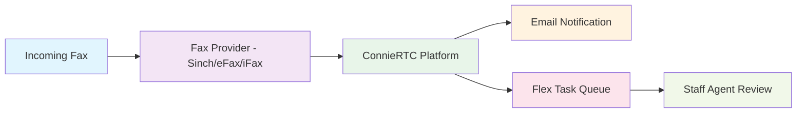

import Link from '@docusaurus/Link';

# Choose Your Fax Service Provider

## Introduction

ConnieRTC integrates with multiple fax service providers to give your nonprofit organization the flexibility to choose the solution that best fits your needs and budget. Our fax integration allows you to receive and send faxes directly through the Connie platform, creating seamless workflows for your staff.

## How Fax Integration Works

**The Process**:
- **Receive Faxes**: Faxes are received by your chosen provider and converted to digital format
- **Automatic Processing**: ConnieRTC automatically processes incoming faxes
- **Task Creation**: Each fax becomes a task in your Flex queue for staff review
- **Email Notifications**: Staff receive email alerts with fax attachments
- **Centralized Management**: All fax communications are tracked within ConnieRTC

## Select Your Fax Provider

Choose your fax service provider below to view setup instructions and integration details:

  
  

    

      <Link to="/developers/backend/fax/sinch-implementation">
        
      </Link>
    

    <Link to="/developers/backend/fax/sinch-implementation" style={{textDecoration: 'none', fontWeight: 'bold'}}>
      Setup Guide Available
    </Link>
    

      ✅ Production Ready 
      💰 $0.045/page
    

  

  

    

      
    

    
      Setup guide coming soon
    
    

      🚧 In Development
    

  

  

    

      
    

    
      Setup guide coming soon
    
    

      🚧 In Development
    

  

*Don't see your preferred fax provider? Contact the Connie Care team to discuss integration options.*

## Provider Comparison

| Feature | Sinch | eFax | iFax |
|---------|-------|------|------|
| **Status** | ✅ Production Ready | 🚧 Coming Soon | 🚧 Coming Soon |
| **Cost per Page** | $0.045 | TBD | TBD |
| **Email Integration** | ✅ Yes | TBD | TBD |
| **Flex Task Creation** | ✅ Yes | TBD | TBD |
| **PDF Attachments** | ✅ Yes | TBD | TBD |
| **API Integration** | ✅ Full API | TBD | TBD |

## Key Features

### Seamless Workflow Integration
- **Automatic Task Creation**: Incoming faxes automatically create tasks in Flex queue
- **Email Notifications**: Staff receive immediate email alerts with PDF attachments
- **Centralized Management**: All fax communications tracked in ConnieRTC dashboard

### Professional Fax Handling
- **High-Quality PDF Conversion**: Crystal clear document reproduction
- **Secure Transmission**: HIPAA-compliant fax handling for sensitive documents
- **Delivery Confirmations**: Automatic status tracking for sent faxes

### Cost-Effective Solution
- **Pay-Per-Use**: Only pay for faxes actually sent/received
- **No Monthly Minimums**: Flexible pricing for organizations of all sizes
- **Transparent Billing**: Clear cost tracking within ConnieRTC platform

## Important Considerations

### Before You Begin
- ✅ Determine your expected monthly fax volume
- ✅ Verify any compliance requirements (HIPAA, etc.)
- ✅ Have your ConnieRTC account configured for fax integration
- ✅ Ensure staff have appropriate email access for notifications

### Technical Requirements
- **Internet Connection**: Reliable internet for fax processing
- **Email Setup**: Working email addresses for staff notifications
- **ConnieRTC Access**: Active Flex accounts for task management
- **PDF Viewing**: Ability to view PDF attachments

### Compliance & Security
- **Data Protection**: All fax data encrypted in transit and at rest
- **Access Controls**: Role-based permissions for fax handling
- **Audit Trail**: Complete tracking of all fax communications
- **HIPAA Compliance**: Available for healthcare organizations

## Getting Started

1. **Choose Your Provider**: Select from the available options above
2. **Review Setup Guide**: Follow provider-specific configuration instructions
3. **Configure Integration**: Set up ConnieRTC to work with your chosen provider
4. **Test Your Setup**: Send and receive test faxes to verify functionality
5. **Train Your Team**: Ensure staff understand the fax workflow within ConnieRTC

## Need Help?

**Connie Care Team**: Contact us for assistance choosing the right fax provider for your organization

**Technical Support**: Available for setup and configuration questions

**Training Resources**: Comprehensive guides for staff onboarding

---

*Fax integration is available to all ConnieRTC customers. Contact our team to add fax services to your nonprofit's communication platform.*