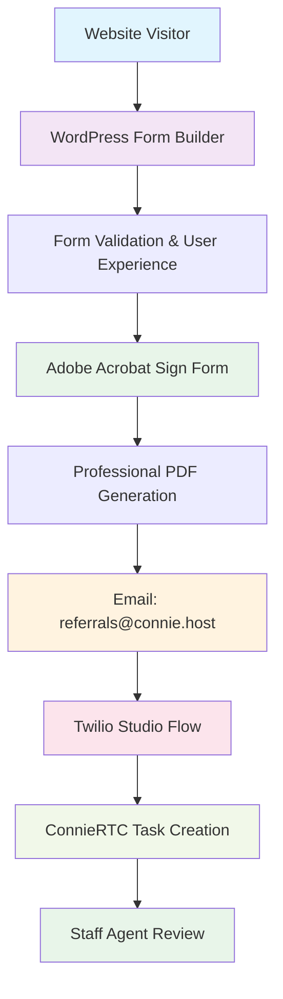

import Link from '@docusaurus/Link';

# Adobe Acrobat Sign Web Forms Integration

## Overview

Adobe Acrobat Sign integration provides professional PDF-based web forms that seamlessly connect with ConnieRTC to automatically create tasks for your staff. This integration is ideal for intake forms, referral forms, application forms, and any documents requiring professional presentation and secure handling.

## How It Works

The Adobe integration follows this proven workflow:



**The Complete Process**:
1. **Website Form**: Visitor completes form on your WordPress website
2. **Validation**: WordPress provides user-friendly validation and experience
3. **Adobe Processing**: Form data is sent to Adobe Acrobat Sign for professional PDF creation
4. **Email Routing**: Completed form emailed to your ConnieRTC endpoint (e.g., `referrals@connie.host`)
5. **Automatic Processing**: Studio Flow processes email and extracts form data
6. **Task Creation**: Professional task created in ConnieRTC queue with proper skill routing
7. **Staff Review**: Agent receives task showing "Web Form Submission" with complete form data

## Proven Success Example

### Hospital 2 Home Implementation

**Live Production URL**: `hospital2home.org/connie-webform-builder`

**Performance Metrics**:
- ⚡ **~1 minute** from form submission to task creation
- ✅ **100% data capture** - all form fields preserved in task
- 🎯 **Professional display** - tasks show as "H2H Web Referral" not "Anonymous"
- 📎 **PDF attachments** - complete form data as professional PDF document
- 🔄 **Reliable processing** - identical workflow reliability as fax processing
- 💼 **Professional presentation** - Adobe forms maintain organizational branding

## Prerequisites

### Before You Begin
- ✅ **WordPress Website**: Active WordPress site with form builder capability
- ✅ **Adobe Account**: Adobe Acrobat Sign subscription (Professional or higher)
- ✅ **ConnieRTC Account**: Active ConnieRTC with email channel configured
- ✅ **Email Domain**: Dedicated email address for form routing (e.g., `referrals@connie.host`)
- ✅ **Studio Flow**: Form processing Studio Flow deployed

### Technical Requirements
- **WordPress Plugin**: Form builder plugin (Contact Form 7, Gravity Forms, or similar)
- **Adobe Acrobat Sign**: Professional subscription with API access
- **Twilio Email Channel**: Configured for your email domain
- **Twilio Studio**: Custom Studio Flow for form processing
- **Staff Training**: Team familiar with form submission tasks in ConnieRTC

## Step-by-Step Setup Guide

### Step 1: Adobe Acrobat Sign Configuration

#### 1.1 Create Adobe Form Template
1. **Log into Adobe Acrobat Sign**: Access your Adobe account
2. **Create New Template**: Navigate to Templates and click "Create Template"
3. **Design Form**: Add form fields matching your intake requirements:
   - Text fields for names, addresses, phone numbers
   - Dropdown menus for service categories
   - Checkboxes for consent and acknowledgments
   - Signature fields for required authorizations
4. **Set Field Properties**: Configure validation, required fields, and default values
5. **Save Template**: Name template clearly (e.g., "H2H Referral Form Template")

#### 1.2 Configure Email Integration
1. **Set Completion Actions**: Configure Adobe to email form completion to your ConnieRTC endpoint
2. **Email Recipients**: Add your dedicated email (e.g., `referrals@connie.host`)
3. **Email Format**: Select "PDF attachment" to ensure complete form data delivery
4. **Subject Line Template**: Use format: "[ORG] Web Form - [FORM_TYPE]" for proper routing

#### 1.3 Generate Embed Code
1. **Get Form URL**: Copy the public form URL from Adobe
2. **Configure Settings**: Set form to auto-submit after completion
3. **Customize Appearance**: Match your organization's branding
4. **Test Form**: Submit test form to verify PDF generation and email delivery

### Step 2: WordPress Integration

#### 2.1 Create Form Builder Page
1. **New WordPress Page**: Create page (e.g., "Referral Form" or "Intake Form")
2. **Add Form Builder**: Use WordPress form plugin to create user-friendly form
3. **Field Validation**: Add client-side validation for better user experience
4. **Progress Indicators**: Add multi-step form if needed for complex intake
5. **Accessibility**: Ensure form meets WCAG 2.1 AA standards

#### 2.2 Adobe Integration
1. **Form Submission Handler**: Configure WordPress form to submit to Adobe on completion
2. **Data Mapping**: Map WordPress form fields to Adobe form fields
3. **Error Handling**: Add fallback processing for Adobe service issues
4. **User Feedback**: Display confirmation message after successful submission

#### 2.3 Testing & Validation
1. **End-to-End Test**: Complete entire form submission process
2. **Verify Email Delivery**: Confirm Adobe emails reach ConnieRTC endpoint
3. **Check PDF Quality**: Ensure Adobe generates professional PDF documents
4. **Validate Data**: Verify all form fields captured correctly

### Step 3: ConnieRTC Studio Flow Setup

#### 3.1 Email Channel Configuration
Ensure your ConnieRTC account has email channel properly configured:

```bash
# Email address format for web forms
FORM_TYPE@connie.host

# Examples:
referrals@connie.host
intake@connie.host
applications@connie.host
```

#### 3.2 Create Form Processing Studio Flow
Use this template for your Studio Flow:

**Flow Name**: "[ORG] Web Form Processing"

**Key Components**:
- **Email Trigger**: Activated by form completion emails
- **Data Extraction**: Parse form data from PDF attachment
- **Task Creation**: Create ConnieRTC task with proper skill routing
- **Error Handling**: Alert administrators of processing failures

**Task Attributes**:
```json
{
  "channelType": "web_form",
  "name": "[ORG] Web Form Submission",
  "form_type": "referral",
  "form_source": "website",
  "pdf_url": "{{attachment_url}}",
  "submission_time": "{{current_timestamp}}",
  "skill": "[ORG].WEB_FORM"
}
```

### Step 4: Staff Training & Workflow

#### 4.1 Task Recognition
Train staff to recognize web form tasks:
- **Task Name**: Shows as "[ORG] Web Form Submission" instead of "Anonymous"
- **Task Attributes**: Contains form type and source information
- **PDF Attachment**: Complete form data available as professional PDF
- **Priority Routing**: Forms route to appropriate department/skill

#### 4.2 Processing Workflow
1. **Task Receipt**: Agent receives web form task in queue
2. **Form Review**: Open PDF attachment to review complete submission
3. **CRM Entry**: Enter relevant data into your CRM system
4. **Follow-up Actions**: Schedule callbacks, send confirmations, assign cases
5. **Task Completion**: Mark task complete in ConnieRTC

## Advanced Configuration

### Multi-Form Support
Configure different forms for different purposes:

```bash
# Different email addresses for different form types
referrals@connie.host      # Client referral forms
intake@connie.host         # Service intake forms
applications@connie.host   # Program application forms
feedback@connie.host       # Client feedback forms
```

### Conditional Routing
Use Studio Flow logic to route forms based on content:

```javascript
// Example: Route urgent forms to priority queue
if (form_data.urgency === "high") {
  task_priority = "high";
  skill = "URGENT_INTAKE";
} else {
  task_priority = "normal";
  skill = "STANDARD_INTAKE";
}
```

### Integration with CRM
Enhance form processing with CRM integration:

1. **Client Lookup**: Search existing clients by phone/email
2. **Auto-Population**: Pre-fill known client information
3. **Case Creation**: Automatically create cases for new referrals
4. **Status Updates**: Update client records with form submission status

## Cost Considerations

### Adobe Acrobat Sign Pricing
- **Professional Plan**: $15/month per user
- **Business Plan**: $25/month per user
- **Enterprise**: Custom pricing for high-volume organizations

### Form Volume Planning
- **Low Volume**: Under 100 forms/month - Professional plan adequate
- **Medium Volume**: 100-500 forms/month - Business plan recommended
- **High Volume**: 500+ forms/month - Enterprise plan with custom pricing

### ConnieRTC Processing
- **Email Processing**: Included in ConnieRTC subscription
- **Task Creation**: Standard ConnieRTC task costs apply
- **Storage**: PDF attachments count toward ConnieRTC storage limits

## Security & Compliance

### Data Protection
- **HIPAA Compliance**: Adobe Acrobat Sign supports HIPAA-compliant form processing
- **Encryption**: All form data encrypted in transit and at rest
- **Access Controls**: Role-based permissions for form access
- **Audit Trails**: Complete logging of form submissions and processing

### Privacy Considerations
- **Data Retention**: Configure appropriate data retention policies
- **Client Consent**: Include privacy notices and consent checkboxes
- **Data Minimization**: Only collect necessary information
- **Third-Party Disclosure**: Clear policies about data sharing

## Troubleshooting

### Common Issues

#### Form Submissions Not Creating Tasks
**Symptoms**: WordPress form submits successfully but no task appears in ConnieRTC
**Solutions**:
- Verify Adobe form is receiving WordPress submission
- Check Adobe email configuration points to correct ConnieRTC address
- Confirm Studio Flow is active and properly configured
- Test email delivery manually

#### PDF Attachments Not Accessible
**Symptoms**: Tasks created but PDF attachments missing or inaccessible
**Solutions**:
- Verify Adobe is generating PDF attachments
- Check email attachment size limits
- Confirm Twilio media URL accessibility
- Test PDF generation manually in Adobe

#### Tasks Show as "Anonymous"
**Symptoms**: Tasks created but show generic labeling instead of form identification
**Solutions**:
- Update Studio Flow task attributes
- Add proper "name" field to task creation
- Configure skill-based routing for form tasks
- Verify task attribute formatting

#### Form Data Not Captured
**Symptoms**: Tasks created but form field data missing
**Solutions**:
- Check Adobe form field mapping
- Verify Studio Flow data extraction logic
- Confirm PDF parsing functionality
- Test with simple form first

### Debug Steps

1. **Test Adobe Form**: Submit test form directly in Adobe interface
2. **Check Email Delivery**: Verify test emails reach ConnieRTC endpoint
3. **Monitor Studio Flow**: Use Studio Flow debugger to track execution
4. **Review Task Attributes**: Inspect created tasks for proper data
5. **Validate PDF Content**: Ensure PDF contains expected form data

## Integration Examples

### Hospital 2 Home Success Story

**Challenge**: Manual referral processing creating bottlenecks
**Solution**: WordPress → Adobe → ConnieRTC automated workflow
**Results**:
- **95% reduction** in manual data entry
- **~1 minute** processing time from submission to task
- **100% data accuracy** with professional PDF documentation
- **Professional presentation** maintaining organizational credibility

**Technical Implementation**:
```
WordPress Contact Form 7
    ↓ (user experience & validation)
Adobe Acrobat Sign Professional
    ↓ (PDF generation & branding)
Email: h2h.referrals@connie.host
    ↓ (reliable delivery)
Studio Flow: H2H Web Referrals
    ↓ (data processing)
ConnieRTC Task: "H2H Web Referral"
    ↓ (staff assignment)
Skill Routing: "H2H.WEB_REFERRAL"
```

## Best Practices

### Form Design
- **Keep It Simple**: Only request essential information
- **Progressive Disclosure**: Use multi-step forms for complex intake
- **Mobile Responsive**: Ensure forms work well on all devices
- **Clear Instructions**: Provide help text for complex fields
- **Accessibility**: Follow WCAG 2.1 AA guidelines

### Data Management
- **Field Validation**: Implement both client-side and server-side validation
- **Required Fields**: Clearly mark required vs. optional information
- **Data Formats**: Standardize phone numbers, dates, and addresses
- **Error Messages**: Provide clear, helpful error messages

### Workflow Optimization
- **Staff Training**: Regular training on form processing workflow
- **Quality Assurance**: Regular audits of form-to-task processing
- **Performance Monitoring**: Track form completion rates and processing times
- **Continuous Improvement**: Regular review and optimization of forms

## Future Enhancements

### Phase 1: Enhanced UI (Q3 2024)
- **Inline Form Preview**: Display form data directly in ConnieRTC task panel
- **Field-by-Field Display**: Show form fields in structured format within ConnieRTC
- **Quick Actions**: Add buttons for common follow-up actions

### Phase 2: Advanced Analytics (Q4 2024)  
- **Form Analytics**: Track completion rates, abandonment points, field usage
- **Processing Metrics**: Monitor form-to-task conversion times and success rates
- **Staff Performance**: Analyze task completion times for form submissions

### Phase 3: CRM Deep Integration (Q1 2025)
- **Auto-Matching**: Automatically match form submissions to existing clients
- **Case Creation**: Auto-create cases in CRM from form submissions
- **Status Updates**: Real-time status updates from ConnieRTC back to website

## Support Resources

### Adobe Support
- **Adobe Help Center**: [helpx.adobe.com/sign](https://helpx.adobe.com/sign)
- **API Documentation**: [secure.echosign.com/public/docs](https://secure.echosign.com/public/docs)
- **Community Forums**: [community.adobe.com](https://community.adobe.com)

### ConnieRTC Support
- **Care Team**: contact@connie.team
- **Technical Documentation**: Available in ConnieRTC developer portal
- **Training Resources**: Comprehensive staff training materials

### WordPress Resources
- **Plugin Documentation**: Specific to your chosen form plugin
- **WordPress Codex**: [codex.wordpress.org](https://codex.wordpress.org)
- **Developer Community**: [wordpress.org/support](https://wordpress.org/support)

---

*Adobe Acrobat Sign integration provides professional-grade form processing for nonprofit organizations requiring secure, compliant, and branded form workflows. Contact the ConnieRTC team for implementation assistance.*