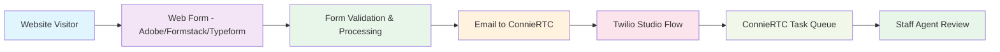

import Link from '@docusaurus/Link';

# Choose Your Web Forms Service Provider

## Introduction

ConnieRTC integrates with multiple web forms service providers to give your nonprofit organization the flexibility to create professional intake forms, referral forms, and data collection workflows. Our web forms integration allows you to capture form submissions and automatically route them to your staff through the Connie platform, creating seamless workflows for your organization.

## How Web Forms Integration Works



**The Process**:
- **Form Submission**: Website visitors complete forms on your site
- **Validation & Processing**: Your chosen provider validates and processes the submission
- **Email Routing**: Form data is emailed to your ConnieRTC endpoint (e.g., `referrals@connie.host`)
- **Automatic Processing**: ConnieRTC Studio Flow processes the email and form data
- **Task Creation**: Each form submission becomes a task in your ConnieRTC queue for staff review
- **Centralized Management**: All form submissions are tracked within ConnieRTC

## Select Your Web Forms Provider

Choose your web forms service provider below to view setup instructions and integration details:

<div style={{display: 'flex', flexWrap: 'wrap', gap: '20px', justifyContent: 'center', margin: '20px 0'}}>
  
  <div style={{textAlign: 'center', width: '200px'}}>
    <div style={{height: '80px', display: 'flex', alignItems: 'center', justifyContent: 'center', marginBottom: '10px'}}>
      <Link to="/end-users/cbo-admins/channels/web/web-forms/adobe-acrobat-sign">
        
      </Link>
    </div>
    <Link to="/end-users/cbo-admins/channels/web/web-forms/adobe-acrobat-sign" style={{textDecoration: 'none', fontWeight: 'bold'}}>
      Setup Guide Available
    </Link>
    <div style={{fontSize: '12px', color: '#666', marginTop: '5px'}}>
      ✅ Production Ready<br/>
      💰 Professional PDF Forms
    </div>
  </div>

  <div style={{textAlign: 'center', width: '200px', opacity: 0.6}}>
    <div style={{height: '80px', display: 'flex', alignItems: 'center', justifyContent: 'center', marginBottom: '10px'}}>
      
    </div>
    <span style={{color: '#666', fontSize: '14px'}}>
      Setup guide coming soon
    </span>
    <div style={{fontSize: '12px', color: '#666', marginTop: '5px'}}>
      📋 In Development
    </div>
  </div>

  <div style={{textAlign: 'center', width: '200px', opacity: 0.6}}>
    <div style={{height: '80px', display: 'flex', alignItems: 'center', justifyContent: 'center', marginBottom: '10px'}}>
      
    </div>
    <span style={{color: '#666', fontSize: '14px'}}>
      Setup guide coming soon
    </span>
    <div style={{fontSize: '12px', color: '#666', marginTop: '5px'}}>
      📋 In Development
    </div>
  </div>

</div>

*Don't see your preferred form provider? Contact the Connie Care team to discuss integration options.*

## Provider Comparison

| Feature | Adobe Acrobat Sign | Formstack | Typeform |
|---------|-------------------|-----------|----------|
| **Status** | ✅ Production Ready | 📋 Coming Soon | 📋 Coming Soon |
| **Form Type** | PDF-based professional forms | Web-native forms | Interactive conversational forms |
| **Email Integration** | ✅ Yes | TBD | TBD |
| **ConnieRTC Task Creation** | ✅ Yes | TBD | TBD |
| **PDF Generation** | ✅ Yes | TBD | TBD |
| **Validation** | ✅ Professional validation | TBD | TBD |
| **Workflow Integration** | ✅ WordPress + Adobe + Email | TBD | TBD |

## Key Features

### Seamless Workflow Integration
- **Automatic Task Creation**: Form submissions automatically create tasks in ConnieRTC queue
- **Email Processing**: Studio Flow processes form emails with full data capture
- **Centralized Management**: All form submissions tracked in ConnieRTC dashboard
- **Professional Display**: Tasks show as "Web Form Submission" with proper attribution

### Professional Form Handling
- **High-Quality PDF Generation**: Professional document creation and validation
- **Secure Data Processing**: HIPAA-compliant form handling for sensitive information
- **Validation & Verification**: Multi-step validation before submission to staff
- **Complete Data Capture**: All form fields preserved in task details

### Flexible Integration Options
- **WordPress Integration**: Direct integration with WordPress websites
- **Email Routing**: Flexible email-based routing to different departments
- **Custom Workflows**: Tailored Studio Flows for different form types
- **Multi-Channel Support**: Forms can trigger voice, email, or chat workflows

## Successful Implementation Example

### Hospital 2 Home Web Referral Workflow

**Live Implementation**: `hospital2home.org/connie-webform-builder`

**Technical Architecture**:
```
WordPress Form Builder
    ↓ (validation & user experience)
Adobe Acrobat Sign Form
    ↓ (professional PDF generation)
Email: h2h.referrals@connie.host
    ↓ (Twilio Email Channel)
Studio Flow: referrals@connie.host
    ↓ (processing & routing)
ConnieRTC Task Queue
    ↓ (staff assignment)
Task Skill: "H2H.ORG Web Referral"
```

**Performance Metrics**:
- ⚡ **~1 minute** from form submission to task creation
- ✅ **100% data capture** - all form fields preserved
- 🎯 **Professional display** - tasks show as "H2H Web Referral" instead of "Anonymous"
- 📎 **PDF attachments** - complete form data as professional PDF
- 🔄 **Reliable processing** - identical workflow to fax processing

## Important Considerations

### Before You Begin
- ✅ Determine your expected monthly form submission volume
- ✅ Verify any compliance requirements (HIPAA, etc.)
- ✅ Have your ConnieRTC account configured for web forms integration
- ✅ Ensure staff have appropriate email access for notifications
- ✅ Plan your form routing strategy (which forms go to which departments)

### Technical Requirements
- **Website Platform**: WordPress recommended for Adobe integration
- **Email Configuration**: Dedicated email addresses for form routing (e.g., `referrals@connie.host`)
- **Twilio Email Channel**: Configured email channel for form processing
- **Studio Flow**: Custom Studio Flow for form-to-task conversion
- **ConnieRTC Access**: Active ConnieRTC accounts for task management

### Compliance & Security
- **Data Protection**: All form data encrypted in transit and at rest
- **Access Controls**: Role-based permissions for form handling
- **Audit Trail**: Complete tracking of all form submissions
- **HIPAA Compliance**: Available for healthcare and social services organizations
- **Professional Validation**: Multi-step verification before final submission

## Getting Started

1. **Choose Your Provider**: Select from the available options above
2. **Review Setup Guide**: Follow provider-specific configuration instructions
3. **Configure Email Routing**: Set up dedicated email addresses for form processing
4. **Create Studio Flow**: Deploy the form processing Studio Flow
5. **Test Your Setup**: Submit test forms to verify complete workflow
6. **Train Your Team**: Ensure staff understand form submissions within ConnieRTC

## Advanced Features

### Phase 1: Current Implementation
- **Email-Based Processing**: Form submissions processed via email
- **PDF Attachments**: Complete form data as professional PDF documents
- **Task Queue Integration**: Automatic task creation with proper skill routing
- **Professional Display**: Branded task names and descriptions

### Phase 2: Planned Enhancements
- **Inline Form Preview**: View form submissions directly in ConnieRTC interface
- **CRM Container Integration**: Enhanced form data display within tasks
- **Advanced Routing**: Complex routing based on form field values
- **Analytics Dashboard**: Form submission metrics and analytics

## Need Help?

**Connie Care Team**: Contact us for assistance choosing the right forms provider for your organization

**Technical Support**: Available for setup and configuration questions

**Training Resources**: Comprehensive guides for staff onboarding

**Integration Consulting**: Professional services for complex form workflow design

---

*Web forms integration is available to all ConnieRTC customers. Contact our team to add form processing services to your nonprofit's communication platform.*