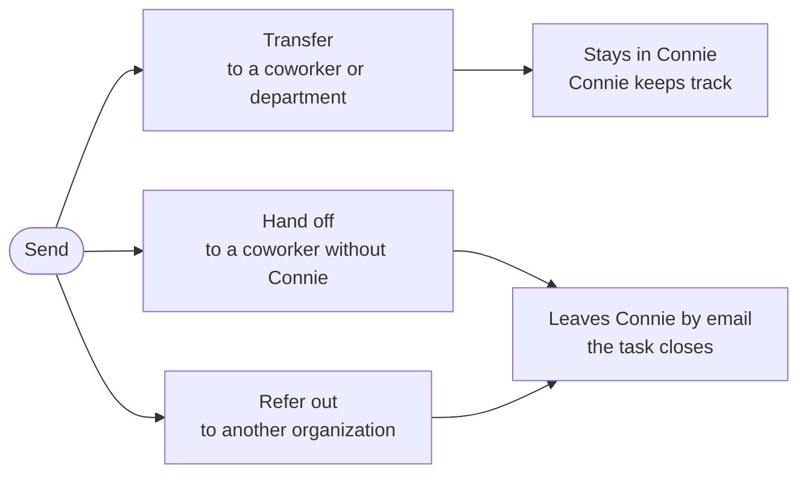

# Connie Task Sender

## What is the Task Sender?

When a task needs to go to someone else, you use one button: **Send**. It sits at the top of every task you are working on. Press it, and Connie shows you only the choices that make sense for that task.

*On a live web chat, the Send menu shows only **Transfer**, because someone is waiting with you.*

## Your three choices

| Choice | What it does | Does Connie keep track? |
|---|---|---|
| **Transfer** | Sends the task to a coworker or a department in Connie. | **Yes.** It stays in Connie. |
| **Hand off** | Emails it to a coworker who does **not** use Connie (for example, someone in the front office). | **No.** It leaves Connie and closes. |
| **Refer out** | Emails it to someone at **another organization** (a clinic, a partner agency, a caseworker). | **No.** It leaves Connie and closes. |

Easy way to remember it: **Transfer keeps it. Hand off and Refer out let it go.**

## Which tasks can use which choice

| Task type | Transfer | Hand off | Refer out |
|---|---|---|---|
| 📞 Phone call (someone is on the line) | ✅ | ❌ | ❌ |
| 💬 Web chat (someone is typing to you) | ✅ | ❌ | ❌ |
| 📱 Text message | ✅ | ❌ | ❌ |
| 🎙️ Voicemail | ✅ | ✅ | ✅ |
| 📠 Fax | ✅ | ✅ | ✅ |
| 📝 Web form | ✅ | ✅ | ✅ |
| ✉️ Email | ✅ | ✅ | ✅ |

**Why can't I hand off or refer out a call, chat or text?** Because a real person is waiting with you right now. Hand off and Refer out work by email, and you can't email someone who is on the phone with you. For a live person, use **Transfer** (or connect a caller to an outside number using the **External** tab or the dial pad).

## How to Transfer

### A phone call, web chat or text (someone is waiting)

1. Press **Send**, then **Transfer**.
2. The transfer list opens. Pick a coworker (**Agent** tab) or a department (**Queues** tab).
3. On a phone call you can also talk to them first (warm) or pass it straight over (cold).

*The transfer list. Use **Agent** for a coworker or **Queues** for a department.*

### A voicemail, fax, web form or email

1. Press **Send**, then **Transfer**.
2. Choose a **department** or a **coworker** from the list.
3. Fax, web form and email: choose a **disposition** (and add a note if you like). This records how you handled it, because your copy closes as soon as you transfer it.
4. Press **Transfer**.
5. Voicemail: after the transfer, pick your disposition in wrap-up and press **Complete**.

*The Transfer box on a web form. Here the department is closed, so Connie asks before sending (see below).*

## How to Hand off or Refer out

1. Press **Send**, then **Hand off** (coworker without Connie) or **Refer out** (another organization).
2. Pick the person from the list.
3. Press **Send**. Connie asks you to check: *"This closes the task in Connie. Nobody here will be reminded about it."* Press **Send** again to confirm.
4. Pick a disposition in wrap-up and press **Complete**.

The person receives an email with everything attached: the recording and transcript for a voicemail, the document for a fax or form, or the full email with its attachments.

### Who shows up in the list?

People in your contacts who have an **email address** saved.

- **Hand off** shows people whose email is at **your own organization**.
- **Refer out** shows everyone else.
- Your **My Contacts** are private: only you see them and only you can send to them.
- **Shared Contacts** are your organization's address book; an admin or supervisor looks after them. (Admins: see [Shared Contacts & External Referrals](/end-users/administrators/shared-contacts-and-referrals).)

## "This department is closed right now"

If you transfer to a department that is closed, Connie checks with you first:
*"This department is closed right now. Nobody is there to pick it up in [department] until it reopens. Transfer anyway?"*

- Press **Cancel** to keep the task. Nothing moves.
- Press **Transfer anyway** if you still want to send it.

Good to know: Connie only warns about **closed** departments. If a department is open but everyone is busy, the task waits there for the next free person.

## Good to know

- **Hand off and Refer out close the task in Connie.** Connie will not remind anyone or follow up.
- **Replies to that email do not come back into Connie.** It is sent from a Connie address, not from your own inbox. If you need an answer, ask the person to call or email you directly. (If the client who first wrote to you writes in again, that arrives as a **new task**.)
- **A contact with no email** will not appear under Hand off or Refer out. Ask your admin to add one.
- **Every move is recorded** on the task: what was transferred, handed off or referred out, by whom and when.

:::note Don't see the Send button?
The Task Sender is switched on for each organization by the Connie team. Until it is switched on for you, a voicemail, fax or web form shows a **Route this task** button (a small share icon) at the top instead. It opens one box with two parts: **Hand off to a queue** moves the task to another department in Connie, and **Refer out to a partner** emails it to a Shared Contact that has an email address. Phone calls, chats, texts and emails keep the transfer arrow. If you're not sure which one you have, ask your supervisor.
:::

## Need help?

Ask your supervisor, or contact Connie support from the **Get Support** button in Agent Tools. You can also visit [Get Support](/get-support/overview).

**Related:** [Transferring Tasks](/end-users/staff-agents/transferring-tasks) · [Handing Off & Referring Out](/end-users/staff-agents/handing-off-tasks) · [Parking Tasks](/end-users/staff-agents/parking-tasks)
