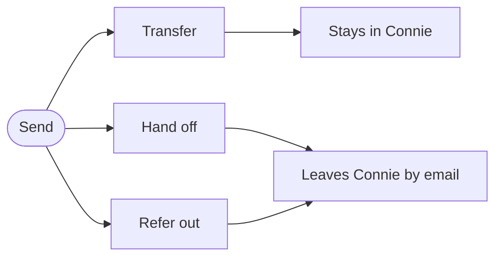

import Tabs from '@theme/Tabs';
import TabItem from '@theme/TabItem';

# ThreadConnect Task Sender: Transfer, Hand off & Refer out

:::info Tasks stay for 96 hours
A task that arrives while you're closed will **still be waiting for four full days** — long enough to survive a weekend, and a holiday weekend. Close Friday at 5:30 PM, an email lands at 5:31 PM, and it's still there when someone starts Monday morning.

Live phone calls and web chats are the exception; their window is much shorter, because someone is on the line right now.

Need a different window for a program or channel? Custom settings are available — contact your Connie account representative or the [Connie Care Team](/get-support/overview). See **[How Long a Task Stays in Your Queue](/end-users/staff-agents/handling-tasks/how-long-tasks-last)**.
:::

**One Send button on every task. Transfer it, hand it off, or refer it out — with everything intact.**

Some requests don't belong with the first person who receives them. A call, chat, voicemail, fax, web form or email might need a different department, a specialist, a coworker who doesn't use Connie, or a partner organization that offers the service your client needs. The **Connie Task Sender** puts all of that behind one **Send** button at the top of every task, and shows only the choices that make sense for that task.

## Why It Matters

Before, moving a task meant different buttons in different places depending on the channel, and some tasks could only be completed where they landed. Now every task has the same button, no request is trapped, and every move is recorded on the task: what was transferred, handed off or referred out, by whom and when.

## Three Choices, One Button

| Choice | Where it goes | Does Connie keep track? |
|---|---|---|
| **Transfer** | A coworker or a department in Connie | **Yes.** It stays in Connie. |
| **Hand off** | By email to a coworker at your organization who does **not** use Connie | **No.** It leaves Connie and closes. |
| **Refer out** | By email to someone at **another organization** (a clinic, a partner agency, a caseworker) | **No.** It leaves Connie and closes. |

> **Transfer keeps it. Hand off and Refer out let it go.** Replies to a Hand off or Refer out email do not come back into Connie; the person should contact your organization directly.

## Works With

| Task type | Transfer | Hand off | Refer out |
|---|---|---|---|
| Phone call, web chat, text message | ✅ | ❌ | ❌ |
| Voicemail, fax, web form, email | ✅ | ✅ | ✅ |

Live calls, chats and texts can only be transferred, because a real person is waiting. What travels with a Hand off or Refer out: the recording and transcript for a voicemail, the document for a fax or form, or the full email with its attachments.

---

<Tabs>
<TabItem value="agents" label="👤 Staff Agents" default>

## For Staff Agents

Press **Send** at the top of the task and pick **Transfer**, **Hand off** or **Refer out**. Full step-by-step, with screenshots: **[Connie Task Sender](/end-users/staff-agents/task-sender)**.

</TabItem>
<TabItem value="admins" label="👑 Administrators">

## For Administrators

The Task Sender is switched on per organization by the Connie team. To get the most out of it:

- Keep your **Shared Contacts** up to date **with email addresses** — only contacts with an email appear under Hand off and Refer out. See [Shared Contacts & External Referrals](/end-users/administrators/shared-contacts-and-referrals).

Talk to your Connie Care Team to turn it on or change it.

</TabItem>
</Tabs>

## Availability

✅ **Available** — switched on per organization by the Connie team. Talk to your Connie Care Team to turn it on.

---

*Related: [Connie Task Sender](/end-users/staff-agents/task-sender) (agent how-to) · [Transferring Tasks](/end-users/staff-agents/transferring-tasks) · [Handing Off & Referring Out](/end-users/staff-agents/handing-off-tasks).*
