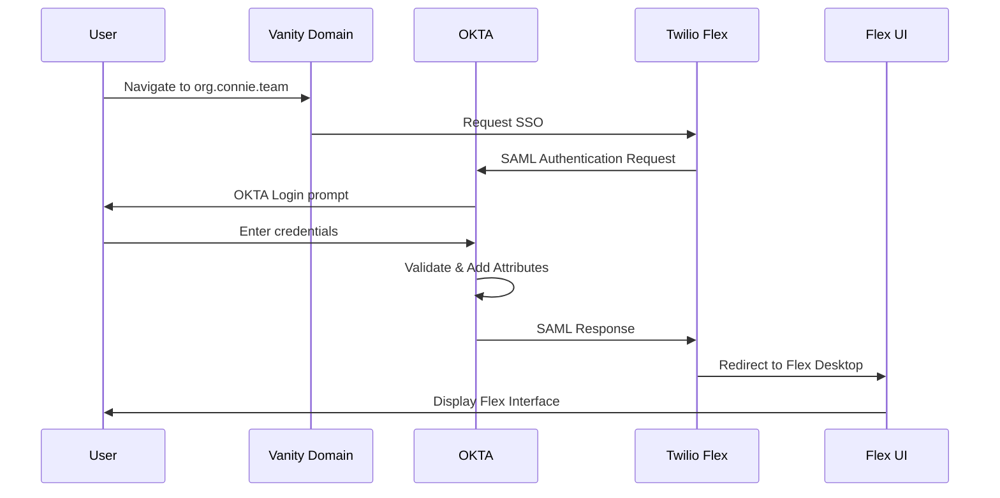

# OKTA SSO Configuration (Legacy)

Documentation for OKTA SSO integration with Twilio Flex.

:::warning Not Currently Used
**Current Status:** ConnieRTC currently uses **Auth0** for SSO. OKTA integration is not actively deployed.

This documentation is preserved for:
- Historical reference
- Future migration path if needed
- Demonstrating Connie's multi-provider support
:::

---

## 🎯 Purpose

This legacy documentation demonstrates that ConnieRTC **supports both Auth0 and OKTA** as identity providers. The architectural patterns and principles described in this authentication section apply to OKTA as well as Auth0.

**Current Recommendation:** Use [Auth0 Configuration](/techops/account-provisioning/authentication/auth0-configuration) for active deployments.

---

## 🏗️ OKTA Architecture Overview

OKTA integration follows the same SAML-based SSO pattern as Auth0:



**Key Similarity:** Both Auth0 and OKTA use SAML 2.0 for Flex integration.

---

## 📋 OKTA vs Auth0 Comparison

| Feature | Auth0 | OKTA | Notes |
|---------|-------|------|-------|
| **SAML 2.0 Support** | ✅ Yes | ✅ Yes | Both use same protocol |
| **Pattern A Support** | ✅ Yes | ✅ Yes | Multi-program with teams |
| **Pattern B Support** | ✅ Yes | ✅ Yes | Isolated organizations |
| **Attribute Mapping** | Via Actions | Via Attribute Statements | Different implementation |
| **User Metadata** | `app_metadata` | Custom Attributes | Different storage |
| **Current Deployment** | ✅ Active | ⚠️ Not Used | Auth0 preferred currently |

---

## 🔧 OKTA Configuration Overview

**If migrating to OKTA in the future, the configuration would involve:**

### 1. OKTA Application Setup
- Create SAML 2.0 application in OKTA
- Configure with Flex SAML endpoints
- Set audience and recipient URLs

### 2. Attribute Mapping
Map OKTA user attributes to Flex requirements:

| Flex Requirement | OKTA Attribute |
|------------------|----------------|
| `email` | `user.email` |
| `full_name` | `user.firstName + user.lastName` |
| `roles` | `user.flexRoles` (custom attribute) |
| `team` | `user.flexTeam` (custom attribute, Pattern A) |

### 3. Custom Attributes in OKTA
Would need to create:
- `flexRoles` - String array for role assignment
- `flexTeam` - String for team assignment (Pattern A)
- `flexProgram` - String for usage tracking (Pattern A)

### 4. OKTA Groups vs Team Attributes
OKTA offers two approaches:
- **Groups:** Map OKTA groups to Flex teams
- **Custom Attributes:** Similar to Auth0 approach

---

## 📖 Historical Context

### Why Auth0 is Currently Used

ConnieRTC initially evaluated both OKTA and Auth0 for SSO integration. Auth0 was selected for current deployments due to:

- Rapid prototyping and development flexibility
- Simpler custom attribute management via Actions
- Cost structure for nonprofit clients
- Developer experience and documentation

**Important:** This was a pragmatic choice for **current needs**, not a permanent commitment. ConnieRTC architecture remains identity-provider agnostic.

---

## 🔄 Migration Path: OKTA ↔ Auth0

If future requirements necessitate OKTA:

### Auth0 → OKTA Migration

**Preparation:**
1. Audit all Auth0 users and metadata
2. Map Auth0 `app_metadata` to OKTA custom attributes
3. Document Auth0 Actions logic for OKTA implementation
4. Test OKTA configuration in non-production environment

**Migration:**
1. Configure OKTA application with Flex SAML
2. Create OKTA users with appropriate attributes
3. Update Flex SSO settings to use OKTA metadata
4. Test with pilot users
5. Cutover during maintenance window
6. Monitor for 48 hours

**Rollback Plan:**
- Keep Auth0 configuration for 30 days post-migration
- Document rollback steps
- Have emergency contacts ready

---

## 📊 OKTA Pattern Support

Both [Pattern A (Multi-Program)](/techops/account-provisioning/authentication/pattern-a-multi-program) and [Pattern B (Isolated Organizations)](/techops/account-provisioning/authentication/pattern-b-isolated) work with OKTA:

### Pattern A with OKTA

**Team Segmentation via OKTA:**
```
OKTA Groups:
├── NSS_Admins (no team attribute)
├── NSS_RAMP_Supervisors (team: RAMP)
└── NSS_RAMP_Agents (team: RAMP)
```

Or via custom attributes:
```
User: jbuckley@nevadaseniorservices.org
Custom Attributes:
- flexRoles: ["supervisor"]
- flexTeam: "RAMP"
- flexProgram: "RAMP"
```

### Pattern B with OKTA

**Separate OKTA Tenants:**
```
Organization A → OKTA Tenant A → Flex Instance A
Organization B → OKTA Tenant B → Flex Instance B
```

Complete isolation achieved same as Auth0 Pattern B.

---

## 🔐 OKTA-Specific Features

### Advantages of OKTA

**If migrating to OKTA, these features would be available:**

**Universal Directory:**
- Centralized user management across applications
- Automated user provisioning/deprovisioning
- Advanced user lifecycle management

**Advanced Security:**
- Adaptive Multi-Factor Authentication
- Risk-based authentication
- Detailed security event logging

**Enterprise Integration:**
- Pre-built integrations with enterprise tools
- Directory integration (Active Directory, LDAP)
- HR system integration (Workday, BambooHR)

**Compliance:**
- SOC 2, ISO 27001 certified
- HIPAA compliance features
- FedRAMP authorized (government clients)

---

## 🆘 OKTA Documentation References

**If implementing OKTA in the future:**

**Official OKTA Docs:**
- [OKTA SAML Configuration](https://help.okta.com/en/prod/Content/Topics/Apps/Apps_App_Integration_Wizard_SAML.htm)
- [Attribute Statements](https://help.okta.com/en/prod/Content/Topics/users-groups-profiles/usgp-add-custom-user-attributes.htm)
- [Group Management](https://help.okta.com/en/prod/Content/Topics/users-groups-profiles/usgp-about-groups.htm)

**Twilio Flex + OKTA:**
- [Configure OKTA SSO with Flex](https://www.twilio.com/docs/flex/admin-guide/setup/sso-configuration)

---

## 📝 OKTA Reference Implementation

**For future implementation reference:**

### OKTA Attribute Statements (SAML)

**Pattern A (Multi-Program):**
```
Name: email
Value: user.email

Name: full_name
Value: String.append(user.firstName, " ", user.lastName)

Name: roles
Value: user.flexRoles

Name: team
Value: user.flexTeam

Name: program
Value: user.flexProgram
```

**Pattern B (Isolated Organizations):**
```
Name: email
Value: user.email

Name: full_name
Value: String.append(user.firstName, " ", user.lastName)

Name: roles
Value: user.flexRoles
```

---

## ✅ Validation That OKTA Would Work

ConnieRTC's authentication architecture was designed with **provider agnosticism** in mind:

**Evidence:**
1. ✅ SAML 2.0 standard protocol (OKTA supports)
2. ✅ Pattern A and B are protocol-agnostic
3. ✅ Attribute mapping flexible (both providers support)
4. ✅ Team segmentation works via attributes or groups
5. ✅ Twilio Flex officially supports OKTA

**Confidence Level:** High confidence OKTA would work if needed.

---

## 🎯 When to Consider OKTA

**Scenarios where OKTA might be preferred:**

1. **Enterprise Requirements**
   - Client already has OKTA deployment
   - Enterprise-wide SSO strategy requires OKTA
   - Compliance requirements favor OKTA

2. **Scale Considerations**
   - Managing 1000+ users across multiple organizations
   - Complex directory integration needs
   - Advanced security requirements (adaptive MFA)

3. **Government/Healthcare**
   - FedRAMP authorization required
   - HIPAA compliance with specific OKTA features
   - Government contractor requirements

**Current Deployments:** Auth0 meets all current nonprofit client needs.

---

## 📖 Related Documentation

- **Current Standard:** [Auth0 Configuration](/techops/account-provisioning/authentication/auth0-configuration)
- **Architecture Overview:** [Identity & Multi-Tenant Architecture](/techops/account-provisioning/authentication/overview)
- **Pattern A:** [Multi-Program Setup](/techops/account-provisioning/authentication/pattern-a-multi-program)
- **Pattern B:** [Isolated Organizations](/techops/account-provisioning/authentication/pattern-b-isolated)

---

## 📞 Contact

**Considering OKTA for your deployment?**

Before implementing OKTA:
1. Review [Decision Matrix](/techops/account-provisioning/authentication/overview#-decision-matrix-which-pattern) for pattern choice
2. Consult with Connie CTO on implementation strategy
3. Consider Auth0 vs OKTA for your specific requirements
4. Document rationale for provider choice

**Professional Services:** OKTA integration implementation available. Contact your Connie representative for details.

---

:::info Future-Proofing
This documentation exists to demonstrate ConnieRTC's **provider-agnostic architecture**. We can support OKTA or Auth0 based on client needs, not vendor lock-in.

**Core Principle:** Identity provider is a configuration choice, not an architectural constraint.
:::

:::tip Currently Using Auth0?
You're in the right place! Follow the [Auth0 Configuration Guide](/techops/account-provisioning/authentication/auth0-configuration) for active deployment documentation.
:::
