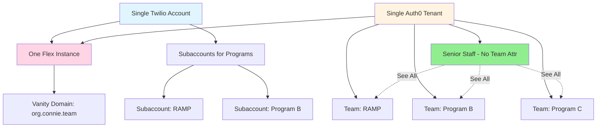
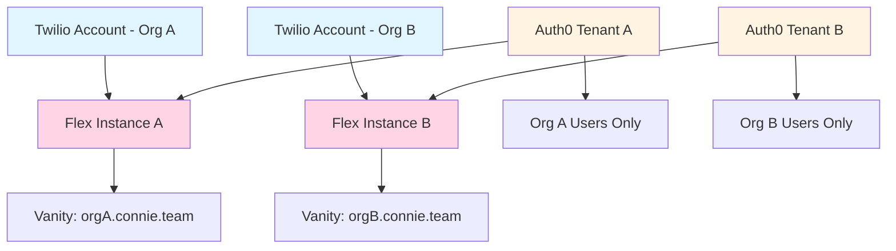

# Identity & Multi-Tenant Architecture

Complete guide to understanding and implementing authentication patterns for multi-tenant Connie deployments.

## 🎯 Purpose of This Guide

This documentation is designed for **Connie platform administrators** who are:
- Onboarding new nonprofit clients to Connie
- Configuring Twilio Flex + SSO integration
- Managing multi-program or multi-tenant deployments
- Troubleshooting authentication and team visibility issues

**Not for end-users:** Client staff (nonprofit administrators, agents, supervisors) simply login via their vanity URL and don't need this documentation.

---

## 🏗️ Two Deployment Patterns

Connie supports two distinct multi-tenant patterns. Choosing the right one is critical for proper isolation and team visibility.

### Pattern A: Single Organization, Multiple Programs

**Use Case:** One nonprofit with multiple internal programs/departments that need team-based segmentation.

**Architecture:**

**Key Characteristics:**
- ✅ One Twilio account with subaccounts for billing/usage tracking
- ✅ One Auth0 tenant with team-based segmentation
- ✅ One vanity domain for entire organization
- ✅ Team attributes control visibility in Flex
- ✅ Senior staff with no team attribute see all teams
- ✅ Program supervisors/agents only see their team members

**Example Client:** Nevada Senior Services (NSS)
- Main domain: `nss.connie.team`
- Programs: RAMP, future additional services
- Senior executives see all programs
- RAMP supervisor (Jessica) only sees RAMP team
- RAMP agents (Afia) only see RAMP tasks

---

### Pattern B: Fully Isolated Organizations

**Use Case:** Completely independent nonprofits or legal entities requiring full separation.

**Architecture:**

**Key Characteristics:**
- ✅ Separate Twilio accounts (different SIDs)
- ✅ Separate Auth0 tenants
- ✅ Separate vanity domains
- ✅ Complete organizational isolation
- ✅ No shared visibility or resources
- ✅ Independent billing and management

**Example Client:** HHOVV (separate from NSS)
- Separate Twilio SID
- Separate Auth0 tenant
- Own vanity domain
- Zero visibility to other organizations

---

## 🧭 Decision Matrix: Which Pattern?

Use this decision matrix to determine the correct pattern for your client:

| Question | Pattern A | Pattern B |
|----------|-----------|-----------|
| **Same legal entity?** | ✅ Yes - Single nonprofit | ❌ No - Different organizations |
| **Shared senior oversight?** | ✅ Yes - Executives see all programs | ❌ No - Completely independent |
| **Team-based segmentation needed?** | ✅ Yes - Programs need isolation within org | ⚠️ Not required - Full org isolation |
| **Billing structure?** | Subaccounts for program tracking | Separate accounts for independent billing |
| **Single vanity domain?** | ✅ Yes - `org.connie.team` for all | ❌ No - Each org has own domain |
| **Auth0 setup?** | One tenant, multiple teams | Separate tenants per organization |
| **User visibility requirements** | Seniors see all, teams see their own | Each org only sees their users |
| **Typical use case** | Multi-program nonprofits | Independent client organizations |

### Real-World Examples

**✅ Pattern A Scenarios:**
- Nevada Senior Services with RAMP, Adult Day Care, and Home Health programs
- Community center with Youth Services, Senior Programs, and Food Bank divisions
- Hospital system with different departments sharing oversight

**✅ Pattern B Scenarios:**
- HHOVV as a completely separate client from NSS
- Multiple independent nonprofit clients on Connie platform
- Different legal entities requiring audit separation

---

## 🚨 Common Mistakes & Red Flags

### ❌ Mistake: Using Pattern A for Pattern B Organizations

**Symptom:** Users from Organization B appearing in Organization A's Auth0 tenant or Flex Teams View

**Example:** HHOVV users showing up in NSS's Auth0 as team members

**Cause:** Incorrectly using single Auth0 tenant for completely separate organizations

**Fix:**
1. Create separate Auth0 tenant for Organization B
2. Remove Organization B users from Organization A's Auth0
3. Configure Organization B's vanity domain to use new Auth0 tenant
4. Validate complete isolation

**Prevention:** Use the decision matrix above **before** onboarding new clients

---

## 📋 Implementation Roadmap

### For Pattern A (Multi-Program):
1. Read: [Pattern A: Multi-Program Setup](/techops/account-provisioning/authentication/pattern-a-multi-program)
2. Configure: [Auth0 Configuration](/techops/account-provisioning/authentication/auth0-configuration)
3. Setup: [Twilio Flex SSO](/techops/account-provisioning/authentication/twilio-flex-sso)
4. Test: [Testing Checklist](/techops/account-provisioning/authentication/testing-checklist)

### For Pattern B (Isolated):
1. Read: [Pattern B: Isolated Organizations](/techops/account-provisioning/authentication/pattern-b-isolated)
2. Configure: [Auth0 Configuration](/techops/account-provisioning/authentication/auth0-configuration)
3. Setup: [Twilio Flex SSO](/techops/account-provisioning/authentication/twilio-flex-sso)
4. Test: [Testing Checklist](/techops/account-provisioning/authentication/testing-checklist)

---

## 🔐 Supported Identity Providers

Connie supports multiple SSO providers:

| Provider | Status | Pattern Support |
|----------|--------|-----------------|
| **Auth0** | ✅ Active | Pattern A & B |
| **OKTA** | ⚠️ Legacy (Not Currently Used) | Pattern A & B |

Both providers support the architectural patterns described in this guide. Current deployments use Auth0.

See: [OKTA Legacy Documentation](/techops/account-provisioning/authentication/okta-legacy) for historical reference.

---

## 🎯 Current State: UAT Focus

:::info Automation Roadmap
These guides document **manual configuration steps** for UAT and initial client onboarding.

**Future State:** Automated provisioning scripts will streamline this process for production deployments.
:::

---

## 📚 Context: Twilio Support Guidance

These patterns align with Twilio's recommendations for managing multi-program organizations:

**From Twilio Support:**
> "Use a single Auth0 tenant/project for your entire organization. This allows you to centrally manage all users, roles, and groups. You can leverage Auth0's roles and groups (or custom claims) to segment access. Avoid creating a separate Auth0 tenant/project for each team—this leads to siloed user management, duplicate work, and more complex SSO integration with Flex."

This guidance applies to **Pattern A** scenarios. Pattern B requires separate tenants by design due to organizational independence.

---

## 🆘 Need Help?

- **Pattern confusion?** Review the decision matrix above
- **Users appearing in wrong org?** See [Troubleshooting Guide](/techops/account-provisioning/authentication/troubleshooting)
- **SAML issues?** Check [Auth0 Configuration](/techops/account-provisioning/authentication/auth0-configuration)
- **Testing failures?** Follow [Testing Checklist](/techops/account-provisioning/authentication/testing-checklist)

---

## 📖 What's Next?

Choose your pattern and dive into the detailed implementation guide:

- **Multi-Program Setup** → [Pattern A Documentation](/techops/account-provisioning/authentication/pattern-a-multi-program)
- **Isolated Organizations** → [Pattern B Documentation](/techops/account-provisioning/authentication/pattern-b-isolated)

:::tip Professional Services Available
If you prefer assistance with authentication setup for complex deployments, Connie professional services are available. Contact your Connie representative for details.
:::
