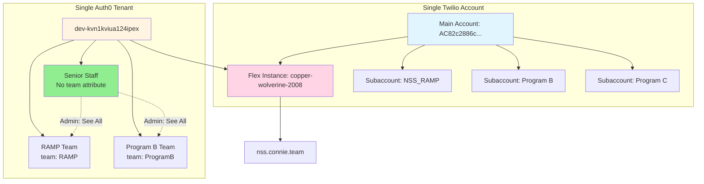

# Pattern A: Single Organization, Multiple Programs

Complete implementation guide for onboarding nonprofits with multiple internal programs using team-based segmentation.

## 🎯 When to Use This Pattern

Use Pattern A when:
- ✅ Single legal entity (one nonprofit organization)
- ✅ Multiple internal programs/departments
- ✅ Shared senior leadership needs visibility across all programs
- ✅ Individual program teams need isolation from each other
- ✅ Centralized billing with program-level usage tracking

**Example:** Nevada Senior Services (NSS) with RAMP program, Adult Day Care, Home Health services.

---

## 🏗️ Architecture Overview



**Key Components:**
1. **Single Twilio Account** with subaccounts for billing segmentation
2. **Single Auth0 Tenant** with user metadata for team assignment
3. **One Flex Instance** with Teams View filtering
4. **One Vanity Domain** for entire organization
5. **SAML Attributes** passing team and program information to Flex

---

## 📋 Prerequisites

Before beginning setup:
- ✅ Twilio account credentials (Account SID and Auth Token)
- ✅ Auth0 tenant access with admin privileges
- ✅ List of programs/teams within the nonprofit
- ✅ Organizational structure (who should see what)
- ✅ Vanity domain configured (e.g., `nss.connie.team`)
- ✅ User email addresses for initial staff setup

---

## 🚀 Implementation Steps

### Step 1: Create Twilio Subaccounts (Optional but Recommended)

Subaccounts provide billing and usage transparency for each program without creating separate Flex instances.

**1.1 Navigate to Twilio Console**
- URL: `https://console.twilio.com/`
- Login with main account credentials

**1.2 Create Subaccount**
- Go to **Account** → **Subaccounts**
- Click **Create new subaccount**
- Enter details:
  - **Friendly Name:** `NSS_RAMP` (or your program name)
  - **Purpose:** Billing and usage tracking for RAMP program

:::tip Changing Subaccount Names
Subaccount friendly names can be changed anytime via Console or API without affecting functionality. The friendly name is just a label for reference.
:::

**1.3 Note the Subaccount SID**
```
Example: AC[EXAMPLE_SUBACCOUNT_SID_32_CHARS]
```

You'll use this for associating program-specific usage later.

**📸 Screenshot Placeholder:**
```
[Screenshot: Twilio Console - Subaccounts Page]
Description: Shows the "Create new subaccount" button and form with Friendly Name field
Location: Console → Account → Subaccounts
```

---

### Step 2: Configure Auth0 Users with Team Metadata

**2.1 Access Auth0 Dashboard**
- URL: `https://manage.auth0.com/dashboard/`
- Navigate to **User Management** → **Users**

**2.2 Create or Update User**

For each staff member, configure their `app_metadata` with Flex roles and team assignment.

**Example: RAMP Supervisor (Jessica Buckley)**

```json
{
  "flex": {
    "roles": ["supervisor"],
    "team": "RAMP"
  },
  "program": "RAMP"
}
```

**Example: RAMP Agent (Afia Kambon)**

```json
{
  "flex": {
    "roles": ["agent"],
    "team": "RAMP"
  },
  "program": "RAMP"
}
```

**Example: Senior Executive (No Team - Sees All)**

```json
{
  "flex": {
    "roles": ["admin"]
  }
}
```

**Metadata Field Definitions:**

| Field | Purpose | Values |
|-------|---------|--------|
| `flex.roles` | Flex permission level | `admin`, `supervisor`, `agent` |
| `flex.team` | Team visibility filter | `RAMP`, `ProgramB`, etc. (omit for admin) |
| `program` | Usage tracking attribute | Program name for reporting |

**📸 Screenshot Placeholder:**
```
[Screenshot: Auth0 - User Metadata Editor]
Description: Shows the app_metadata JSON editor with example RAMP supervisor metadata
Location: Auth0 Dashboard → Users → [User] → Raw JSON tab
```

---

### Step 3: Update Auth0 Action for SAML Attributes

Auth0 Actions pass user metadata to Twilio Flex via SAML attributes. This is **critical** for team-based visibility.

**3.1 Navigate to Auth0 Actions**
- Dashboard: `https://manage.auth0.com/dashboard/`
- Go to **Actions** → **Library**
- Find: **"Add Flex Roles to SAML"**
  - Action ID: `4753bc91-8906-450d-b1fd-d8259aade890`

**3.2 Update Action Code**

Replace existing code with:

```javascript
/**
 * Auth0 Post-Login Action: Add Flex Roles to SAML Response
 *
 * Purpose: Pass user metadata to Twilio Flex via SAML attributes
 * Critical for: Team-based visibility filtering in Flex Teams View
 */
exports.onExecutePostLogin = async (event, api) => {
  // Get Flex roles from user's app_metadata
  const flexRoles = event.user.app_metadata?.flex?.roles || ['agent'];
  const flexTeam = event.user.app_metadata?.flex?.team;
  const program = event.user.app_metadata?.program;

  // Set SAML attributes that Twilio Flex requires
  api.samlResponse.setAttribute('email', event.user.email);

  // Build full name from available user data
  const fullName = event.user.name ||
    [event.user.given_name, event.user.family_name].filter(Boolean).join(' ') ||
    event.user.email.split('@')[0];

  api.samlResponse.setAttribute('full_name', fullName);
  api.samlResponse.setAttribute('roles', flexRoles.join(','));

  // Add team attribute (critical for Teams View filtering)
  if (flexTeam) {
    api.samlResponse.setAttribute('team', flexTeam);
  }

  // Add program attribute (for billing/reporting)
  if (program) {
    api.samlResponse.setAttribute('program', program);
  }
};
```

**Why This Matters:**
- The `team` attribute enables Flex's native Teams View filtering
- Jessica (RAMP supervisor with `team: "RAMP"`) only sees RAMP team members
- Senior staff without `team` attribute see ALL teams (admin override)
- `program` attribute enables usage tracking by program

**3.3 Deploy the Action**
- Click **Deploy** in top right
- Verify action is deployed to the login flow

**📸 Screenshot Placeholders:**
```
[Screenshot: Auth0 Actions - Library View]
Description: Shows the Actions Library with "Add Flex Roles to SAML" action highlighted
Location: Auth0 Dashboard → Actions → Library

[Screenshot: Auth0 Actions - Code Editor]
Description: Shows the action code editor with the updated SAML attribute code
Location: Actions → Add Flex Roles to SAML → Code tab

[Screenshot: Auth0 Actions - Deploy Button]
Description: Shows the Deploy button and deployment confirmation
Location: Actions → Add Flex Roles to SAML → Top right
```

---

### Step 4: Configure Twilio Flex SSO

See: [Twilio Flex SSO Configuration](/techops/account-provisioning/authentication/twilio-flex-sso) for detailed SSO setup steps.

**Quick Reference:**
1. Configure SAML application in Auth0
2. Set Auth0 callback URLs for Flex
3. Configure Flex SSO settings in Twilio Console
4. Set vanity domain (`nss.connie.team`)

---

### Step 5: Test Team Visibility

After configuration, validate that team-based visibility works correctly.

**Test Scenarios:**

**✅ Test 1: Supervisor Sees Only Their Team**
- Login: Jessica Buckley (RAMP supervisor)
- Expected: Only sees RAMP team members (Afia) in Teams View
- Expected: Does NOT see members from other programs

**✅ Test 2: Agent Has Appropriate Permissions**
- Login: Afia Kambon (RAMP agent)
- Expected: No supervisor controls visible
- Expected: Can accept tasks and change status

**✅ Test 3: Admin Sees All Teams**
- Login: Senior executive (no team attribute)
- Expected: Sees ALL program teams in Teams View
- Expected: Full administrative controls

See: [Testing Checklist](/techops/account-provisioning/authentication/testing-checklist) for comprehensive testing protocol.

---

## 🔄 Adding Additional Programs

Once Pattern A is established, adding new programs follows the same process:

**For Each New Program:**

1. **Create Subaccount** (optional)
   - Friendly Name: `NSS_ProgramB`
   - Purpose: Usage tracking for new program

2. **Add Users to Auth0**
   - Set `flex.team` to new program name
   - Set `program` attribute for tracking

3. **Update User Roles**
   - Assign appropriate `flex.roles` (admin/supervisor/agent)

4. **Test Isolation**
   - Verify new program team only sees their members
   - Verify existing teams unaffected

**Example: Adding Adult Day Care Program**

```json
{
  "flex": {
    "roles": ["supervisor"],
    "team": "AdultDayCare"
  },
  "program": "AdultDayCare"
}
```

No changes to Auth0 Action or Flex configuration required—team attributes handle everything automatically.

---

## 📊 Usage Tracking by Program

**Viewing Program-Specific Usage:**

1. **Twilio Console** → Navigate to specific subaccount
2. **Usage Dashboard** → Filter by date range
3. **View Metrics:**
   - Task Router usage
   - Flex Active User Hours
   - Call/conversation volumes
   - Separate billing line items

**Timeline:** Usage data typically populates within 24-48 hours.

**Reporting:** Program attribute in user metadata enables custom reporting by program across the single Flex instance.

---

## 🏢 Real-World Example: NSS RAMP Setup

**Organization:** Nevada Senior Services (NSS)
**Program:** RAMP (Resource Assistance for Marginalized Populations)
**Architecture:** Pattern A (Multi-Program)

**Configuration:**

| Component | Value |
|-----------|-------|
| **Twilio Main Account** | `AC[MAIN_ACCOUNT_SID]` |
| **Flex Instance** | `copper-wolverine-2008` |
| **RAMP Subaccount** | `AC[RAMP_SUBACCOUNT_SID]` |
| **Auth0 Tenant** | `dev-kvn1kviua124ipex` |
| **Vanity Domain** | `nss.connie.team` |

**Users:**

**Jessica Buckley** (RAMP Supervisor)
- Email: `jbuckley@nevadaseniorservices.org`
- User ID: `auth0|691e32d4889ef6e2a3f0626f`
- Metadata: `{"flex": {"roles": ["supervisor"], "team": "RAMP"}, "program": "RAMP"}`
- Visibility: Only sees RAMP team members

**Afia Kambon** (RAMP Agent)
- Email: `akambon@nevadaseniorservices.org`
- User ID: `auth0|691f64260d15618957163e44`
- Metadata: `{"flex": {"roles": ["agent"], "team": "RAMP"}, "program": "RAMP"}`
- Visibility: Agent-level access, visible to Jessica

**Result:** Jessica can supervise only her RAMP team while senior NSS executives with admin role see all programs.

---

## ⚠️ Common Mistakes

### ❌ Forgetting Team Attribute
**Symptom:** All users see all teams
**Cause:** `flex.team` not set in user metadata
**Fix:** Add team attribute to all non-admin users

### ❌ Auth0 Action Not Deployed
**Symptom:** Team attributes not working after metadata update
**Cause:** Action code updated but not deployed
**Fix:** Click "Deploy" button in Auth0 Actions

### ❌ Case Sensitivity Issues
**Symptom:** Team filtering not working
**Cause:** Team names in metadata don't match exactly (e.g., "ramp" vs "RAMP")
**Fix:** Use consistent team naming (recommend: CamelCase or UPPERCASE)

---

## 🆘 Troubleshooting

See: [Authentication Troubleshooting Guide](/techops/account-provisioning/authentication/troubleshooting) for detailed debugging steps.

**Quick Checks:**
1. Verify user metadata in Auth0 includes `flex.team`
2. Confirm Auth0 Action is deployed
3. Check SAML attributes in Auth0 login logs
4. Verify user logged in at least once after Action update
5. Confirm Flex Worker attributes in Twilio Console

---

## 📖 Next Steps

- **Configure Auth0:** [Auth0 Configuration Reference](/techops/account-provisioning/authentication/auth0-configuration)
- **Setup Flex SSO:** [Twilio Flex SSO Guide](/techops/account-provisioning/authentication/twilio-flex-sso)
- **Test Deployment:** [Testing Checklist](/techops/account-provisioning/authentication/testing-checklist)

:::tip Pattern B Instead?
If your client requires complete organizational isolation (separate legal entities), use [Pattern B: Isolated Organizations](/techops/account-provisioning/authentication/pattern-b-isolated) instead.
:::
