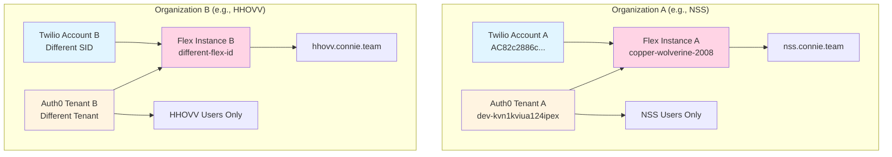

# Pattern B: Fully Isolated Organizations

Complete implementation guide for onboarding independent nonprofit clients requiring complete organizational separation.

## 🎯 When to Use This Pattern

Use Pattern B when:
- ✅ Separate legal entities (different nonprofit organizations)
- ✅ Complete independence required between organizations
- ✅ No shared oversight or visibility needed
- ✅ Independent billing and financial separation
- ✅ Different vanity domains for each organization

**Example:** HHOVV as a separate client from NSS, or any independent nonprofit on the Connie platform.

---

## 🏗️ Architecture Overview



**Key Components:**
1. **Separate Twilio Accounts** with different Account SIDs
2. **Separate Auth0 Tenants** with no shared users
3. **Separate Flex Instances** with independent configuration
4. **Separate Vanity Domains** for each organization
5. **Complete Isolation** - no visibility or resource sharing

---

## 📋 Prerequisites

Before beginning setup:
- ✅ Separate Twilio account for the new organization
- ✅ Separate Auth0 tenant (or ability to create one)
- ✅ Organization's user list and roles
- ✅ Unique vanity domain for organization
- ✅ Confirmed that organizations are legally independent

:::warning Check Your Pattern
Before proceeding, verify this is the correct pattern using the [Decision Matrix](/techops/account-provisioning/authentication/overview#-decision-matrix-which-pattern).

**Common Mistake:** Using Pattern B when Pattern A (multi-program) is actually needed.
:::

---

## 🚀 Implementation Steps

### Step 1: Verify Twilio Account Separation

**1.1 Confirm Separate Twilio Account**

Each organization must have its own Twilio Account SID:

**Organization A:**
```
Account SID: AC[ORG_A_MAIN_ACCOUNT_SID]
Example: Nevada Senior Services
```

**Organization B:**
```
Account SID: AC[different-32-character-id]
Example: HHOVV
```

**Why This Matters:** Separate Twilio accounts ensure:
- Independent billing
- No shared resources
- Complete audit separation
- Separate Flex instances

**📸 Screenshot Placeholder:**
```
[Screenshot: Twilio Console - Account Info]
Description: Shows Account SID and Friendly Name for verification
Location: Console → Account → General Settings
```

---

### Step 2: Create Separate Auth0 Tenant

**2.1 Create New Auth0 Tenant**

Do **NOT** reuse existing Auth0 tenant from other organizations.

1. Login to Auth0 Dashboard
2. **Tenant Dropdown** (top right) → **Create Tenant**
3. **Tenant Name:** `hhovv-connie-prod` (or organization-specific)
4. **Region:** Select appropriate region
5. **Environment:** Production

**2.2 Configure Tenant Domain**

Your new tenant will have a domain like:
```
hhovv-connie-prod.us.auth0.com
```

**2.3 Note Tenant Information**
- Tenant Domain
- Tenant ID
- Client ID (from default application)
- Client Secret (for SAML configuration)

**📸 Screenshot Placeholder:**
```
[Screenshot: Auth0 - Create Tenant Dialog]
Description: Shows the tenant creation form with name, region, and environment fields
Location: Auth0 Dashboard → Tenant Dropdown → Create Tenant
```

---

### Step 3: Configure Auth0 Application for Flex SSO

**3.1 Create SAML Application**

1. **Auth0 Dashboard** → **Applications** → **Create Application**
2. **Name:** `Twilio Flex SSO - [Organization Name]`
3. **Type:** Select **"Regular Web Application"**
4. Click **Create**

**3.2 Configure Application Settings**

Navigate to application **Settings** tab:

**Application URLs:**
```
Allowed Callback URLs:
https://iam.twilio.com/v2/saml2/authenticate/[YOUR_FLEX_INSTANCE_SID]

Allowed Logout URLs:
https://flex.twilio.com/logout
```

**3.3 Enable SAML2 Web App Addon**

1. Navigate to **Addons** tab
2. Enable **SAML2 Web App**
3. Configure SAML settings:

```json
{
  "audience": "https://iam.twilio.com/v2/saml2/metadata/[YOUR_FLEX_INSTANCE_SID]",
  "recipient": "https://iam.twilio.com/v2/saml2/authenticate/[YOUR_FLEX_INSTANCE_SID]",
  "mappings": {
    "email": "email",
    "name": "full_name",
    "roles": "roles"
  }
}
```

**📸 Screenshot Placeholder:**
```
[Screenshot: Auth0 - SAML2 Addon Configuration]
Description: Shows the SAML2 Web App addon settings with audience and recipient URLs
Location: Auth0 → Applications → [App] → Addons → SAML2 Web App
```

---

### Step 4: Create Auth0 Action for SAML Attributes

Each Auth0 tenant needs its own Post-Login Action.

**4.1 Create New Action**

1. **Auth0 Dashboard** → **Actions** → **Library** → **Build Custom**
2. **Name:** `Add Flex Roles to SAML - [Organization]`
3. **Trigger:** Post-Login
4. **Runtime:** Node 18

**4.2 Add Action Code**

```javascript
/**
 * Auth0 Post-Login Action: Add Flex Roles to SAML Response
 * Organization: [Your Organization Name]
 * Pattern: B - Isolated Organization
 */
exports.onExecutePostLogin = async (event, api) => {
  // Get Flex roles from user's app_metadata
  const flexRoles = event.user.app_metadata?.flex?.roles || ['agent'];

  // Set SAML attributes that Twilio Flex requires
  api.samlResponse.setAttribute('email', event.user.email);

  // Build full name from available user data
  const fullName = event.user.name ||
    [event.user.given_name, event.user.family_name].filter(Boolean).join(' ') ||
    event.user.email.split('@')[0];

  api.samlResponse.setAttribute('full_name', fullName);
  api.samlResponse.setAttribute('roles', flexRoles.join(','));
};
```

**Note:** Pattern B typically does NOT need team attributes unless the organization internally uses multi-program structure. If they do, see [Pattern A](/techops/account-provisioning/authentication/pattern-a-multi-program) for team attribute configuration.

**4.3 Deploy the Action**
- Click **Deploy**
- Add to **Login Flow**: Actions → Flows → Login → Add Action

**📸 Screenshot Placeholder:**
```
[Screenshot: Auth0 Actions - Custom Action Code]
Description: Shows the action code editor with the SAML attribute mapping code
Location: Auth0 → Actions → Library → [Custom Action]
```

---

### Step 5: Add Users to New Auth0 Tenant

**5.1 Create Users**

For each staff member in the organization:

1. **Auth0 Dashboard** → **User Management** → **Users** → **Create User**
2. Enter user details:
   - **Email:** User's email address
   - **Password:** Initial password (or send invitation)
   - **Connection:** Username-Password-Authentication

**5.2 Configure User Metadata**

**Example: Organization Administrator**
```json
{
  "flex": {
    "roles": ["admin"]
  }
}
```

**Example: Supervisor**
```json
{
  "flex": {
    "roles": ["supervisor"]
  }
}
```

**Example: Agent**
```json
{
  "flex": {
    "roles": ["agent"]
  }
}
```

**📸 Screenshot Placeholder:**
```
[Screenshot: Auth0 - User Creation Form]
Description: Shows the create user form with email, password, and connection fields
Location: Auth0 → User Management → Users → Create User
```

---

### Step 6: Configure Twilio Flex SSO

See: [Twilio Flex SSO Configuration](/techops/account-provisioning/authentication/twilio-flex-sso) for detailed SSO setup steps.

**Key Differences for Pattern B:**
- Use the **new Auth0 tenant's** SAML metadata URL
- Configure SSO for the **organization's specific Flex instance**
- Set unique vanity domain for this organization

---

### Step 7: Test Complete Isolation

After configuration, validate that organizations are completely isolated.

**✅ Test 1: Verify Separate Auth0 Tenants**
- Confirm Organization A users exist ONLY in Tenant A
- Confirm Organization B users exist ONLY in Tenant B
- No shared users between tenants

**✅ Test 2: Test Login Isolation**
- Login to Organization A vanity domain → Should authenticate via Tenant A
- Login to Organization B vanity domain → Should authenticate via Tenant B
- Cross-contamination not possible

**✅ Test 3: Verify Separate Flex Instances**
- Organization A users see only Organization A data
- Organization B users see only Organization B data
- No shared Teams View or resources

See: [Testing Checklist](/techops/account-provisioning/authentication/testing-checklist) for comprehensive testing protocol.

---

## 🔄 Migrating from Pattern A to Pattern B

**Common Scenario:** Organization incorrectly set up using Pattern A when Pattern B was needed.

**Example:** HHOVV users appearing in NSS's Auth0 tenant.

### Migration Steps

**1. Assess Current State**
- Identify all users belonging to Organization B in Organization A's Auth0
- Document their roles and metadata

**2. Create Pattern B Infrastructure**
- Follow Steps 1-5 above to create separate Auth0 tenant
- Do NOT delete Organization B users from Organization A yet

**3. Recreate Users in New Tenant**
- Add all Organization B users to new Auth0 tenant
- Match their roles and permissions
- Verify email addresses are correct

**4. Test New Configuration**
- Validate Organization B users can login via new tenant
- Confirm complete isolation from Organization A
- Test all functionality

**5. Clean Up Organization A**
- After successful validation, remove Organization B users from Organization A's Auth0
- Update documentation
- Notify affected users of any URL changes

**📸 Screenshot Placeholder:**
```
[Screenshot: Auth0 - User List with Org Filter]
Description: Shows how to identify users from different organizations in shared tenant
Location: Auth0 → User Management → Users (with search/filter)
```

---

## 🏢 Real-World Example: HHOVV Isolation

**Problem:** HHOVV users incorrectly appearing in NSS's Auth0 tenant.

**Root Cause:** Pattern A (multi-program) was used when Pattern B (isolated) was required.

**Solution:**

**Nevada Senior Services (Pattern A)**
- Twilio Account: `AC[NSS_MAIN_ACCOUNT_SID]`
- Auth0 Tenant: `dev-kvn1kviua124ipex`
- Domain: `nss.connie.team`
- Users: NSS staff only (RAMP, other programs)

**HHOVV (Pattern B - Corrected)**
- Twilio Account: `AC[different-sid]` (separate)
- Auth0 Tenant: `hhovv-connie-prod` (NEW)
- Domain: `hhovv.connie.team` (separate)
- Users: HHOVV staff only

**Result:** Complete organizational isolation achieved. NSS and HHOVV operate as independent Connie clients.

---

## ⚠️ Common Mistakes

### ❌ Sharing Auth0 Tenant Between Independent Orgs
**Symptom:** Users from Org B appearing in Org A's Teams View
**Cause:** Using single Auth0 tenant for Pattern B scenario
**Fix:** Create separate Auth0 tenants (this guide)

### ❌ Using Same Vanity Domain
**Symptom:** Login conflicts, wrong organization access
**Cause:** Multiple organizations using same vanity URL
**Fix:** Assign unique vanity domain per organization

### ❌ Confusing Pattern A vs Pattern B
**Symptom:** Over-complicated setup or insufficient isolation
**Cause:** Wrong pattern chosen for use case
**Fix:** Review [Decision Matrix](/techops/account-provisioning/authentication/overview#-decision-matrix-which-pattern)

---

## 📊 Advantages of Pattern B

**Benefits of Complete Isolation:**
- ✅ **Security:** No possibility of cross-organization data access
- ✅ **Compliance:** Clear audit trails per organization
- ✅ **Billing:** Completely independent financial tracking
- ✅ **Customization:** Each org can have unique Flex configuration
- ✅ **Scalability:** No complexity limits as client base grows

**Tradeoffs:**
- ⚠️ **Management:** Each tenant requires separate administration
- ⚠️ **Cost:** Multiple Auth0 tenants may increase licensing costs
- ⚠️ **Updates:** Configuration changes must be applied per-tenant

---

## 🆘 Troubleshooting

See: [Authentication Troubleshooting Guide](/techops/account-provisioning/authentication/troubleshooting) for detailed debugging steps.

**Pattern B Specific Issues:**

**Issue: Users seeing wrong organization's data**
- **Cause:** Incorrect Flex instance SID in SSO configuration
- **Fix:** Verify SAML audience matches organization's Flex instance

**Issue: Login fails with SAML error**
- **Cause:** Wrong Auth0 tenant metadata URL in Flex SSO settings
- **Fix:** Confirm metadata URL from correct Auth0 tenant

---

## 📖 Next Steps

- **Configure Auth0:** [Auth0 Configuration Reference](/techops/account-provisioning/authentication/auth0-configuration)
- **Setup Flex SSO:** [Twilio Flex SSO Guide](/techops/account-provisioning/authentication/twilio-flex-sso)
- **Test Deployment:** [Testing Checklist](/techops/account-provisioning/authentication/testing-checklist)

:::tip Pattern A Instead?
If your client has multiple programs within a single legal entity, consider [Pattern A: Multi-Program Setup](/techops/account-provisioning/authentication/pattern-a-multi-program) for simpler management.
:::
