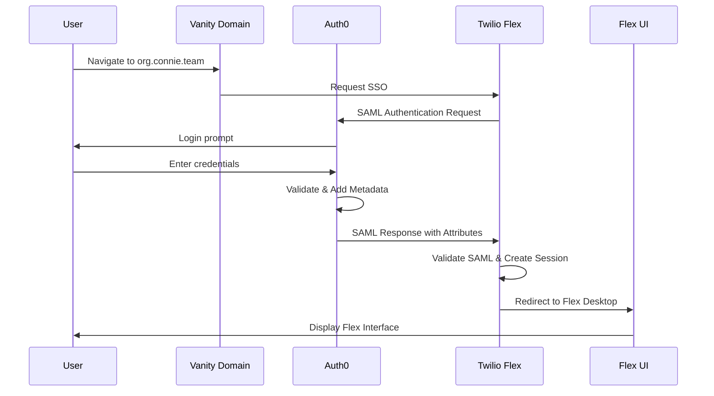

# Twilio Flex SSO Configuration

Complete guide to configuring SAML-based Single Sign-On for Twilio Flex using Auth0.

## 🎯 Purpose

This guide covers the Twilio Flex side of SSO configuration. Complete Auth0 configuration first using the [Auth0 Configuration Guide](/techops/account-provisioning/authentication/auth0-configuration).

**Prerequisites:**
- Auth0 tenant configured with SAML application
- Auth0 SAML metadata URL available
- Twilio Flex instance provisioned
- Admin access to Twilio Console

---

## 🏗️ SSO Architecture



---

## 📋 Prerequisites Checklist

Before beginning Flex SSO setup:

**From Auth0:**
- ✅ SAML metadata URL (e.g., `https://YOUR_TENANT.auth0.com/samlp/metadata/YOUR_CLIENT_ID`)
- ✅ Auth0 application configured for SAML
- ✅ Post-Login Action deployed
- ✅ Test user created

**From Twilio:**
- ✅ Flex instance SID (e.g., `FO...`)
- ✅ Account SID and Auth Token
- ✅ Admin role in Twilio Console

**Vanity Domain:**
- ✅ Domain decided (e.g., `nss.connie.team`)
- ✅ DNS configured (if using custom domain)

---

## 🚀 Configuration Steps

### Step 1: Access Twilio Flex Console

**1.1 Login to Twilio Console**
- URL: `https://console.twilio.com/`
- Use credentials for appropriate account:
  - **Pattern A:** Main organization account
  - **Pattern B:** Organization-specific account

**1.2 Navigate to Flex**
- Left sidebar: **Flex** → **Admin**
- Or direct URL: `https://console.twilio.com/us1/develop/flex`

**1.3 Verify Flex Instance**
- Note your Flex instance SID (starts with `FO`)
- Example: `FO7e8c9d0a1b2c3d4e5f6g7h8i9j0k1l`

**📸 Screenshot Placeholder:**
```
[Screenshot: Twilio Console - Flex Admin Panel]
Description: Shows Flex admin navigation and instance SID location
Location: Twilio Console → Flex → Admin
```

---

### Step 2: Configure SSO Settings

**2.1 Navigate to SSO Configuration**
- Twilio Console → **Flex** → **Admin** → **Single Sign-On**
- Or search for "SSO" in console search bar

**2.2 Enable SSO**
- Toggle **"Enable Single Sign-On"** to ON
- This reveals SSO configuration fields

**📸 Screenshot Placeholder:**
```
[Screenshot: Twilio Flex - Enable SSO Toggle]
Description: Shows the SSO enable toggle in the ON position
Location: Flex → Admin → Single Sign-On
```

---

### Step 3: Add Identity Provider (Auth0)

**3.1 Add New Identity Provider**
- Click **"Add Identity Provider"** button
- Select **"SAML 2.0"** as protocol

**3.2 Configure Identity Provider Settings**

**Basic Information:**

| Field | Value | Example |
|-------|-------|---------|
| **Name** | `Auth0 - [Organization]` | `Auth0 - Nevada Senior Services` |
| **Entity ID** | From Auth0 SAML metadata | `urn:auth0:YOUR_TENANT:YOUR_CLIENT` |
| **SSO URL** | From Auth0 SAML metadata | `https://YOUR_TENANT.auth0.com/...` |

**3.3 Upload Auth0 Metadata**

**Option A: Metadata URL (Recommended)**
- Select **"Metadata URL"** option
- Enter: `https://YOUR_TENANT.auth0.com/samlp/metadata/YOUR_CLIENT_ID`
- Click **"Fetch Metadata"**
- Twilio will auto-populate Entity ID and SSO URL

**Option B: Manual Entry**
- Download Auth0 SAML metadata XML
- Copy Entity ID and SSO URL manually
- Upload certificate from metadata

**📸 Screenshot Placeholder:**
```
[Screenshot: Twilio Flex - Add Identity Provider Form]
Description: Shows the SAML 2.0 identity provider configuration form with Auth0 metadata URL
Location: Flex → Single Sign-On → Add Identity Provider
```

---

### Step 4: Configure Attribute Mapping

Flex requires specific SAML attributes to create user sessions.

**4.1 Navigate to Attribute Mapping**
- In SSO configuration, scroll to **"Attribute Mapping"** section

**4.2 Configure Required Attributes**

Map Auth0 SAML attributes to Flex worker attributes:

| Flex Attribute | Auth0 SAML Attribute | Required | Purpose |
|----------------|---------------------|----------|---------|
| `email` | `email` | ✅ Yes | User identifier |
| `full_name` | `full_name` | ✅ Yes | Display name |
| `roles` | `roles` | ✅ Yes | Permission level |
| `team` | `team` | ⚠️ Pattern A | Team visibility filter |
| `program` | `program` | ❌ Optional | Usage tracking |

**Example Configuration:**
```
Flex: email          ← SAML: email
Flex: full_name      ← SAML: full_name
Flex: roles          ← SAML: roles
Flex: team           ← SAML: team
```

**📸 Screenshot Placeholder:**
```
[Screenshot: Twilio Flex - SAML Attribute Mapping]
Description: Shows attribute mapping configuration with email, full_name, roles, and team mappings
Location: Flex → Single Sign-On → Attribute Mapping
```

---

### Step 5: Configure Vanity Domain

**5.1 Navigate to Vanity Domain Settings**
- Flex Admin → **Single Sign-On** → **Vanity URL**
- Or: Flex Admin → **Settings** → **Vanity URL**

**5.2 Set Vanity Domain**

**Option A: Connie Subdomain (Recommended)**
```
https://nss.connie.team
```

**Option B: Organization's Custom Domain**
```
https://flex.organization.org
```

**5.3 DNS Configuration (If Custom Domain)**

If using organization's own domain, configure DNS:

**CNAME Record:**
```
flex.organization.org  →  flex.twilio.com
```

**Or A Record:**
```
Contact Twilio support for IP addresses
```

**5.4 Save Vanity Domain**
- Click **Save**
- Wait for DNS propagation (if custom domain)
- Test domain accessibility

**📸 Screenshot Placeholder:**
```
[Screenshot: Twilio Flex - Vanity URL Configuration]
Description: Shows vanity URL field with example domain nss.connie.team
Location: Flex → Admin → Settings → Vanity URL
```

---

### Step 6: Configure Auth0 Callback URLs

**Return to Auth0 to complete the loop:**

**6.1 Get Flex Callback URL**

From Twilio Flex SSO settings, copy:
```
https://iam.twilio.com/v2/saml2/authenticate/[YOUR_FLEX_INSTANCE_SID]
```

**6.2 Update Auth0 Application**
- Auth0 Dashboard → **Applications** → [Your Flex App]
- Navigate to **Settings** tab

**6.3 Add Callback URLs**

**Allowed Callback URLs:**
```
https://iam.twilio.com/v2/saml2/authenticate/[YOUR_FLEX_INSTANCE_SID]
https://iam.twilio.com/v2/saml2/authenticate/[YOUR_FLEX_INSTANCE_SID]/callback
```

**Allowed Logout URLs:**
```
https://flex.twilio.com/logout
https://[YOUR_VANITY_DOMAIN]/logout
```

**Example:**
```
https://iam.twilio.com/v2/saml2/authenticate/FO7e8c9d0a1b2c3d4e5f6g7h8i9j0k1l
https://iam.twilio.com/v2/saml2/authenticate/FO7e8c9d0a1b2c3d4e5f6g7h8i9j0k1l/callback
https://flex.twilio.com/logout
https://nss.connie.team/logout
```

**6.4 Save Auth0 Settings**

**📸 Screenshot Placeholder:**
```
[Screenshot: Auth0 - Application Callback URLs]
Description: Shows the Allowed Callback URLs and Allowed Logout URLs fields with Flex URLs
Location: Auth0 → Applications → [Flex App] → Settings
```

---

### Step 7: Test SSO Configuration

**7.1 Initiate Test Login**

**Method 1: Via Vanity Domain**
```
Navigate to: https://nss.connie.team
```

**Method 2: Via Direct Flex URL**
```
Navigate to: https://flex.twilio.com
Click "Sign in with SSO"
Enter vanity domain: nss.connie.team
```

**7.2 Expected Flow**
1. Redirected to Auth0 login page
2. Enter credentials
3. Auth0 validates and adds metadata
4. Redirected back to Flex
5. Flex creates session with attributes
6. Flex Desktop UI loads

**7.3 Verify Successful Login**
- ✅ Flex UI loads
- ✅ User's name appears in top right
- ✅ Appropriate role features visible
- ✅ Team View shows correct team members (Pattern A)

**📸 Screenshot Placeholder:**
```
[Screenshot: Twilio Flex - SSO Login Flow]
Description: Shows the Auth0 login page accessed via vanity domain
Location: Browser at https://nss.connie.team
```

---

## 🔧 Advanced Configuration

### Multiple Identity Providers (Advanced)

Flex supports multiple IdPs for different user groups:

**Use Case:** Contractors use different SSO than staff

**Configuration:**
1. Add second Identity Provider in Flex SSO settings
2. Configure separate vanity domain or login path
3. Each IdP has own attribute mappings

---

### Just-In-Time (JIT) Provisioning

**Enabled by default:** Flex creates worker records automatically on first login.

**Worker Attributes from SAML:**
- Email → Worker contact URI
- Full Name → Worker friendly name
- Roles → Worker roles in Flex
- Team → Custom worker attribute

**Manual Verification:**
- Twilio Console → **TaskRouter** → **Workers**
- Verify worker created with correct attributes

**📸 Screenshot Placeholder:**
```
[Screenshot: Twilio TaskRouter - Workers List]
Description: Shows worker list with attributes populated from SAML
Location: Twilio Console → TaskRouter → Workers
```

---

## 🔍 Debugging SSO Issues

### Issue: Redirect Loop After Login

**Symptoms:**
- User logs into Auth0 successfully
- Redirected back to Auth0 repeatedly
- Never reaches Flex UI

**Diagnosis:**
1. Check Auth0 Allowed Callback URLs
2. Verify Flex instance SID in callback URL
3. Check Auth0 logs for error messages

**Fix:**
- Ensure callback URLs include correct Flex instance SID
- Verify SAML metadata URL is correct in Flex
- Check for typos in URLs

---

### Issue: "Invalid SAML Response" Error

**Symptoms:**
- Error message after Auth0 redirect
- Flex rejects SAML response

**Diagnosis:**
1. Verify Auth0 SAML metadata URL in Flex is correct
2. Check SAML certificate hasn't expired
3. Review Flex SSO logs in Twilio Console

**Fix:**
- Re-fetch Auth0 metadata in Flex SSO settings
- Verify Entity ID and SSO URL match Auth0
- Check clock sync between Auth0 and Twilio (rare)

---

### Issue: User Has No Roles in Flex

**Symptoms:**
- Login successful but user has no permissions
- Flex UI loads but features missing

**Diagnosis:**
1. Check user's `app_metadata.flex.roles` in Auth0
2. Verify Auth0 Action is deployed and in login flow
3. Check SAML response in Auth0 logs for `roles` attribute
4. Verify attribute mapping in Flex SSO settings

**Fix:**
- Add roles to user metadata in Auth0
- Deploy Auth0 Post-Login Action
- Verify `roles` attribute mapped in Flex
- User must re-login after metadata changes

---

### Issue: Team Visibility Not Working (Pattern A)

**Symptoms:**
- User sees all teams instead of own team
- Supervisor sees wrong team members

**Diagnosis:**
1. Verify `team` attribute in SAML response (Auth0 logs)
2. Check `team` attribute mapping in Flex SSO settings
3. Verify user has `flex.team` in Auth0 app_metadata
4. Check worker attributes in TaskRouter

**Fix:**
- Add `team` to attribute mapping in Flex
- Ensure Auth0 Action includes team attribute (Pattern A code)
- Add `flex.team` to user metadata in Auth0
- User must re-login for changes to take effect

---

## 📊 Monitoring SSO Health

### Twilio Console Logs

**Access SSO Logs:**
- Twilio Console → **Monitor** → **Logs** → **Errors**
- Filter by "Flex SSO" or "SAML"

**Common Log Entries:**
- `SAML_VALIDATION_FAILED` - SAML response rejected
- `ATTRIBUTE_MAPPING_ERROR` - Required attribute missing
- `IDP_UNREACHABLE` - Can't reach Auth0 metadata URL

---

### Auth0 Logs

**Access Auth0 Logs:**
- Auth0 Dashboard → **Monitoring** → **Logs**
- Filter by application: [Your Flex App]

**Key Events:**
- `Success Login` - SSO flow completed
- `Failed Login` - Authentication failed
- `Error` - Action or SAML errors

---

## 🔐 Security Best Practices

### Certificate Management

**SAML certificates expire:**
- Monitor Auth0 certificate expiration dates
- Set calendar reminders for renewal
- Test SSO after certificate renewal

**Rotation Process:**
1. Auth0 generates new certificate
2. Update Flex SSO with new metadata URL
3. Flex automatically fetches new certificate
4. Test SSO login

---

### Session Management

**Session timeouts:**
- Configure in Flex Admin → Settings
- Recommended: 8-12 hours for agents
- Force logout after business hours (optional)

**Multi-Factor Authentication (MFA):**
- Configure in Auth0, not Flex
- Auth0 Dashboard → **Security** → **Multi-factor Auth**
- Recommended for admin and supervisor roles

---

## 📖 Related Documentation

- **Auth0 Configuration:** [Complete Auth0 Setup Guide](/techops/account-provisioning/authentication/auth0-configuration)
- **Pattern A:** [Multi-Program Setup](/techops/account-provisioning/authentication/pattern-a-multi-program)
- **Pattern B:** [Isolated Organizations](/techops/account-provisioning/authentication/pattern-b-isolated)
- **Testing:** [Comprehensive Testing Checklist](/techops/account-provisioning/authentication/testing-checklist)
- **Troubleshooting:** [Authentication Troubleshooting](/techops/account-provisioning/authentication/troubleshooting)

---

## 📚 External References

- [Twilio Flex SSO Documentation](https://www.twilio.com/docs/flex/admin-guide/setup/sso-configuration)
- [SAML 2.0 Specification](https://docs.oasis-open.org/security/saml/Post2.0/sstc-saml-tech-overview-2.0.html)
- [Auth0 SAML Configuration](https://auth0.com/docs/authenticate/protocols/saml/saml-configuration)

:::tip Testing Tip
Always test SSO with a test user first before configuring production accounts. This prevents accidentally locking out real users during configuration issues.
:::
