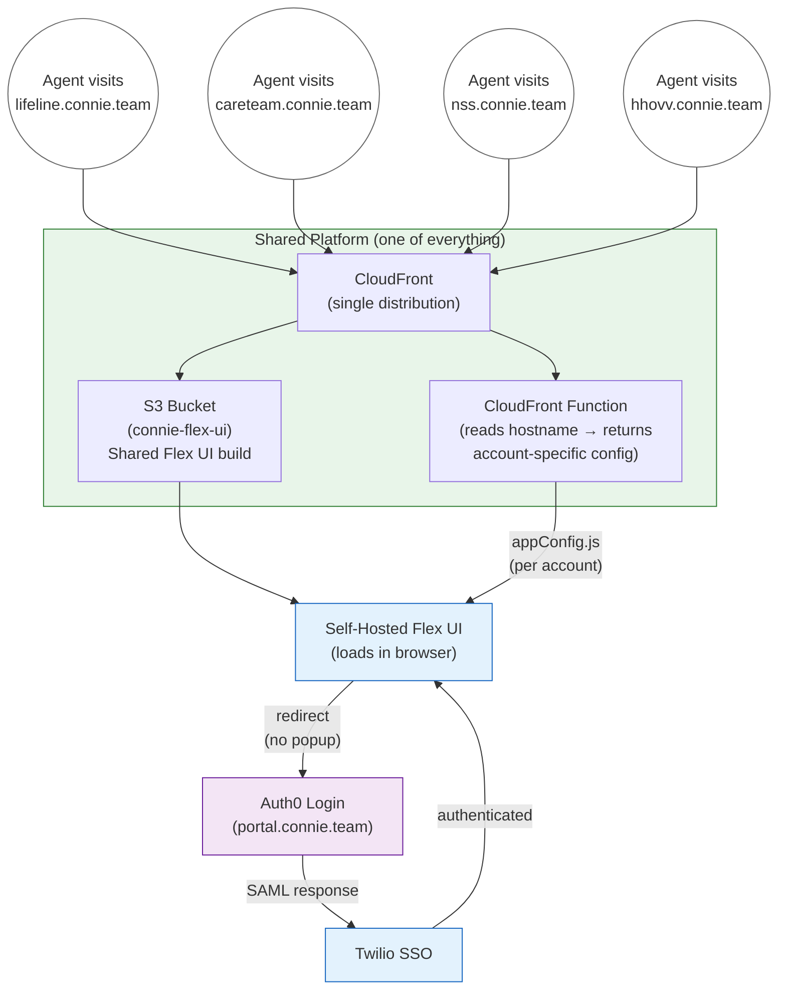

# Twilio Flex Account Provisioning Guide

**Provisioning a new Flex account on the shared ConnieRTC platform with Auth0 SSO**

```
Version: 2.0
Created: January 15, 2026
Author: CTO Agent
Last Updated: February 16, 2026
Changelog: v2.0 - Complete rewrite for shared CloudFront + self-hosted Flex UI architecture
           v1.1 - Added "Login using popup" requirement (obsolete — iframe architecture removed)
           v1.0 - Initial guide (per-account S3/CloudFront/iframe architecture — replaced)
```

---

## Overview

This guide provisions a new Twilio Flex account on the shared ConnieRTC platform:
- Auth0 SSO authentication (SAML 2.0)
- Vanity domain (`clientname.connie.team`) on shared infrastructure
- Self-hosted Flex UI with dynamic per-account configuration
- Redirect-based SSO (no iframes, no popups)

### Architecture (v26.02 — Shared Platform)

All accounts share one set of infrastructure. Adding a new client means adding one DNS record, one CloudFront alias, and one entry in a config function — no new resources to create or manage.



**Key difference:** Infrastructure stays flat no matter how many accounts we add. The CloudFront Function dynamically generates the right configuration based on which subdomain the agent visits — no per-account resources, no iframes, no popups.

### What This Guide Creates

| Component | Shared (already exists) | Per-Account (you create) |
|-----------|------------------------|--------------------------|
| S3 Bucket | `connie-flex-ui` | — |
| CloudFront Distribution | `E7QKED61KY1F9` | Add alias only |
| CloudFront Function | `connie-flex-router` | Add account entry |
| ACM Certificate | `*.connie.team` wildcard | — |
| Auth0 Application | — | New SAML app |
| Twilio SSO | — | New SSO config |
| DNS Record | — | New CNAME |

### Estimated Time

| Experience Level | Time Required |
|-----------------|---------------|
| First time (with this guide) | 45-60 minutes |
| Experienced | 20-30 minutes |

---

## Prerequisites

### Required Access

- [ ] Twilio account with Flex provisioned
- [ ] Auth0 tenant access (`dev-kvn1kviua124ipex.us.auth0.com`)
- [ ] AWS CLI configured with appropriate permissions
- [ ] Route 53 access for `connie.team` hosted zone

### Required Tools

```bash
twilio --version    # Twilio CLI
aws --version       # AWS CLI
```

### Key Values (shared across all accounts)

| Value | Description |
|-------|-------------|
| `dev-kvn1kviua124ipex.us.auth0.com` | Auth0 tenant |
| `portal.connie.team` | Auth0 custom domain |
| `BViCXzqlwzRHRkpmxmfvAqFDzta7f5nt` | Auth0 M2M Client ID |
| `XVO9zVKsUzbpLtz112e5oYTNluSdhcEY` | OAuth Client ID (Twilio — same for all accounts) |
| `E7QKED61KY1F9` | Shared CloudFront Distribution ID |
| `d2r791mh4irajz.cloudfront.net` | Shared CloudFront Domain |
| `Z0761753LA835CJR31QV` | Route 53 Hosted Zone ID (`connie.team`) |

### Credentials

All credentials are stored at: `~/.claude/credentials/`

- Auth0 M2M secret: `~/.claude/credentials/AUTH0-API-ACCESS.md`
- Twilio API keys: `~/.twilio-cli/config.json` (per-account profiles)

---

## Phase 1: DNS

Create an explicit CNAME record pointing to the shared CloudFront distribution.

```bash
cat > /tmp/dns-record.json <<'EOF'
{
    "Changes": [
        {
            "Action": "CREATE",
            "ResourceRecordSet": {
                "Name": "<account>.connie.team.",
                "Type": "CNAME",
                "TTL": 300,
                "ResourceRecords": [
                    {
                        "Value": "d2r791mh4irajz.cloudfront.net"
                    }
                ]
            }
        }
    ]
}
EOF

aws route53 change-resource-record-sets \
  --hosted-zone-id Z0761753LA835CJR31QV \
  --change-batch file:///tmp/dns-record.json
```

**Verify propagation:**

```bash
dig <account>.connie.team +short
# Should return: d2r791mh4irajz.cloudfront.net (or CloudFront IPs)
```

:::warning
The wildcard `*.connie.team` points to a dead distribution (`d1lmtcg3tssu76`). You MUST create an explicit CNAME for each account subdomain. Do not rely on the wildcard.
:::

---

## Phase 2: CloudFront Alias

Add the new subdomain as an alias on the shared distribution.

```bash
# 1. Get current distribution config
aws cloudfront get-distribution-config --id E7QKED61KY1F9 > /tmp/cf-config.json

# 2. Note the ETag from the response (needed for update)

# 3. Add the new alias to Aliases.Items[] in the config
#    Increment Aliases.Quantity by 1

# 4. Update the distribution
aws cloudfront update-distribution \
  --id E7QKED61KY1F9 \
  --if-match <ETAG> \
  --distribution-config file:///tmp/cf-config-updated.json
```

The distribution uses the existing ACM wildcard cert (`*.connie.team`) — no new certificate needed.

:::warning
If you get `CNAMEAlreadyExists`, the alias is still attached to another distribution. Remove it from the old distribution first, wait for that distribution to reach `Deployed` status, then retry.
:::

---

## Phase 3: Auth0 SAML Application

### 3.1 Get Management API Token

```bash
curl -s --request POST \
  --url "https://dev-kvn1kviua124ipex.us.auth0.com/oauth/token" \
  --header 'content-type: application/json' \
  --data '{
    "client_id": "BViCXzqlwzRHRkpmxmfvAqFDzta7f5nt",
    "client_secret": "<M2M_SECRET>",
    "audience": "https://dev-kvn1kviua124ipex.us.auth0.com/api/v2/",
    "grant_type": "client_credentials"
  }' | python3 -m json.tool
```

### 3.2 Create Regular Web Application

```bash
curl -s --request POST \
  --url "https://dev-kvn1kviua124ipex.us.auth0.com/api/v2/clients" \
  --header "authorization: Bearer <TOKEN>" \
  --header "content-type: application/json" \
  --data '{
    "name": "Twilio Flex <AccountName>",
    "description": "SAML SSO for <account>.connie.team",
    "app_type": "regular_web",
    "oidc_conformant": true,
    "grant_types": ["authorization_code", "implicit", "refresh_token"],
    "callbacks": [
      "https://login.flex.us1.twilio.com/login/callback?connection=<JQ_CONNECTION_SID>",
      "https://<account>.connie.team",
      "https://flex.twilio.com"
    ],
    "allowed_logout_urls": [
      "https://<account>.connie.team/*"
    ],
    "allowed_origins": [
      "https://<account>.connie.team",
      "https://flex.twilio.com"
    ],
    "web_origins": [
      "https://<account>.connie.team",
      "https://flex.twilio.com"
    ]
  }'
```

**Save the returned `client_id`** — you'll need it for SAML config and CloudFront Function.

:::danger Critical Settings
- **`oidc_conformant: true`** — defaults to `false`, breaks SSO if not set
- **NO `client_credentials`** in grant_types — only `authorization_code, implicit, refresh_token`
- **Remove from `google-oauth2` connection** after creation (eliminates Dev Keys alert)
:::

### 3.3 Configure SAML2 Addon

```bash
curl -s --request PATCH \
  --url "https://dev-kvn1kviua124ipex.us.auth0.com/api/v2/clients/<AUTH0_CLIENT_ID>" \
  --header "authorization: Bearer <TOKEN>" \
  --header "content-type: application/json" \
  --data '{
    "addons": {
      "samlp": {
        "audience": "urn:flex:<JQ_CONNECTION_SID>",
        "recipient": "https://login.flex.us1.twilio.com/login/callback?connection=<JQ_CONNECTION_SID>",
        "nameIdentifierProbes": ["email"],
        "signatureAlgorithm": "rsa-sha256",
        "digestAlgorithm": "sha256",
        "passthroughClaimsWithNoMapping": true,
        "mapUnknownClaimsAsIs": true,
        "lifetimeInSeconds": 3600
      }
    }
  }'
```

:::danger MANDATORY: nameIdentifierProbes
`"nameIdentifierProbes": ["email"]` is **non-negotiable**. Without it, Auth0 sends its internal user ID (`auth0|abc123...`) as the SAML NameID. Twilio then creates a phantom worker with that ID as its name. Phantom workers incur Twilio billing costs.
:::

### 3.4 Download SAML Certificate

```bash
curl -o /tmp/<account>-auth0-cert.pem \
  "https://dev-kvn1kviua124ipex.us.auth0.com/pem"

# Copy to clipboard for Twilio console (PEM format with headers)
cat /tmp/<account>-auth0-cert.pem | pbcopy
```

The same tenant certificate is used for all accounts.

---

## Phase 4: Twilio Console SSO (CEO Required)

This phase requires manual configuration in the Twilio Console. Provide these values to the CEO:

### SSO Configuration Values

| Field | Value |
|-------|-------|
| Friendly Name | `<account>.connie.team` |
| Identity Provider Issuer | `dev-kvn1kviua124ipex.us.auth0.com` |
| Single Sign-On URL | `https://dev-kvn1kviua124ipex.us.auth0.com/samlp/<AUTH0_CLIENT_ID>` |
| X.509 Certificate | PEM format WITH headers, 64-char line wrapping |
| Default redirect URL | `https://<account>.connie.team` |
| Trusted URLs | `https://<account>.connie.team` **AND** `https://portal.connie.team` |
| Login using popup | **UNCHECKED** |

:::warning
- **"Login using popup" must be UNCHECKED** — we use redirect-based SSO, not popup/iframe
- **`portal.connie.team` MUST be in Trusted URLs** — this is the Auth0 custom domain that handles the SAML flow
:::

After saving, the CEO should provide the **JQ Connection SID** (format: `JQxxxxxxxxxxxxxxxxxxxxxxxxxxxxxxxx`) — this is the SSO connection identifier needed for Auth0 SAML audience/recipient and the CloudFront Function.

---

## Phase 5: CloudFront Function

Update `connie-flex-router` to add the new account entry.

### 5.1 Update the Function

Edit `~/projects/connie/flex-ui/cloudfront-function.js` — add the new account to the `accounts` object:

```javascript
'<account>.connie.team': {
    accountSid: '<TWILIO_ACCOUNT_SID>',
    connection: '<JQ_CONNECTION_SID>',
    clientId: 'XVO9zVKsUzbpLtz112e5oYTNluSdhcEY',
    auth0ClientId: '<AUTH0_CLIENT_ID>'
},
```

Note: `clientId` is the same OAuth Client ID for ALL accounts.

### 5.2 Publish to LIVE

```bash
# Get current ETag
aws cloudfront describe-function --name connie-flex-router --stage DEVELOPMENT

# Update function code
aws cloudfront update-function \
  --name connie-flex-router \
  --function-config '{"Comment":"Connie Flex multi-tenant router","Runtime":"cloudfront-js-2.0"}' \
  --function-code fileb://cloudfront-function.js \
  --if-match <ETAG>

# Publish to LIVE stage
aws cloudfront publish-function \
  --name connie-flex-router \
  --if-match <NEW_ETAG>

# Invalidate cache
aws cloudfront create-invalidation \
  --distribution-id E7QKED61KY1F9 \
  --paths "/assets/appConfig.js" "/logout-success.html"
```

---

## Phase 6: Flex Configuration API

Configure the Flex UI attributes for the new account.

```bash
curl -X POST "https://flex-api.twilio.com/v1/Configuration" \
  -u "<API_KEY_SID>:<API_KEY_SECRET>" \
  -H "Content-Type: application/json" \
  -d '{
    "account_sid": "<TWILIO_ACCOUNT_SID>",
    "ui_attributes": {
      "loginPopup": false,
      "plugin_service_enabled": true,
      "custom_data": {
        "features": {
          ... copy from Lifeline proven config, swap serverless domains ...
        }
      }
    }
  }'
```

:::warning API Gotchas
- URL is `/v1/Configuration` — **capital C**. Lowercase returns 404.
- Use **API key auth** (`-u "SK...:secret"`), not auth token. Auth token may fail on some accounts.
- Must include `account_sid` in the JSON body.
- Must include the **full** `custom_data.features` block — not just `loginPopup`.
- API key credentials are in `~/.twilio-cli/config.json` under each profile.
:::

---

## Phase 7: connie.plus Middleware

Add the new account domain to the middleware CORS and CSP configuration.

1. Add `https://<account>.connie.team` to `allowedOrigins` in the CORS config
2. Add to `frame-ancestors` CSP header
3. Deploy: `git push` → SSH to EC2 → `git pull` → `npm run build` → `pm2 restart`

---

## Phase 8: Worker Setup

When a user first logs in via SSO, Twilio creates a new worker identity based on the Auth0 email address. If migrating from an existing account:

1. **Pre-create the SSO worker** with the user's Auth0 email as the friendly name
2. **Copy attributes** from the old worker (skills, roles, profile data)
3. **Verify** the old worker won't conflict

```bash
# List existing workers
curl -s "https://taskrouter.twilio.com/v1/Workspaces/<WORKSPACE_SID>/Workers" \
  -u "<API_KEY_SID>:<API_KEY_SECRET>" | python3 -m json.tool

# Create worker with migrated attributes
curl -X POST "https://taskrouter.twilio.com/v1/Workspaces/<WORKSPACE_SID>/Workers" \
  -u "<API_KEY_SID>:<API_KEY_SECRET>" \
  --data-urlencode "FriendlyName=user@example.com" \
  --data-urlencode 'Attributes={"full_name":"User Name","email":"user@example.com","roles":["admin"]}'
```

---

## Verification Checklist

### Pre-Launch

```
[ ] DNS
    [ ] Explicit CNAME created (NOT relying on wildcard)
    [ ] dig returns d2r791mh4irajz.cloudfront.net

[ ] CloudFront
    [ ] Alias added to E7QKED61KY1F9
    [ ] Distribution status: Deployed

[ ] Auth0
    [ ] App created with oidc_conformant: true
    [ ] SAML addon with nameIdentifierProbes: ["email"]
    [ ] Removed from google-oauth2 connection
    [ ] Grant types: authorization_code, implicit, refresh_token only

[ ] Twilio SSO (CEO)
    [ ] SSO configured with correct Auth0 values
    [ ] "Login using popup" UNCHECKED
    [ ] Trusted URLs include portal.connie.team
    [ ] Default redirect: https://<account>.connie.team

[ ] CloudFront Function
    [ ] Account entry added to connie-flex-router
    [ ] Published to LIVE stage
    [ ] Cache invalidated

[ ] Flex Configuration
    [ ] loginPopup: false
    [ ] plugin_service_enabled: true
    [ ] Full features block configured

[ ] connie.plus
    [ ] CORS allowedOrigins updated
    [ ] frame-ancestors CSP updated
    [ ] Deployed to EC2
```

### Smoke Test

1. Open incognito browser
2. Navigate to `https://<account>.connie.team`
3. Should redirect to Auth0 login (portal.connie.team) automatically
4. Enter credentials
5. Should redirect back to Flex UI, fully authenticated
6. Verify worker identity shows email (not `auth0|...`)

---

## Troubleshooting

### Auth0 redirects but Flex shows "Access Denied"

- Check that `oidc_conformant: true` is set on the Auth0 app
- Verify the SAML audience matches the JQ Connection SID exactly

### Worker shows `auth0|...` instead of email

- SAML config is missing `nameIdentifierProbes: ["email"]`
- Fix the SAML addon, then delete the phantom worker in Twilio Console
- The correct worker will be created on next login

### `CNAMEAlreadyExists` when adding CloudFront alias

- The subdomain alias is still on another CloudFront distribution
- Remove it from the old distribution first
- Wait for old distribution to reach `Deployed` status (can take 5+ minutes)
- Then retry adding to the shared distribution

### Flex Configuration API returns 404

- URL must be `/v1/Configuration` with capital C
- Use API key auth, not auth token

### Flex loads but plugins don't render

- `plugin_service_enabled` must be `true`
- Must include the full `custom_data.features` block, not just `loginPopup`

---

## Quick Reference Commands

```bash
# Check DNS
dig <account>.connie.team +short

# Get Auth0 Management Token
curl -s --request POST \
  --url "https://dev-kvn1kviua124ipex.us.auth0.com/oauth/token" \
  --header 'content-type: application/json' \
  --data '{"client_id":"BViCXzqlwzRHRkpmxmfvAqFDzta7f5nt","client_secret":"<SECRET>","audience":"https://dev-kvn1kviua124ipex.us.auth0.com/api/v2/","grant_type":"client_credentials"}'

# Check CloudFront Distribution aliases
aws cloudfront get-distribution --id E7QKED61KY1F9 \
  --query "Distribution.DistributionConfig.Aliases"

# Invalidate CloudFront Cache
aws cloudfront create-invalidation \
  --distribution-id E7QKED61KY1F9 \
  --paths "/*"

# Get Flex Configuration
curl -s "https://flex-api.twilio.com/v1/Configuration" \
  -u "<API_KEY_SID>:<API_KEY_SECRET>" | python3 -m json.tool
```

---

**Document Version:** 2.0
**Last Updated:** February 16, 2026
