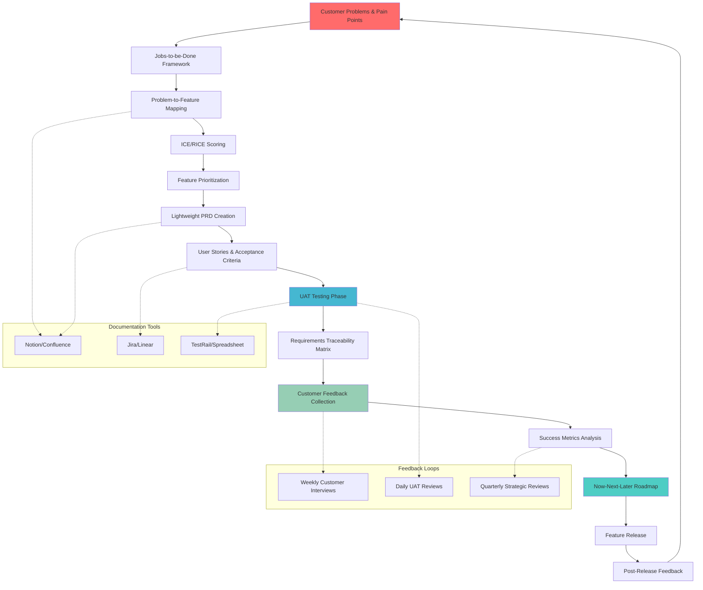

  
  
  **Prepared by:** Christopher Berno  
  **Date:** October 16, 2024

---

# Product requirement documentation for early-stage B2B contact center solutions

For a B2B SaaS startup with a working prototype in UAT phase, the most effective approach combines lightweight documentation frameworks with clear traceability from customer problems through testing to roadmap planning. Based on extensive research of successful early-stage companies and current best practices, this guide provides immediately actionable frameworks specifically tailored for contact center solutions transitioning from prototype to structured product development.

## Product management flow overview

This diagram shows the complete flow from customer problems through to roadmap execution:

## Start with problem-to-feature mapping using Jobs-to-be-Done

The Jobs-to-be-Done (JTBD) framework proves particularly effective for B2B contact center solutions, as demonstrated by **Intercom's successful implementation**. Rather than creating detailed personas, focus on what customers are trying to accomplish. For contact center software, this means understanding specific workflows agents and managers need to complete.

Use this problem statement template for each feature area:
- **Problem**: Describe the specific pain point (e.g., "Agents can't see customer history during calls")
- **Customer Segment**: Who experiences this (e.g., "Support agents handling 50+ calls daily")
- **Evidence**: Interview quotes, observed behaviors, support ticket patterns
- **Current Solution**: How they solve it today (e.g., "Manually searching CRM while customer waits")
- **Proposed Feature**: What you'll build (e.g., "Real-time CTI pop-up with customer context")
- **Success Criteria**: Measurable outcomes (e.g., "Reduce average handle time by 30 seconds")

Document these using a simple **Notion database** ($8/user/month) or the free tier initially. Create linked databases connecting problems to features to test cases, providing the traceability you need without complex enterprise tools.

## Implement RICE scoring for feature prioritization

For early-stage contact center solutions, the **ICE scoring method** (Impact × Confidence × Ease) offers faster decision-making than the more comprehensive RICE framework. Score each feature from 1-10 on:
- **Impact**: Effect on key metrics like customer satisfaction or agent productivity
- **Confidence**: Certainty in your estimates based on UAT feedback
- **Ease**: Implementation simplicity given your current architecture

Once you have more data (typically after 6 months), transition to **RICE scoring** which adds Reach (number of users affected) for more nuanced prioritization. Aircall and Talkdesk both evolved their prioritization methods this way, starting simple and adding sophistication as they grew.

## Structure requirements using lightweight PRDs

Avoid the temptation to create comprehensive PRDs early on. Instead, follow **Slack's early approach** of focusing on 3-5 core features that define your product essence. Use this streamlined PRD template:

**Feature Overview** (1 paragraph): What problem this solves and why it matters
**User Stories**: 3-5 stories using "As a [user], I want [capability] so that [benefit]"
**Acceptance Criteria**: Testable conditions using Given-When-Then format
**Out of Scope**: Explicitly state what won't be included
**Success Metrics**: 2-3 measurable outcomes
**Dependencies**: Technical requirements or integrations needed

Store these in **Confluence** ($6/user/month) if you're already using Jira, or continue with Notion for an all-in-one solution. The key is maintaining a living document that evolves with customer feedback rather than a static specification.

## Connect features to UAT using acceptance criteria mapping

Your UAT phase provides the perfect opportunity to establish rigorous testing practices. Create a **Requirements Traceability Matrix (RTM)** that links each requirement to specific test cases:

| Req ID | Feature | Test Cases | UAT Status | Customer Feedback |
|--------|---------|------------|------------|-------------------|
| REQ-001 | SSO Login | TC-001, TC-002 | Pass | "Critical for enterprise" |
| REQ-002 | Call Recording | TC-003, TC-004 | In Progress | "Need pause capability" |

For contact center solutions, focus UAT on **end-to-end agent workflows** rather than isolated features. Test scenarios should include:
- Agent login and workspace setup
- Inbound call handling with screen pops
- Call transfer and conference scenarios
- Post-call wrap-up and disposition
- Supervisor monitoring and coaching

Use **TestRail** or simply track in your existing tool with clear test case documentation. The critical element is maintaining bidirectional traceability between requirements and test results.

## Build roadmaps using the Now-Next-Later framework

The Now-Next-Later framework works exceptionally well for early-stage B2B SaaS, providing flexibility while maintaining strategic direction. Structure your roadmap as:

**NOW (2-4 weeks)**: Currently in development, fully specified
- Critical UAT bug fixes
- Core integration completions (CRM, help desk)
- Essential security features for enterprise readiness

**NEXT (1-3 months)**: Medium confidence, key details defined
- Advanced reporting dashboard
- Workforce management features
- Quality assurance capabilities

**LATER (3+ months)**: Strategic themes, low detail
- AI-powered agent assistance
- Predictive analytics
- International expansion features

This approach, used successfully by companies like **Zoom during rapid scaling**, allows you to commit to near-term deliverables while maintaining flexibility for market feedback. Review and adjust monthly based on customer input and competitive dynamics.

## Choose tools based on your growth stage

For a startup in UAT phase with limited budget, this tool stack provides maximum value:

**Immediate needs** (Total: <$50/month):
- **Requirements**: Notion ($24/month for 3 users) for all documentation
- **Story Mapping**: StoriesOnBoard (currently free) for user journey visualization
- **Development**: Jira (free up to 10 users) for sprint management
- **Testing**: Built-in Jira test management or simple spreadsheet tracking

**6-12 month evolution** (Total: $200-400/month):
- Add **Jira Product Discovery** ($10/user/month) for better prioritization
- Implement **Airfocus** ($19/user/month) for strategic roadmapping
- Consider **TestRail** for comprehensive test management
- Add customer feedback tools like **Canny** or **ProductBoard** when you have 50+ customers

Avoid expensive enterprise tools like Aha! ($59+/user/month) or LaunchDarkly ($36,000+/year) until you've achieved product-market fit and have dedicated product management resources.

## Learn from successful contact center startups

**Aircall's evolution** provides an excellent model: they started with simple cloud telephony and gradually added sophisticated features based on customer feedback. Their early documentation focused on integration capabilities (80+ CRM connections) rather than comprehensive feature specifications, recognizing that ease of integration was their key differentiator.

Similarly, **Zendesk combined quality assurance with customer support** in early stages, creating tight feedback loops that informed product decisions. This approach works particularly well for contact center solutions where your customers are themselves managing customer interactions.

## Create templates for consistent documentation

Develop these four essential templates for your team:

**Problem-to-Feature Mapping**: Links customer pain points to proposed solutions with clear success criteria
**User Story Template**: Standardized format with acceptance criteria and test scenarios
**UAT Test Script**: Reusable format for end-to-end workflow testing
**Feature Release Template**: Communication plan for internal teams and customers

These templates should live in your central documentation tool and evolve based on team feedback. Start simple and add complexity only when the absence of detail causes confusion or delays.

## Establish feedback loops throughout development

The most successful B2B SaaS companies create multiple feedback collection points:

**Pre-development**: Weekly customer interviews using the "When [situation], I want to [motivation], so I can [outcome]" format
**During UAT**: Daily stand-ups reviewing test results and customer feedback
**Post-release**: Systematic collection of usage data and support tickets
**Quarterly reviews**: Strategic assessment of feature performance against success metrics

For contact center solutions, pay special attention to both **buyer feedback** (managers focused on metrics and ROI) and **user feedback** (agents focused on usability and efficiency). These often diverge, and successful products address both perspectives.

## Conclusion

Your transition from prototype to structured product development doesn't require expensive tools or complex frameworks. Start with lightweight documentation using Notion or similar tools, implement ICE scoring for quick prioritization decisions, and maintain clear traceability from customer problems through features to testing and roadmap planning. Focus on creating tight feedback loops with your UAT participants, and gradually add sophistication to your processes as your team and customer base grow. The key is maintaining customer focus while building repeatable processes that can scale with your organization.